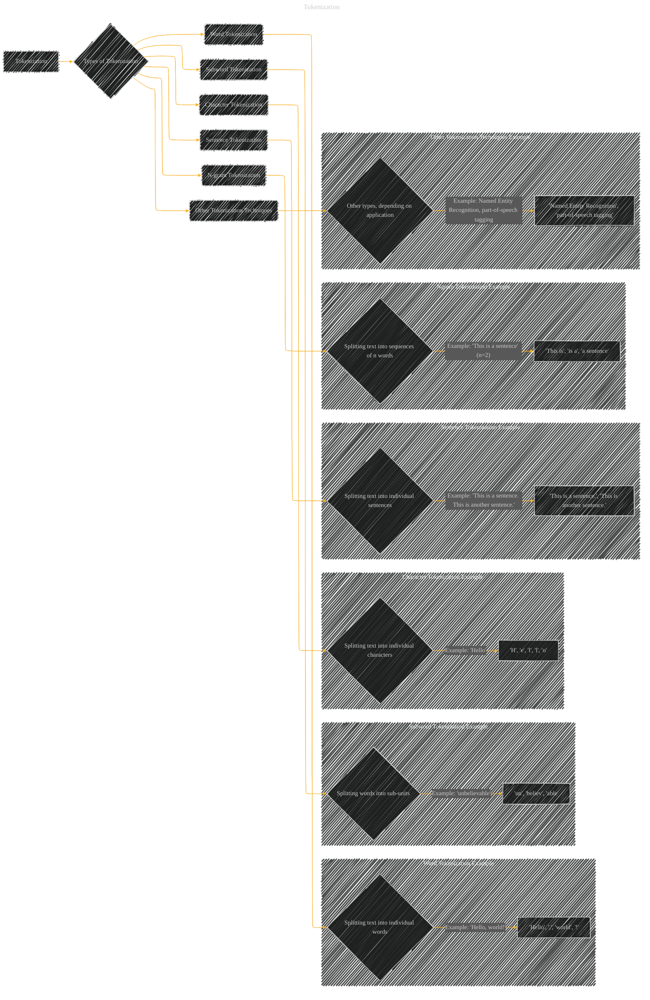

# Tokenization
> **Disclaimer:**
>
> This document contains my personal notes on the topic,
> compiled from publicly available documentation and various cited sources.
> The materials are intended for educational purposes, personal study, and reference.
> The content is dual-licensed:
> 1. **MIT License:** Applies to all code implementations (Swift, Mermaid, and other programming languages).
> 2. **Creative Commons Attribution 4.0 International License (CC BY 4.0):** Applies to all non-code content, including text, explanations, diagrams, and illustrations.
---

## A Diagram Structure

----

### Explanation and Considerations

* **Tokenization:**  The overall process of breaking down text into smaller units (tokens).

* **Word Tokenization:** The simplest form, splitting text into individual words.  Punctuation is often handled as separate tokens, or removed before tokenization.

* **Subword Tokenization:**  Breaks down words into smaller sub-units, like prefixes and suffixes, to handle out-of-vocabulary words or rare words.

* **Character Tokenization:**  Splits text into individual characters. This can be useful for tasks that require even finer-grained analysis or for languages without clear word boundaries.

* **Sentence Tokenization:**  Splits text into sentences, using punctuation marks to determine sentence boundaries.

* **N-gram Tokenization:**  Generates sequences of n words (n-grams). Useful for capturing word context and relationships within a sequence.

* **Other Tokenization Techniques:**  A catch-all category for specialized techniques like named entity recognition (NER) or part-of-speech (POS) tagging, which are more complex tokenization procedures that may not be straightforwardly split into tokens but may be part of the overall process.

---

### Diagram Elements and Interpretation

*   **Nodes:** Each node represents a type of tokenization or a concept related to tokenization.
*   **Edges:** Arrows connect a node to another to show relationships and dependencies.
*   **Subgraphs:** The use of subgraphs can group related concepts for a more structured visual.
*   **Examples:** The examples clarify the tokenization process by providing illustrative input-output pairs.

This diagram provides a high-level overview of tokenization types and demonstrates the different ways text can be broken down into smaller units.  The specific examples are just illustrative; the actual tokenization rules can vary significantly depending on the language and the application.

---
**Licenses:**

- **MIT License:**   - Full text in [LICENSE](LICENSE) file.
- **Creative Commons Attribution 4.0 International:**  - Legal details in [LICENSE-CC-BY](LICENSE-CC-BY) and at [Creative Commons official site](http://creativecommons.org/licenses/by/4.0/).

---