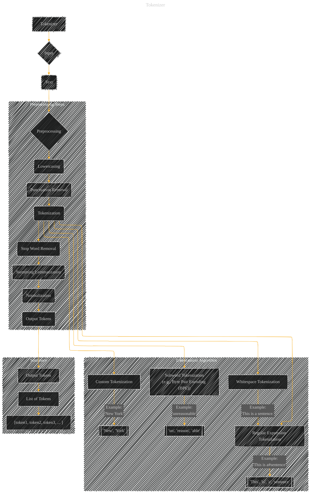

# Tokenizer
> **Disclaimer:**
>
> This document contains my personal notes on the topic,
> compiled from publicly available documentation and various cited sources.
> The materials are intended for educational purposes, personal study, and reference.
> The content is dual-licensed:
> 1. **MIT License:** Applies to all code implementations (Swift, Mermaid, and other programming languages).
> 2. **Creative Commons Attribution 4.0 International License (CC BY 4.0):** Applies to all non-code content, including text, explanations, diagrams, and illustrations.
---

## A Diagram Structure

----

### Explanation

This Mermaid diagram outlines the process of a Tokenizer, highlighting different tokenization approaches and preprocessing steps.

* **Input (B):** The input to the Tokenizer is a text string (C).

* **Preprocessing (D):** This stage encompasses several steps crucial for transforming raw text into usable tokens:
    * **Lowercasing (DA):** Converts all text to lowercase to treat "The" and "the" as the same token.
    * **Punctuation Removal (DB):** Removes punctuation marks like periods, commas, and question marks. This is often necessary to avoid treating punctuation as independent tokens.
    * **Tokenization (DC):** This is the core step, where the text is broken down into smaller units called tokens. This section further elaborates different algorithms:
        * **Whitespace Tokenization (DC1):**  Splits the text at whitespace characters.
        * **Regular Expression Tokenization (DC2):** Uses regular expressions to define token boundaries.
        * **Custom Tokenization (DC4):** Allows for defining custom rules or patterns to extract specific tokens.
        * **Subword Tokenization (DC6):** Breaks down words into smaller subword units, such as with Byte Pair Encoding (BPE).  This is particularly useful for handling rare words or out-of-vocabulary (OOV) words.
    * **Stop Word Removal (DD):** Filters out common words like "the", "a", "is", etc., which often don't contribute much to the meaning.
    * **Stemming/Lemmatization (DE):** Reduces words to their root form (e.g., "running" to "run"). This is beneficial for grouping semantically similar words.
    * **Normalization (DF):**  This could include further transformations, like converting numbers to a standardized form or handling dates and times.

* **Output (E):** The Tokenizer outputs a list of tokens (EE) in a standardized format. This list of tokens is then ready for further processing in natural language processing (NLP) tasks.

----

### Key Considerations

* **Flexibility:** The diagram highlights that the Tokenizer can adapt to various tokenization algorithms.
* **Preprocessing Pipeline:**  The preprocessing steps are crucial for preparing the text for tokenization.
* **Output Format:** The output format (list of tokens) is standardized, facilitating integration with other NLP components.

This diagram provides a structured and comprehensive overview of a tokenizer, suitable for understanding and potentially implementing different tokenization strategies. Remember to adjust the specific preprocessing steps based on the requirements of your NLP task.

---
**Licenses:**

- **MIT License:**   - Full text in [LICENSE](LICENSE) file.
- **Creative Commons Attribution 4.0 International:**  - Legal details in [LICENSE-CC-BY](LICENSE-CC-BY) and at [Creative Commons official site](http://creativecommons.org/licenses/by/4.0/).

---