# Unigram Language Model
> **Disclaimer:**
>
> This document contains my personal notes on the topic,
> compiled from publicly available documentation and various cited sources.
> The materials are intended for educational purposes, personal study, and reference.
> The content is dual-licensed:
> 1. **MIT License:** Applies to all code implementations (Swift, Mermaid, and other programming languages).
> 2. **Creative Commons Attribution 4.0 International License (CC BY 4.0):** Applies to all non-code content, including text, explanations, diagrams, and illustrations.
---

## Unigram Language Model - A Diagram Structure

```mermaid
---
title: Unigram Language Model
config:
  layout: elk
  look: handDrawn
  theme: dark
---
%%{
  init: {
    'fontFamily': 'verdana',
    'themeVariables': {
      'primaryColor': '#BB2528',
      'primaryTextColor': '#f529',
      'primaryBorderColor': '#7C0000',
      'lineColor': '#F8B229',
      'secondaryColor': '#006100',
      'tertiaryColor': '#fff'
    }
  }
}%%
graph LR
    A[Unigram Language Model] --> B{Core Concept}
    B --> C(Probability of a word)
    C --> D{Calculation}
    
    subgraph Calculation_Formula
        D --  P(w<sub>i</sub>) = count(w<sub>i</sub>) / N  --> E
        E -- count(w<sub>i</sub>): --> F(Frequency of word w<sub>i</sub>)
        E -- N: --> G(Total number of words)
    end
    
    B --> C1(Markov Chain)
    C1 --> D1(Simplification)
    D1 -- Assumes words are independent --> E1

    B --> C2(Prediction)
    C2 --> D2(Generating text)
    D2 --  Find the most probable sequence of words  --> E2

    subgraph Example
        E2 -- Example: --> E3
        E3 -- Given a corpus of text --> E4
        E4 --  Calculate unigram probabilities for each word --> E5
        E5 -- Predict the next word by choosing the word with the highest probability --> E6
        E6 -- Output: --> E7
        E7 -- The predicted word is the most frequent word --> E8

    end
    
    subgraph Summary
        C --> CC[Probability of word sequence]
        CC --> CC1["P(w<sub>1</sub>, w<sub>2</sub>, ..., w<sub>n</sub>) = ∏ P(w<sub>i</sub>)"]
        C1 --> CC2[Independence Assumption]
        C1 --> CC3[Simplicity]
    
        C1 --> CC4[Limited Accuracy]
    end

```

----

### Explanation

* **Core Concept:** A unigram language model estimates the probability of a word appearing in a text.  Crucially, it assumes that the probability of a word is independent of the words that precede it. This makes it a simple, computationally efficient model.

* **Calculation:** The probability of a word `wi` is calculated by dividing its frequency (`count(wi)`) by the total number of words (`N`) in the training corpus.  This is the fundamental calculation.

* **Markov Chain (Simplification):** The model simplifies the complexity of language by assuming words are independent.  This means the probability of a word appearing in a sentence only depends on the word itself and not on the words before it.  This makes the model easier to calculate but less accurate, especially for longer sequences.

* **Prediction:** The model predicts the next word by choosing the word with the highest probability in the corpus.

* **Example:** Demonstrates the process with a hypothetical corpus, showing how probabilities are calculated and how the model predicts the next word.

* **Summary:**  Summarizes the crucial aspects of the model, including its calculation formula (which assumes independence), the independence assumption that limits its accuracy.  This shows the model's inherent simplicity, and its limitations.

----

### Important Considerations

* **Training Corpus:** The model's accuracy depends heavily on the quality and size of the training corpus.  A larger, more representative corpus will generally lead to better predictions.
* **Vocabulary:** The model's vocabulary is limited to the words present in the training data.  Words not seen during training will have a probability of zero.
* **N-grams (Extension):**  More sophisticated language models (like bigram or trigram models) consider the context of previous words to make more accurate predictions.

This diagram provides a clear overview of the core mechanics of a unigram language model. It effectively visualizes the concepts, formula, and the trade-off between simplicity and accuracy.

---
**Licenses:**

- **MIT License:**   - Full text in [LICENSE](LICENSE) file.
- **Creative Commons Attribution 4.0 International:**  - Legal details in [LICENSE-CC-BY](LICENSE-CC-BY) and at [Creative Commons official site](http://creativecommons.org/licenses/by/4.0/).

---