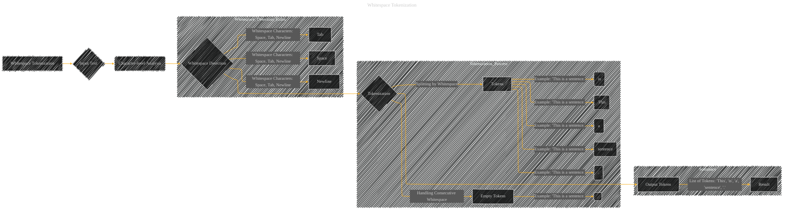

# Whitespace Tokenization
> **Disclaimer:**
>
> This document contains my personal notes on the topic,
> compiled from publicly available documentation and various cited sources.
> The materials are intended for educational purposes, personal study, and reference.
> The content is dual-licensed:
> 1. **MIT License:** Applies to all code implementations (Swift, Mermaid, and other programming languages).
> 2. **Creative Commons Attribution 4.0 International License (CC BY 4.0):** Applies to all non-code content, including text, explanations, diagrams, and illustrations.
---

## Whitespace Tokenization - A Diagram Structure

----

### Explanation

* **Input Text (B):** This is the raw text string that needs tokenization.

* **Character-level Analysis (C):**  The process begins by examining each character in the input text.

* **Whitespace Detection (D):** The core of whitespace tokenization is identifying whitespace characters.  This diagram shows the common whitespace characters: space, tab, and newline.

* **Tokenization (H):**  The text is split into tokens based on the detected whitespace.  The diagram illustrates how consecutive whitespace characters produce empty tokens.

* **Output Tokens (HH):** This is the final list of tokens, ready for further processing.

-----

### Important Concepts and Considerations

* **Whitespace Characters:** The diagram explicitly defines the whitespace characters that signal token boundaries. This needs to be tailored to the specific needs of your application (e.g., considering Unicode whitespace variations).

* **Empty Tokens:** Handling consecutive whitespace characters (like multiple spaces) is crucial.  The diagram correctly shows that this often results in empty tokens, which must be handled appropriately.

* **Tokenization Rules:**  In a real implementation, you would define explicit rules for tokenization. For example, how to handle punctuation marks (part of a token or a separate token).

* **Real-world Applications:** This tokenization is the foundation for many natural language processing (NLP) tasks, like language modeling, sentiment analysis, and text summarization.

This diagram, though simplified, effectively outlines the steps involved in whitespace-based tokenization, a common first step in NLP.  You can use this as a template, modifying the subgraphs and connecting nodes to represent the details needed for a specific text processing task. Remember that the exact implementation will depend on your needs and libraries.

---
**Licenses:**

- **MIT License:**   - Full text in [LICENSE](LICENSE) file.
- **Creative Commons Attribution 4.0 International:**  - Legal details in [LICENSE-CC-BY](LICENSE-CC-BY) and at [Creative Commons official site](http://creativecommons.org/licenses/by/4.0/).

---