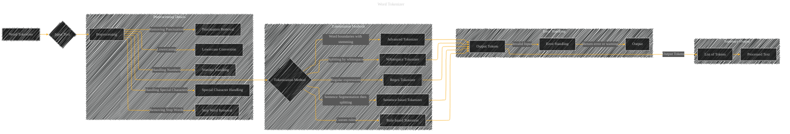

# Word Tokenizer
> **Disclaimer:**
>
> This document contains my personal notes on the topic,
> compiled from publicly available documentation and various cited sources.
> The materials are intended for educational purposes, personal study, and reference.
> The content is dual-licensed:
> 1. **MIT License:** Applies to all code implementations (Swift, Mermaid, and other programming languages).
> 2. **Creative Commons Attribution 4.0 International License (CC BY 4.0):** Applies to all non-code content, including text, explanations, diagrams, and illustrations.
---

## Word Tokenizer - A Diagram Structure

---

### Explanation

This diagram outlines a word tokenizer, highlighting the steps involved and the different tokenization methods.

* **Input Text (B):** The raw text to be processed.

* **Preprocessing (C):** This stage prepares the input for tokenization.  Crucial steps include:
    * **Lowercase Conversion (K):** Converts all text to lowercase for case-insensitive tokenization.
    * **Punctuation Removal (L):** Removes punctuation marks to avoid them being treated as tokens.
    * **Number Handling (M):**  Determines how to treat numbers (e.g., keep them as tokens, split them into digits).
    * **Special Character Handling (N):**  Handles special characters (e.g., remove them, treat them as individual tokens).
    * **Stop Word Removal (O):** Removes common words (e.g., "the", "a", "is") that don't carry much meaning.

* **Tokenization Method (D):**  Different approaches for breaking the text into tokens:
    * **Whitespace Tokenizer (E):** Splits the text into tokens using whitespace as delimiters. Simple, but can't handle hyphenated words or contractions.
    * **Regex Tokenizer (F):** Uses regular expressions to define more complex tokenization rules. Allows for handling various edge cases, but requires more expertise.
    * **Sentence-based Tokenizer (G):**  First segments the text into sentences and then tokenizes each sentence using whitespace or other methods. Improves accuracy for some languages or when dealing with long documents.
    * **Rule-based Tokenizer (H):**  Uses custom rules or a lexicon to define tokens.  Useful for specialized tasks (e.g., tokenizing medical texts).
    * **Advanced Tokenizer (I):**  Combines techniques like stemming (reducing words to their root form) and sophisticated word boundary detection. This can increase accuracy and reduce the token redundancy.

* **Output Tokens (J):** The list of tokens generated after tokenization.

* **Error Handling (P):**  Deals with invalid input or unexpected issues during the preprocessing or tokenization steps.  This part is critical for robust implementations.

* **Summary Output (R):**  Summarizes the final processed text (the text with tokens removed/replaced).

----

### Key Considerations

* **Flexibility:** The diagram emphasizes the flexibility of the tokenizer by allowing the selection of different preprocessing and tokenization methods.
* **Robustness:**  Error handling is explicitly included to deal with potential issues in the input.
* **Granularity:** The diagram breaks down the process into distinct steps to make it more understandable.
* **Complexity:** The `Advanced Tokenizer` node signifies that more advanced methods can be added.

This diagram provides a comprehensive, yet flexible, framework for a word tokenizer.  Implementation details would depend on the specific language and requirements of the task.

---
**Licenses:**

- **MIT License:**   - Full text in [LICENSE](LICENSE) file.
- **Creative Commons Attribution 4.0 International:**  - Legal details in [LICENSE-CC-BY](LICENSE-CC-BY) and at [Creative Commons official site](http://creativecommons.org/licenses/by/4.0/).

---