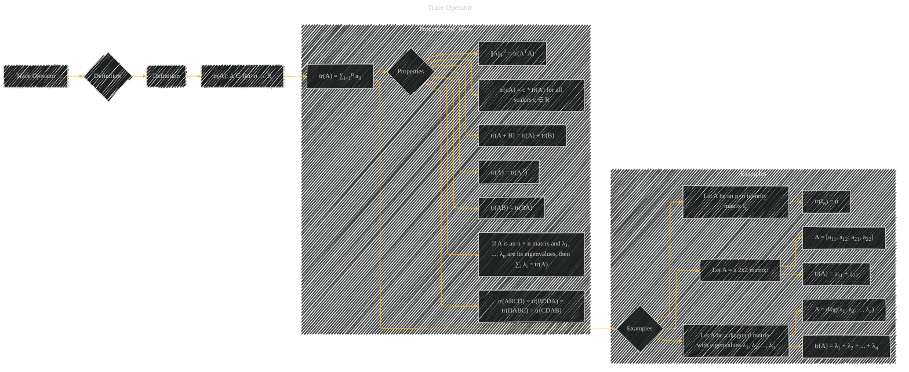

# Trace Operator
> **Disclaimer:**
>
> This document contains my personal notes on the topic,
> compiled from publicly available documentation and various cited sources.
> The materials are intended for educational purposes, personal study, and reference.
> The content is dual-licensed:
> 1. **MIT License:** Applies to all code implementations (Swift, Mermaid, and other programming languages).
> 2. **Creative Commons Attribution 4.0 International License (CC BY 4.0):** Applies to all non-code content, including text, explanations, diagrams, and illustrations.
---

## A Diagram Structure

----

### Explanation and Considerations

* **Definition:** The Trace Operator is defined as the sum of the elements on the main diagonal of a square matrix.  The notation `∑i=1n aii` clearly shows this summation process.

* **Properties:**  The diagram outlines several important properties of the trace operator, including linearity, symmetry, and its relationship to matrix multiplication and eigenvalues. This is crucial for understanding how the trace operator behaves in various mathematical contexts.

* **Examples:**  The examples illustrate the application of the trace operator to different types of matrices (2x2, identity, diagonal), making the concept more concrete and accessible.

----

### Important Notes

* **Matrix Notation:** The use of subscripts and superscripts (e.g., aij, AT) accurately represents matrix elements and transposes, which is essential for clarity.
* **Mathematical Symbols:**  The use of mathematical symbols like summation (∑), and matrix notation (`tr(A)`) is standard and ensures that the diagram conveys the mathematical meaning accurately.
* **Diagram Structure:** The hierarchical structure of the diagram, using subgraphs, clarifies the relationships between the different aspects of the trace operator (definition, properties, examples).

This Mermaid diagram provides a complete visual representation of the trace operator, covering its definition, properties, and illustrative examples, making it easier to understand and remember.  It accurately reflects the mathematical concepts involved.

---
**Licenses:**

- **MIT License:**   - Full text in [LICENSE](LICENSE) file.
- **Creative Commons Attribution 4.0 International:**  - Legal details in [LICENSE-CC-BY](LICENSE-CC-BY) and at [Creative Commons official site](http://creativecommons.org/licenses/by/4.0/).

---