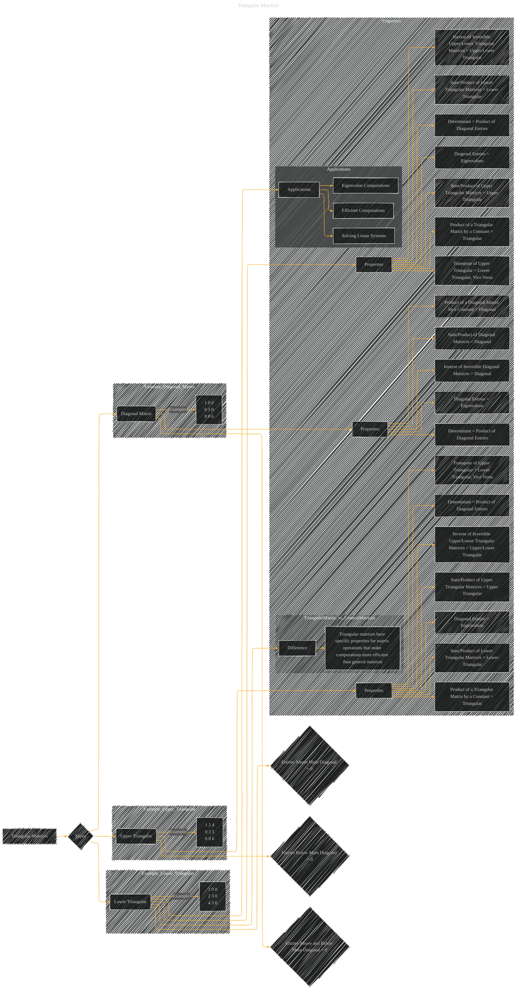

# Triangular Matrices
> **Disclaimer:**
>
> This document contains my personal notes on the topic,
> compiled from publicly available documentation and various cited sources.
> The materials are intended for educational purposes, personal study, and reference.
> The content is dual-licensed:
> 1. **MIT License:** Applies to all code implementations (Swift, Mermaid, and other programming languages).
> 2. **Creative Commons Attribution 4.0 International License (CC BY 4.0):** Applies to all non-code content, including text, explanations, diagrams, and illustrations.
---

## A Diagram Structure

----

### Explanation

This Mermaid diagram visually represents triangular matrices (lower, upper, and diagonal) with their defining characteristics, key properties, and some illustrative applications.  It's structured to clearly show how these matrices differ from general matrices and why they are important in computational contexts.  It emphasizes the specific computational advantages offered by triangular matrices, such as efficient matrix multiplication and inversion, and ties this to their applications in solving linear systems and eigenvalue computations. The diagram includes example matrices to clarify the concept of the entries being zero above or below the main diagonal. It also includes a summary subgraph of the properties of each triangular matrix type.  Finally, it includes a subgraph comparing triangular matrices against general matrices, highlighting the specific benefits that triangular matrices offer. This structure provides a more comprehensive understanding of the concept. Remember that "properties" and "applications" in the diagram are just starting points, and specific examples from your original material should be integrated for greater detail.

---
**Licenses:**

- **MIT License:**   - Full text in [LICENSE](LICENSE) file.
- **Creative Commons Attribution 4.0 International:**  - Legal details in [LICENSE-CC-BY](LICENSE-CC-BY) and at [Creative Commons official site](http://creativecommons.org/licenses/by/4.0/).

---