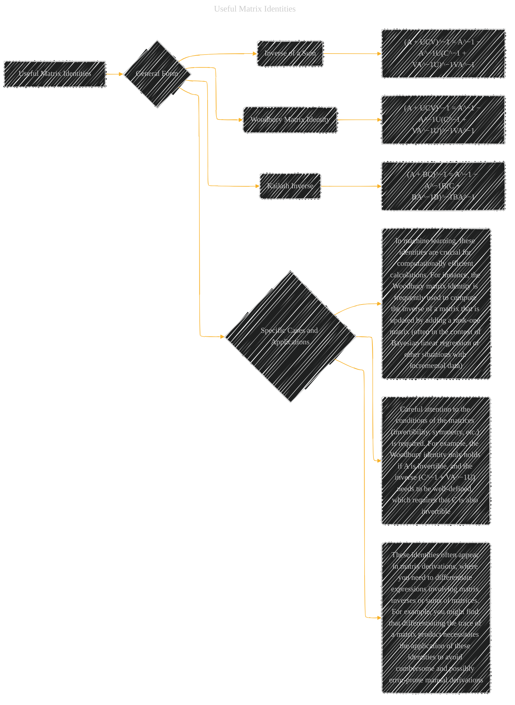

# Useful Matrix Identities
> **Disclaimer:**
>
> This document contains my personal notes on the topic,
> compiled from publicly available documentation and various cited sources.
> The materials are intended for educational purposes, personal study, and reference.
> The content is dual-licensed:
> 1. **MIT License:** Applies to all code implementations (Swift, Mermaid, and other programming languages).
> 2. **Creative Commons Attribution 4.0 International License (CC BY 4.0):** Applies to all non-code content, including text, explanations, diagrams, and illustrations.
---

## A Diagram Structure

-----

### Explanation and Considerations

*   **General Form (B):** The diagram highlights the general structure of the matrix identities.  The `subgraph` and `style` are used to organize and give emphasis to the general ideas.

*   **Specific Cases (F):** The `subgraph` and its connected nodes (`FA`, `FB`, and `FC`) provide crucial contextual information about the practical usage and importance of these identities in machine learning and related fields.  It points out crucial conditions and considerations when applying these identities.

*   **Detailed Identities (C, D, E):** These are the core matrix identities.  They are presented in a clear, concise format suitable for reference.  Note that the diagram structure allows for easy expansion with additional, more specific cases if needed.

-----

### Important Considerations for Diagrams

* **Contextualization:** The diagram should be supplemented with explanations of *why* these identities are important.  Mention specific scenarios in machine learning where they are frequently used (Bayesian methods, matrix inversions in large datasets, etc.).

* **Conditions:**  Highlight the necessary conditions for each identity to hold (e.g., invertibility, symmetry).  This is critical for proper application.

* **Applications:** Connect the identities to practical applications in machine learning, like linear regression, Bayesian inference, and dimensionality reduction.

* **Computational Efficiency:** Explain how these identities lead to computational efficiency improvements (e.g., avoiding direct matrix inversions in large datasets).

---
**Licenses:**

- **MIT License:**   - Full text in [LICENSE](LICENSE) file.
- **Creative Commons Attribution 4.0 International:**  - Legal details in [LICENSE-CC-BY](LICENSE-CC-BY) and at [Creative Commons official site](http://creativecommons.org/licenses/by/4.0/).

---