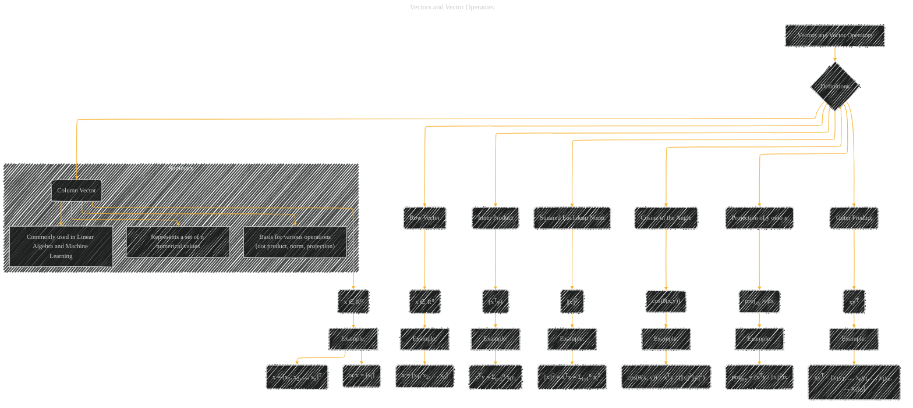

# Vectors and Vector Operators
> **Disclaimer:**
>
> This document contains my personal notes on the topic,
> compiled from publicly available documentation and various cited sources.
> The materials are intended for educational purposes, personal study, and reference.
> The content is dual-licensed:
> 1. **MIT License:** Applies to all code implementations (Swift, Mermaid, and other programming languages).
> 2. **Creative Commons Attribution 4.0 International License (CC BY 4.0):** Applies to all non-code content, including text, explanations, diagrams, and illustrations.
---

## Vectors and Vector Operators - A Diagram Structure

---

### Explanation

This Mermaid graph visually represents the key concepts of "Vectors and Vector Operators."  It follows the structure suggested in the previous response, with nodes for each concept and arrows indicating relationships.

* **Column Vectors and Row Vectors:**  Distinct nodes show the difference in representation (column vs. row), highlighting the importance of the superscript "T" (transpose) in the context of calculations.  The examples make this difference very clear.
* **Inner Product (Dot Product):**  Illustrates the mathematical operation of calculating the dot product between two vectors.
* **Squared Euclidean Norm:** Shows the computation of the squared length of a vector.
* **Cosine of the Angle:** Explains how the dot product relates to the angle between two vectors.
* **Projection of y onto x:** Demonstrates the calculation of the vector projection of one vector onto another.
* **Outer Product:** Explains the creation of a rank-one matrix from two vectors.

The subgraph at the bottom provides a high-level summary, emphasizing the fundamental role of vectors in linear algebra and machine learning.

-----

### Important Considerations

* **Clarity and Conciseness:**  Each concept is clearly labeled and examples are provided for quick comprehension.
* **Context:**  The graph emphasizes the mathematical definitions and how they relate to one another.
* **Visual Hierarchy:** The use of subgraphs and distinct colors helps in structuring the diagram and makes it easy to understand the connections between concepts.
* **Mathematical Notation:** The graph uses clear mathematical notation to represent vectors and operators (e.g., xT, ||x||2).

This revised diagram should help effectively convey the meaning of "Vectors and Vector Operators" to a user, using the framework established in the earlier response.  Remember to adjust the specific examples based on the particular context you're discussing.

---
**Licenses:**

- **MIT License:**   - Full text in [LICENSE](LICENSE) file.
- **Creative Commons Attribution 4.0 International:**  - Legal details in [LICENSE-CC-BY](LICENSE-CC-BY) and at [Creative Commons official site](http://creativecommons.org/licenses/by/4.0/).

---