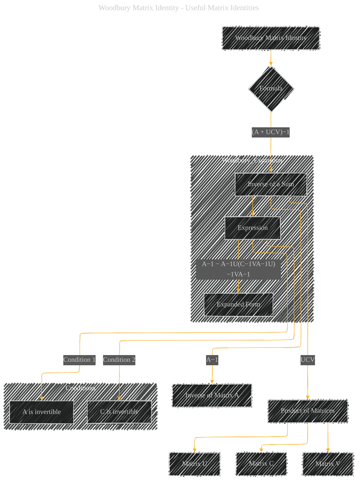

# Woodbury Matrix Identity
> **Disclaimer:**
>
> This document contains my personal notes on the topic,
> compiled from publicly available documentation and various cited sources.
> The materials are intended for educational purposes, personal study, and reference.
> The content is dual-licensed:
> 1. **MIT License:** Applies to all code implementations (Swift, Mermaid, and other programming languages).
> 2. **Creative Commons Attribution 4.0 International License (CC BY 4.0):** Applies to all non-code content, including text, explanations, diagrams, and illustrations.
---

## A Diagram Structure

----

### Explanation

The diagram visualizes the Woodbury Matrix Identity, highlighting the key components and their relationships.

*   **Nodes:**  The diagram uses nodes to represent the key components of the identity, such as the inverse of a sum of matrices, the individual inverses of matrices A and C, and the product of matrices involving U, C, and V.  The diagram explicitly identifies the matrices involved.

*   **Edges:**  Directed edges connect related concepts, clearly showing how the components are used in the formula. For example, an edge connects the 'Inverse of a Sum' node to the 'Inverse of Matrix A' and the 'Product of Matrices' to show the decomposition of the inverse.

*   **Subgraphs:** The "Woodbury Expansion" subgraph visually separates the expanded form of the identity from the main formula. The "Conditions" subgraph highlights the important invertibility requirements for the formula to hold.

---

### Important Considerations and Missing Elementss

* **Contextual Information:** The diagram lacks the contextual details that would make it highly useful in explaining *how* and *why* this identity is relevant in different mathematical or machine learning contexts.
* **Dimensional Constraints:** While the diagram represents the matrices, it doesn't explicitly mention the dimensions of these matrices, crucial for understanding how the matrices fit into the overall mathematical context. A proper visualization would clarify the dimensions of U, C, and V, in relation to A.

**To improve this diagram, consider adding:**

*   **Dimensions:** Annotate the dimensions of each matrix (e.g.,  "A ∈ Rm×m", "U ∈ Rm×n"). This is critical for understanding the application of the identity in different scenarios.
*   **Context:**  Add annotations explaining when and why this identity is useful in linear algebra and machine learning (e.g., solving systems of equations, optimization).
*   **Applications:**  Include examples illustrating the application of the identity to solve specific problems.

By incorporating these elements, the diagram would provide a significantly more informative and useful visual representation of the Woodbury Matrix Identity.

---
**Licenses:**

- **MIT License:**   - Full text in [LICENSE](LICENSE) file.
- **Creative Commons Attribution 4.0 International:**  - Legal details in [LICENSE-CC-BY](LICENSE-CC-BY) and at [Creative Commons official site](http://creativecommons.org/licenses/by/4.0/).

---