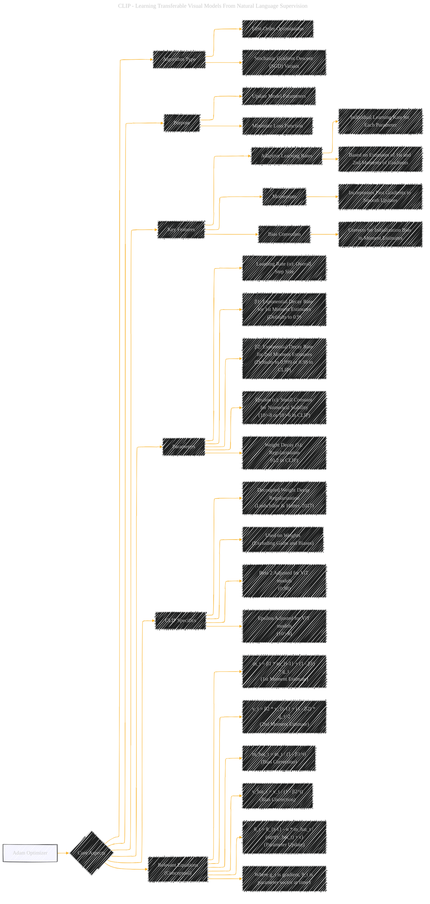

# Adam Optimizer
> **Disclaimer:**
>
> This document contains my personal notes on the topic,
> compiled from publicly available documentation and various cited sources.
> The materials are intended for educational purposes, personal study, and reference.
> The content is dual-licensed:
> 1. **MIT License:** Applies to all code implementations (Swift, Mermaid, and other programming languages).
> 2. **Creative Commons Attribution 4.0 International License (CC BY 4.0):** Applies to all non-code content, including text, explanations, diagrams, and illustrations.
---

## A Diagrammatic Guide 

DOI:[10.13140/RG.2.2.21352.17924](http://dx.doi.org/10.13140/RG.2.2.21352.17924)

---

### Key points and explanations

*   **Core Aspects:** This section defines the core aspects of Adam and its relationship to other optimizers.
*   **Key Features:** Adaptive learning rates and momentum are highlighted as defining features.
*   **Parameters:** The parameters with commonly used default values and CLIP specific tunings are explicitly provided.
*   **CLIP Specifics:** Any modifications used in CLIP are highlighted.
*   **Relevant Equations:** Core equations for the algorithm are shown, however, are kept at a high-level.

This structure allows you to break down the complexities of the Adam optimizer in a concise visual summary. Remember to balance visual clarity with technical accuracy.

---
**Licenses:**

- **MIT License:**   - Full text in [LICENSE](LICENSE) file.
- **Creative Commons Attribution 4.0 International:**  - Legal details in [LICENSE-CC-BY](LICENSE-CC-BY) and at [Creative Commons official site](http://creativecommons.org/licenses/by/4.0/).

---