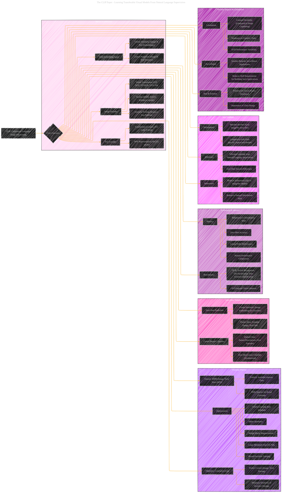

# CLIP - Learning Transferable Visual Models From Natural Language Supervision
> **Disclaimer:**
>
> This document contains my personal notes on the topic,
> compiled from publicly available documentation and various cited sources.
> The materials are intended for educational purposes, personal study, and reference.
> The content is dual-licensed:
> 1. **MIT License:** Applies to all code implementations (Swift, Mermaid, and other programming languages).
> 2. **Creative Commons Attribution 4.0 International License (CC BY 4.0):** Applies to all non-code content, including text, explanations, diagrams, and illustrations.
---

## A Diagrammatic Guide 

---

### Key improvements and explanations:

*   **Clear Categorization:**  The diagram is now organized into major sections like Model Architecture, Training Process, Zero-Shot Transfer, Evaluation Metrics, and Broader Impacts & Limitations, making it easier to understand the flow of information.

*   **Detailed Subgraphs:** Each major section is further broken down into subgraphs, providing a hierarchical view of the key components.

*   **Emphasis on Relationships:**  Edges are used to explicitly show the relationships between different aspects of the CLIP model and the data.

*   **Mathematical Concepts:**  Incorporate the actual mathematical notation used in the paper. This provides more context and information.

*   **Specific Examples:** When possible, include concrete examples from the CLIP paper (e.g., specific ResNet and ViT architectures).

*   **Concise Labels:**  Use clear and concise labels for nodes and edges.

*   **Color-coding:** Apply color-coding to help distinguish between different types of information or concepts.

*   **Bias & Limitations Highlighted:** The section on "Broader Impacts & Limitations" is included.

---
**Licenses:**

- **MIT License:**   - Full text in [LICENSE](LICENSE) file.
- **Creative Commons Attribution 4.0 International:**  - Legal details in [LICENSE-CC-BY](LICENSE-CC-BY) and at [Creative Commons official site](http://creativecommons.org/licenses/by/4.0/).

---