# CLIP - Learning Transferable Visual Models From Natural Language Supervision
> **Disclaimer:**
>
> This document contains my personal notes on the topic,
> compiled from publicly available documentation and various cited sources.
> The materials are intended for educational purposes, personal study, and reference.
> The content is dual-licensed:
> 1. **MIT License:** Applies to all code implementations (Swift, Mermaid, and other programming languages).
> 2. **Creative Commons Attribution 4.0 International License (CC BY 4.0):** Applies to all non-code content, including text, explanations, diagrams, and illustrations.
---

## A Diagrammatic Guide 

```mermaid
---
title: "The CLIP Paper - Learning Transferable Visual Models From Natural Language Supervision"
author: "Cong Le"
version: "1.0"
license(s): "MIT, CC BY 4.0"
copyright: "Copyright (c) 2025 Cong Le. All Rights Reserved."
config:
  layout: elk
  look: handDrawn
  theme: dark
---
%%%%%%%% Mermaid version v11.4.1-b.14
%%%%%%%% Toggle theme value to `base` to activate the initilization below for the customized theme version.
%%%%%%%% Available curve styles include the following keywords:
%% basis, bumpX, bumpY, cardinal, catmullRom, linear, monotoneX, monotoneY, natural, step, stepAfter, stepBefore.
%%{
  init: {
    "graph": { "htmlLabels": false, 'curve': 'linear' },
    'fontFamily': 'Fantasy',
    'themeVariables': {
      'primaryColor': '#ffff',
      'primaryTextColor': '#55ff',
      'primaryBorderColor': '#7c2',
      'lineColor': '#F8B229',
      'secondaryColor': '#006100',
      'tertiaryColor': '#fff'
    }
  }
}%%
graph LR
    A["CLIP:<br>Contrastive Language-Image Pre-training"] --> B{Core Concepts}

    subgraph Model_Architecture ["Model Architecture"]
    style Model_Architecture fill:#f2b3,stroke:#333,stroke-width:1px;
        B --> C[Image Encoder];
        C --> CA["ResNet (RN50, RN101, RN50x{4,16,64})"]
        CA --> CAA[Improvements: ResNet-D, Anti-aliased Rect-2 Blur Pooling];
        CA --> CAB["Output: Image Representation (I_f)"]
        C --> CB["Vision Transformer (ViT-B/32, ViT-B/16, ViT-L/14)"]
        CB --> CBA[Additional Layer Normalization];
        CB --> CBB["Output: Image Representation (I_f)"]
        B --> D[Text Encoder]
        D --> DA["Transformer (12-layer, 512-wide, 8-head)"]
        DA --> DAA["Modifications in Radford et al. (2019)"]
        DA --> DAB["Output: Text Representation (T_f)"]
        D --> DB["BPE (49,152 vocab)"]
        D --> DC["Max Sequence Length: 76"]
        B --> E["Joint Embedding Space"]
        E --> EA["Linear Projection (I_f -> I_e, T_f -> T_e)"]
        EA --> EAA["I_e = l2_normalize(np.dot(I_f, W_i), axis=1)"]
        EA --> EAB["T_e = l2_normalize(np.dot(T_f, W_t), axis=1)"]
        E --> EB["Cosine Similarity (I_e, T_e)"]
        EB --> EBA["logits = np.dot(I_e, T_e.T) * np.exp(t)"]
    end

    subgraph Training_Process ["Training Process"]
    style Training_Process fill:#a2f2,stroke:#333,stroke-width:1px;
        B --> F["Dataset: 400M (Image, Text) Pairs (WIT)"]
        F --> FA[Publicly Available Internet Data];
        F --> FB[500K Queries for Broad Coverage];
        B --> G[Objective: Contrastive Loss];
        G --> GA["Predict Correct (Image, Text) Pairings"]
        G --> GB["Minimize Similarity of Incorrect Pairings"]
        G --> GC["loss = (loss_i + loss_t)/2"]
        G --> GD["loss_i = cross_entropy_loss(logits, labels, axis=0)"]
        G --> GE["loss_t = cross_entropy_loss(logits, labels, axis=1)"]
        B --> H[Optimization];
        H --> HA[Adam Optimizer];
        H --> HB[Weight Decay Regularization];
        H --> HC[Cosine Learning Rate Schedule];
        H --> HD["Large Minibatch Size (32,768)"]
        H --> HE["Mixed Precision Training"]
        H --> HF["Learnable Temperature (τ)"]
    end

    subgraph Zero_Shot_Transfer ["Zero-Shot Transfer"]
    style Zero_Shot_Transfer fill:#f2a4,stroke:#333,stroke-width:1px;
        B --> I[Create Dataset Classifier];
        I --> IA["Embed Class Names/Descriptions (Text Encoder)"]
        I --> IB["Prompt Engineering ('A photo of a {label}.')"]
        I --> IC["Ensembling Multiple Prompts"]
        I --> ID["Zero-Shot Linear Classifier (Synthesized)"]
        B --> J["Zero-Shot Prediction"]
        J --> JA["Cosine Similarity (Image Embeddings & Classifier)"]
        J --> JB["Predict Most Probable (Image, Text) Pair"]
    end

    subgraph Evaluation_Metrics ["Evaluation & Metrics"]
    style Evaluation_Metrics fill:#a2aa,stroke:#333,stroke-width:1px;
        B --> K[Benchmarks];
        K --> KA[>30 Computer Vision Datasets];
        KA --> KAA[ImageNet, CIFAR, STL, etc.];
        KA --> KAB[Diverse Tasks: OCR, Action Recognition, etc.];
        K --> KB["Evaluation Suites: Kornblith et al. (2019)"]
        B --> L[Metrics];
        L --> LA[Zero-Shot Accuracy];
        L --> LB[Linear Probe Performance];
        L --> LC[Robustness to Distribution Shift];
        LC --> LCA[Effective Robustness];
        LC --> LCB[Relative Robustness];
        L --> LD["Human Performance Comparison (Oxford-IIIT Pets)"]
    end

    subgraph Key_Findings ["Key Findings"]
    style Key_Findings fill:#f2fa,stroke:#333,stroke-width:1px;
        B --> M[Performance];
        M --> MA["Matches ResNet-50 on ImageNet Zero-Shot (76.2%)"]
        M --> MB["Competitive with Task-Specific Supervised Models"]
        M --> MC["ViT-L/14@336px: Best Overall Performance"]
        B --> N[Efficiency];
        N --> NA[Efficient Learning from Natural Language Supervision];
        N --> NB[Contrastive Objective: 4x Improvement];
        N --> NC[ViTs: 3x More Compute Efficient than ResNets];
        B --> O[Robustness];
        O --> OA[Robust to Natural Distribution Shift];
        O --> OB["Reduces Robustness Gap vs. ImageNet Models (by 75%)"]
    end

    subgraph Broader_Impacts ["Broader Impacts & Limitations"]
    style Broader_Impacts fill:#a2af,stroke:#333,stroke-width:1px;
        B --> P[Bias & Fairness];
        P --> PA["Potential for Social Biases (FairFace)"]
        PA --> PAA[High Misclassification Rates for Certain Demographics];
        P --> PB[Importance of Class Design];
        P --> PC[Need for Community Exploration];
        B --> Q[Surveillance];
        Q --> QA[Enables Bespoke Surveillance Applications];
        Q --> QB[Reduces Skill Requirements for Building Such Applications];
        Q --> QC[Performance Varies with Data Quality];
        B --> R[Limitations];
        R --> RA["Weakness on Complex Tasks (Counting, etc.)"]
        R --> RB["OCR Performance Variability (Handwritten vs. Rendered)"]
        R --> RC["Limited Flexibility (Compared to Image Captioning)"]
        R --> RD["Poor Data Efficiency (Requires Large Datasets)"]
    end
    
```

DOI:[10.13140/RG.2.2.16319.01447](http://dx.doi.org/10.13140/RG.2.2.16319.01447)

---

### Key improvements and explanations:

*   **ResNet and ViT Details:**  Added specific architectural features for the image encoders, like Attention Pooling, ResNet-D, and Anti-aliased Rect-2 blur pooling.
*   **Training Details:** Included optimizer, regularization, learning rate schedule, batch size, and training time.
*   **Zero-Shot Details:**  Expanded on Prompt Engineering.
*   **Emphasis on Mathematical Equations:** Inserted more direct relationships to key mathematical components for clarity.
*   **Specific Metrics:** Clarified key metrics for various model characteristics.
*   **Limitations and Broader Impacts:** Key social and ethical limitations.

This diagram provides a comprehensive visual summary of the paper's key contributions, methodologies, and results. This more structured visual overview is more easily parsable and provides a higher level understanding of the content.

---
**Licenses:**

- **MIT License:**   - Full text in [LICENSE](LICENSE) file.
- **Creative Commons Attribution 4.0 International:**  - Legal details in [LICENSE-CC-BY](LICENSE-CC-BY) and at [Creative Commons official site](http://creativecommons.org/licenses/by/4.0/).

---