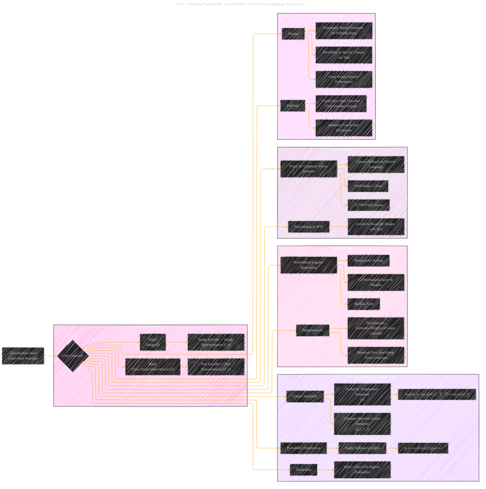

# Classification Head
> **Disclaimer:**
>
> This document contains my personal notes on the topic,
> compiled from publicly available documentation and various cited sources.
> The materials are intended for educational purposes, personal study, and reference.
> The content is dual-licensed:
> 1. **MIT License:** Applies to all code implementations (Swift, Mermaid, and other programming languages).
> 2. **Creative Commons Attribution 4.0 International License (CC BY 4.0):** Applies to all non-code content, including text, explanations, diagrams, and illustrations.
---

## A Diagrammatic Guide 

----

### Key improvements and explanations

*   **Focus on Classification Head:** The diagram specifically highlights the elements directly involved in the zero-shot classification process.
*   **Mathematical Equations Integrated:** Core equations used are directly within the steps.
*   **Training & Implementation Context:** Added that these aspects play a role.
*   **Interpretations and Design Aspects:** Clear depiction.

This diagram provides a structured, visual explanation of CLIP's classification head, making it easier to understand how the model performs zero-shot transfer by synthesizing classifiers from natural language descriptions.

---
**Licenses:**

- **MIT License:**   - Full text in [LICENSE](LICENSE) file.
- **Creative Commons Attribution 4.0 International:**  - Legal details in [LICENSE-CC-BY](LICENSE-CC-BY) and at [Creative Commons official site](http://creativecommons.org/licenses/by/4.0/).

---