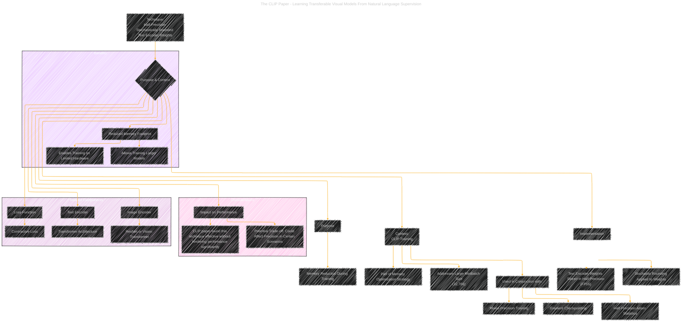

# Half-Precision Stochastically Rounded Text Encoder Weights
> **Disclaimer:**
>
> This document contains my personal notes on the topic,
> compiled from publicly available documentation and various cited sources.
> The materials are intended for educational purposes, personal study, and reference.
> The content is dual-licensed:
> 1. **MIT License:** Applies to all code implementations (Swift, Mermaid, and other programming languages).
> 2. **Creative Commons Attribution 4.0 International License (CC BY 4.0):** Applies to all non-code content, including text, explanations, diagrams, and illustrations.
---

## A Diagrammatic Guide 

---

### Key features of this diagram

*   **Focus on the Technique:** The main node is "Half-Precision Stochastically Rounded Text Encoder Weights," making it clear what the diagram is about.
*   **Context:** The "Context" subgraph connects the technique to the larger goal of efficiently training CLIP.  It highlights its relation to other memory-saving techniques.
*   **Implementation Details:** The "Implementation" subgraph specifies *how* the technique is applied.
*   **Benefits and Considerations:** Subgraphs highlight the positive effects and potential drawbacks.
*   **Connections:** Shows the part to other pieces of the CLIP model.
*   **Clear Labels:** The labels are concise and directly relate to the document.

---
**Licenses:**

- **MIT License:**   - Full text in [LICENSE](LICENSE) file.
- **Creative Commons Attribution 4.0 International:**  - Legal details in [LICENSE-CC-BY](LICENSE-CC-BY) and at [Creative Commons official site](http://creativecommons.org/licenses/by/4.0/).

---