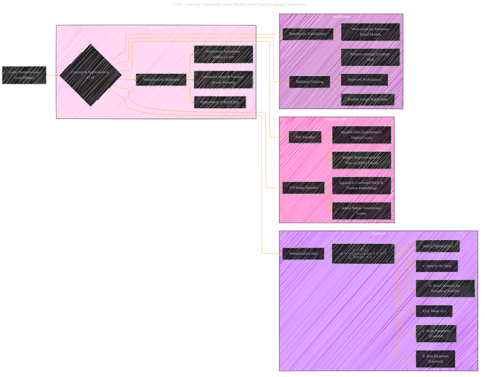

# Layer Normalization
> **Disclaimer:**
>
> This document contains my personal notes on the topic,
> compiled from publicly available documentation and various cited sources.
> The materials are intended for educational purposes, personal study, and reference.
> The content is dual-licensed:
> 1. **MIT License:** Applies to all code implementations (Swift, Mermaid, and other programming languages).
> 2. **Creative Commons Attribution 4.0 International License (CC BY 4.0):** Applies to all non-code content, including text, explanations, diagrams, and illustrations.
---

## A Diagrammatic Guide 

---

### Key improvements and explanations

*   **Mathematical Foundation:** The LaTeX equation makes the diagram technically precise and clear. The equation is then broken down, so that you can expect to see the terms that come out of the equation.
*   **Specific Application in CLIP:**  The visual representation of the different parts of LayerNorm is given, which are taken from the text.

This version creates a more structured explanation of Layer Normalization within the context of CLIP, and it focuses on the properties that are important to explain the role and purpose of this function.

---
**Licenses:**

- **MIT License:**   - Full text in [LICENSE](LICENSE) file.
- **Creative Commons Attribution 4.0 International:**  - Legal details in [LICENSE-CC-BY](LICENSE-CC-BY) and at [Creative Commons official site](http://creativecommons.org/licenses/by/4.0/).

---