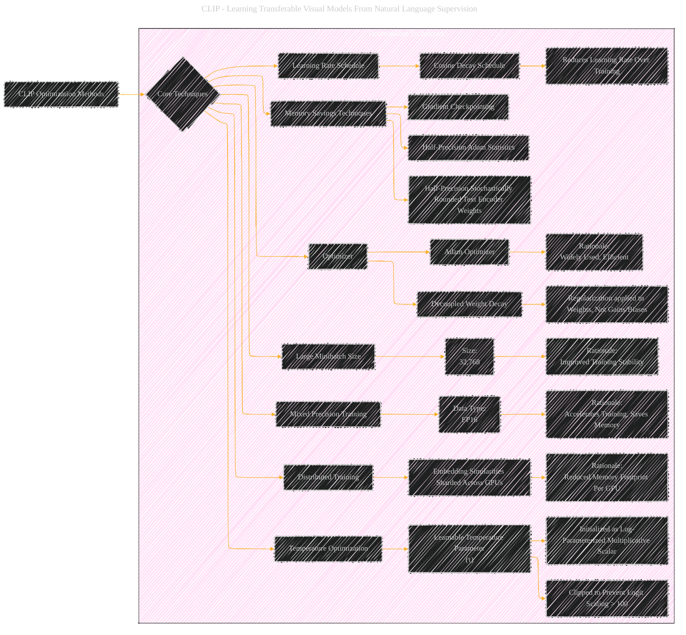

# Optimization Methods
> **Disclaimer:**
>
> This document contains my personal notes on the topic,
> compiled from publicly available documentation and various cited sources.
> The materials are intended for educational purposes, personal study, and reference.
> The content is dual-licensed:
> 1. **MIT License:** Applies to all code implementations (Swift, Mermaid, and other programming languages).
> 2. **Creative Commons Attribution 4.0 International License (CC BY 4.0):** Applies to all non-code content, including text, explanations, diagrams, and illustrations.
---

## A Diagrammatic Guide 

DOI: [10.13140/RG.2.2.11285.84962](http://dx.doi.org/10.13140/RG.2.2.11285.84962)

---

### Key explanations

*   **Adam Optimizer:**  The most important and widely used optimization approach in the study. The Adam optimizer is an algorithm for first-order gradient-based optimization of stochastic objective functions, based on adaptive estimates of lower-order moments.
*   **Decoupled Weight Decay Regularization:**  Addresses how the regularization is applied to the weights. Regularization techniques, such as weight decay, aim to prevent overfitting by adding a penalty term to the loss function. This helps in generalization.
*   **Cosine Learning Rate Schedule:** This schedule reduces the learning rate during training. Cosine annealing refers to a learning rate schedule that follows the cosine function. In this scheme, the learning rate starts at a maximum value and then decreases following a cosine curve.
*   **Temperature Optimization:** Learnable Temperature Parameter (τ) - a parameter of the softmax function that controls the steepness of the probability distribution.
*   **Large Minibatch Size** (32,768)
*   **Mixed Precision Training**
*   **Memory Savings Techniques:** Techniques to reduce memory requirements during training.

This structured visual summary captures the essential optimization techniques employed in CLIP.

---
**Licenses:**

- **MIT License:**   - Full text in [LICENSE](LICENSE) file.
- **Creative Commons Attribution 4.0 International:**  - Legal details in [LICENSE-CC-BY](LICENSE-CC-BY) and at [Creative Commons official site](http://creativecommons.org/licenses/by/4.0/).

---