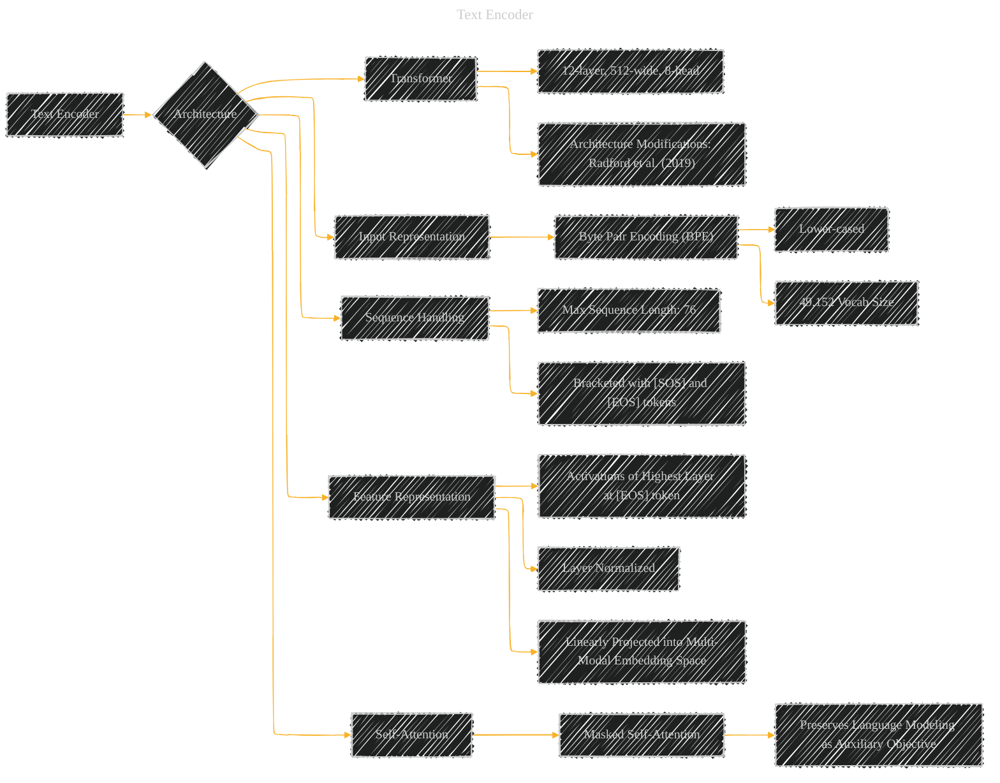

# Text Encoder
> **Disclaimer:**
>
> This document contains my personal notes on the topic,
> compiled from publicly available documentation and various cited sources.
> The materials are intended for educational purposes, personal study, and reference.
> The content is dual-licensed:
> 1. **MIT License:** Applies to all code implementations (Swift, Mermaid, and other programming languages).
> 2. **Creative Commons Attribution 4.0 International License (CC BY 4.0):** Applies to all non-code content, including text, explanations, diagrams, and illustrations.
---

## A Diagrammatic Guide 

---

### Explanation of Elements

*   **A (Text Encoder):** This is the main node representing the text encoder component of the CLIP model.
*   **B (Architecture):** Specifies the underlying architecture of the text encoder.
*   **C (Transformer):** Highlights the Transformer as the foundational model.
    *   **CA (12-layer, 512-wide, 8-head):** Defines the specific dimensions of the Transformer architecture.
    *   **CB (Architecture Modifications: Radford et al. (2019)):** Acknowledges that specific modifications to the standard Transformer architecture are used, referencing the source paper for further details.
*   **D (Input Representation):** Details how the input text is processed.
    *   **DA (Byte Pair Encoding (BPE)):**  Specifies the tokenization method used.
    *   **DAA (Lower-cased):** Indicates that the input text is converted to lowercase.
    *   **DAB (49,152 Vocab Size):** The size of the BPE vocabulary.
*   **E (Sequence Handling):** Describes how the input text sequence is handled.
    *   **EA (Max Sequence Length: 76):** The maximum length of the input text sequences.
    *   **EB (Bracketed with [SOS] and [EOS] tokens):** Describes the special tokens added to the beginning and end of the input.
*   **F (Feature Representation):** Specifies how the text encoder produces the final feature representation.
    *   **FA (Activations of Highest Layer at [EOS] token):** Highlights the specific layer and token used to generate the text feature.
    *   **FB (Layer Normalized):** Specifies the normalization applied to the feature.
    *   **FC (Linearly Projected into Multi-Modal Embedding Space):** Highlights how the feature is projected to a shared embedding space.
*   **G (Self-Attention):** Specifies details of the attention mechanism
    *   **GA (Masked Self-Attention):** The type of self-attention.
    *   **GAA (Preserves Language Modeling as Auxiliary Objective):** The reason for using masked self-attention.

This diagram provides a clear and concise overview of the CLIP text encoder architecture, its inputs, and outputs. The connections between the elements clearly illustrate how the different components interact to create the final text representation.

---
**Licenses:**

- **MIT License:**   - Full text in [LICENSE](LICENSE) file.
- **Creative Commons Attribution 4.0 International:**  - Legal details in [LICENSE-CC-BY](LICENSE-CC-BY) and at [Creative Commons official site](http://creativecommons.org/licenses/by/4.0/).

---