# The CLIP Model Architecture
> **Disclaimer:**
>
> This document contains my personal notes on the topic,
> compiled from publicly available documentation and various cited sources.
> The materials are intended for educational purposes, personal study, and reference.
> The content is dual-licensed:
> 1. **MIT License:** Applies to all code implementations (Swift, Mermaid, and other programming languages).
> 2. **Creative Commons Attribution 4.0 International License (CC BY 4.0):** Applies to all non-code content, including text, explanations, diagrams, and illustrations.
---

## A Diagrammatic Guide 

```mermaid
---
title: "CLIP - Learning Transferable Visual Models From Natural Language Supervision"
author: "Cong Le"
version: "1.0"
license(s): "MIT, CC BY 4.0"
copyright: "Copyright (c) 2025 Cong Le. All Rights Reserved."
config:
  layout: elk
  look: handDrawn
  theme: dark
---
%%%%%%%% Mermaid version v11.4.1-b.14
%%%%%%%% Toggle theme value to `base` to activate the initilization below for the customized theme version.
%%%%%%%% Available curve styles include the following keywords:
%% basis, bumpX, bumpY, cardinal, catmullRom, linear, monotoneX, monotoneY, natural, step, stepAfter, stepBefore.
%%{
  init: {
    "graph": { "htmlLabels": false, 'curve': 'linear' },
    'fontFamily': 'Fantasy',
    'themeVariables': {
      'primaryColor': '#ffff',
      'primaryTextColor': '#55ff',
      'primaryBorderColor': '#7c2',
      'lineColor': '#F8B229',
      'secondaryColor': '#006100',
      'tertiaryColor': '#fff'
    }
  }
}%%
graph TD
    A["CLIP Model Architecture"] --> B{"Components"}
    style A fill:#a3a3,stroke:#333,stroke-width:1px

    B --> C["Image Encoder"]
    C --> CA["ResNet Family<br>(RN50, RN101, RN50x{4,16,64})"]
    CA --> CAA["ResNet-D Improvements<br>(He et al., 2019)"]
    CA --> CAB["Anti-aliased Rect-2 Blur Pooling<br>(Zhang, 2019)"]
    CA --> CAC["Attention Pooling<br>(Replaces Global Average Pooling)"]
    C --> CB["Vision Transformer Family<br>(ViT-B/32, ViT-B/16, ViT-L/14, ViT-L/14@336px)"]
        CB --> CBA["Layer Normalization<br>(Additional Layer)"]
        CB --> CBB["Modified Initialization Scheme"]

    B --> D["Text Encoder"]
    D --> DA["Transformer<br>(Vaswani et al., 2017; Radford et al., 2019)"]
    DA --> DAA["63M Parameters<br>(12-layer, 512-wide, 8-head base)"]
    DA --> DAB["Lower-cased Byte Pair Encoding<br>(BPE)"]
    DA --> DAC["49,152 Vocabulary Size<br>(Sennrich et al., 2015)"]
    D --> DB["Max Sequence Length: 76"]
    D --> DC["Activations at [EOS] token"]
    D --> DD["Masked Self-Attention"]

    B --> E["Joint Embedding Space"]
    E --> EA["Linear Projection from I_f to I_e"]
    EA --> EAA["I_e = l2_normalize(np.dot(I_f, W_i), axis=1)"]
    EA --> EAB["W_i: Learned Projection Matrix"]
    
    E --> EB["Linear Projection from T_f to T_e"]
    EB --> EBA["T_e = l2_normalize(np.dot(T_f, W_t), axis=1)"]
    EB --> EBB["W_t: Learned Projection Matrix"]
    
    E --> EC["Cosine Similarity"]
    EC --> ECA["Scaled Pairwise Cosine Similarities"]
    EC --> ECB["$$logits = np.dot(I_e, T_e.T) * np.exp(τ)$$"]
    
```

DOI: [10.13140/RG.2.2.14641.29289](http://dx.doi.org/10.13140/RG.2.2.14641.29289)

----

### Key aspects of the diagram:

*   **Image Encoder Details:** More specific features of the ResNet (ResNet-D, Anti-aliased Pooling, Attention) and Vision Transformer (Layer Normalization, Initialization) variants used in CLIP are specified. This is helpful in highlighting the architectural choices made in the paper.
*   **Text Encoder Specifics:** Transformer details are clarified, including the parameter count, vocabulary size, and BPE encoding. This provides more technical detail for those familiar with NLP architectures.
*   **Joint Embedding:** Describes how the image and text features are projected into a shared embedding space and the Cosine Similarity is calculated, making it more clear on how different modalities interact.
*   **Explicit References:** The equations for the calculations.
*   **Emphasis on Relationships:**  Edges are used to explicitly show the relationships between different aspects of the CLIP model components.

---
**Licenses:**

- **MIT License:**   - Full text in [LICENSE](LICENSE) file.
- **Creative Commons Attribution 4.0 International:**  - Legal details in [LICENSE-CC-BY](LICENSE-CC-BY) and at [Creative Commons official site](http://creativecommons.org/licenses/by/4.0/).

---