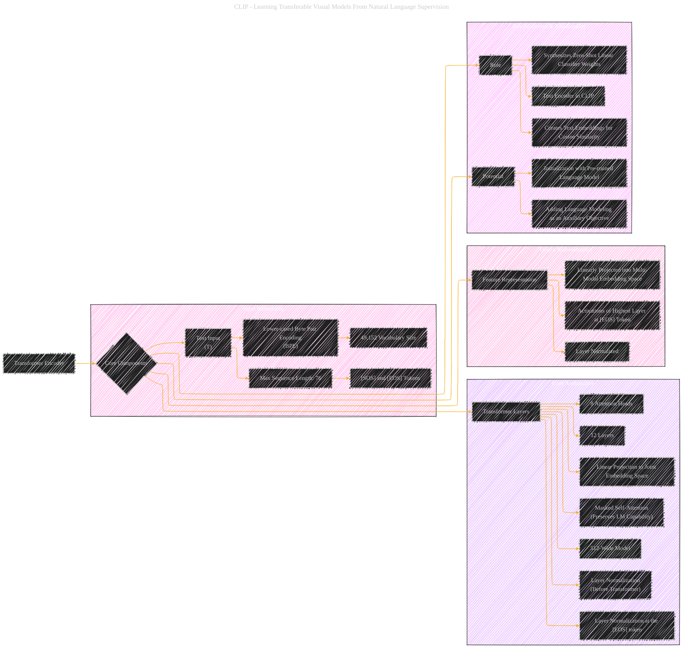

# Transformer Encoder
> **Disclaimer:**
>
> This document contains my personal notes on the topic,
> compiled from publicly available documentation and various cited sources.
> The materials are intended for educational purposes, personal study, and reference.
> The content is dual-licensed:
> 1. **MIT License:** Applies to all code implementations (Swift, Mermaid, and other programming languages).
> 2. **Creative Commons Attribution 4.0 International License (CC BY 4.0):** Applies to all non-code content, including text, explanations, diagrams, and illustrations.
---

## A Diagrammatic Guide 

DOI: [10.13140/RG.2.2.17996.73608](http://dx.doi.org/10.13140/RG.2.2.17996.73608)

---

### Explanation and Key Considerations

*   **Input Embedding:** It was specifically designed for CLIP's text encoding process. The BPE vocabulary size and sequence length are key architectural details.
*   **Core Architecture:** All specific details of Transformer Architecture were mentioned from the document.
*   **Output Representation:** Clearly specifies how to extract feature representation from the text encoder.
*   **Key Properties & Functionality:**  Highlights the role and utility of the transformer encoder in CLIP.

---
**Licenses:**

- **MIT License:**   - Full text in [LICENSE](LICENSE) file.
- **Creative Commons Attribution 4.0 International:**  - Legal details in [LICENSE-CC-BY](LICENSE-CC-BY) and at [Creative Commons official site](http://creativecommons.org/licenses/by/4.0/).

---