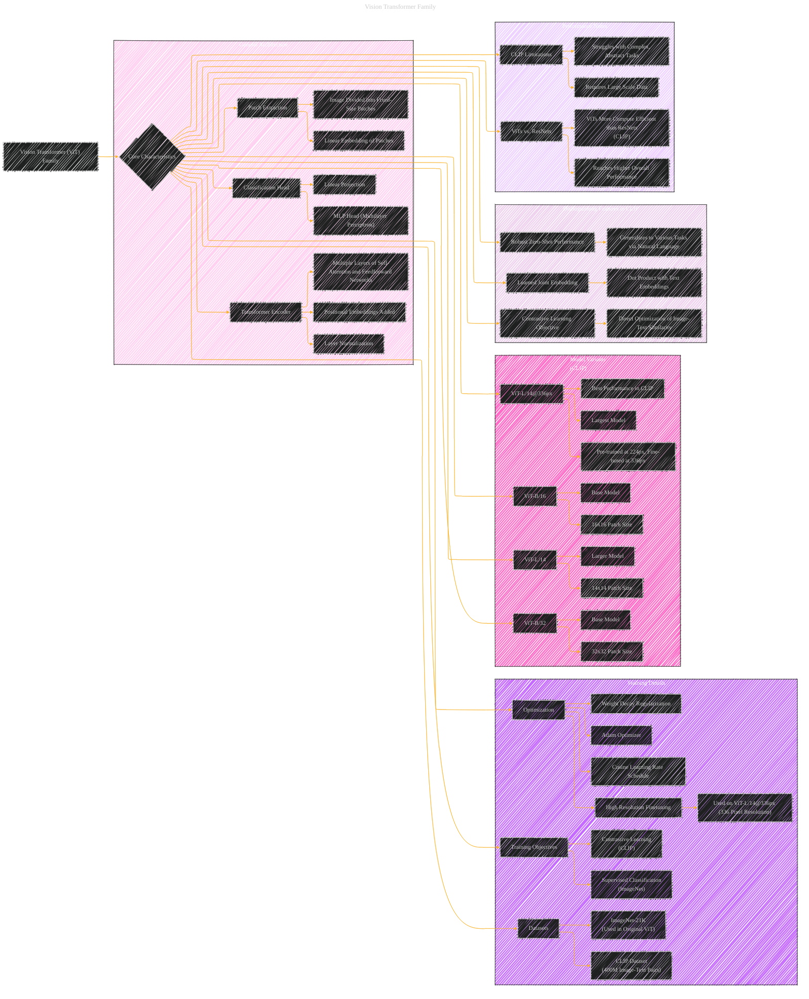

# Vision Transformer Family
> **Disclaimer:**
>
> This document contains my personal notes on the topic,
> compiled from publicly available documentation and various cited sources.
> The materials are intended for educational purposes, personal study, and reference.
> The content is dual-licensed:
> 1. **MIT License:** Applies to all code implementations (Swift, Mermaid, and other programming languages).
> 2. **Creative Commons Attribution 4.0 International License (CC BY 4.0):** Applies to all non-code content, including text, explanations, diagrams, and illustrations.
---

## A Diagrammatic Guide 

---

### Explanations

*   **Distinguishing Features:** Added a specific section on the unique characteristics of Vision Transformers when used within CLIP, focusing on the dot product with text embeddings and the contrastive learning objective.
*   **Concrete Examples:** included patch size and other distinguishing properties.
*   **Highlights Key Results:** More direct mention of how the performance and efficiency compares to ResNet architectures.
*   **Clearer Organization:** Reorganized for better flow and readability.

This structure provides a complete and detailed overview of the Vision Transformer family within the context of the CLIP paper. It outlines the core characteristics, training details, different model variants, and performance highlights.

---
**Licenses:**

- **MIT License:**   - Full text in [LICENSE](LICENSE) file.
- **Creative Commons Attribution 4.0 International:**  - Legal details in [LICENSE-CC-BY](LICENSE-CC-BY) and at [Creative Commons official site](http://creativecommons.org/licenses/by/4.0/).

---