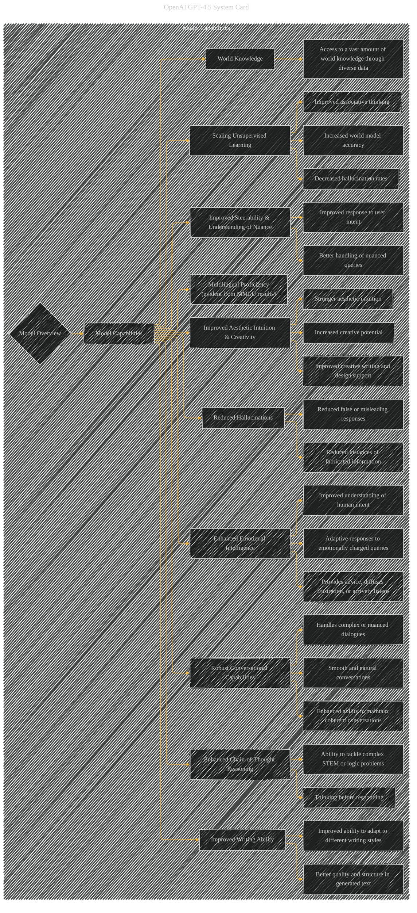

# Model Capabilities
> **Disclaimer:**
>
> This document contains my personal notes on the topic,
> compiled from publicly available documentation and various cited sources.
> The materials are intended for educational purposes, personal study, and reference.
> The content is dual-licensed:
> 1. **MIT License:** Applies to all code implementations (Swift, Mermaid, and other programming languages).
> 2. **Creative Commons Attribution 4.0 International License (CC BY 4.0):** Applies to all non-code content, including text, explanations, diagrams, and illustrations.
---

## Model Capabilities - A Diagrammatic Guide 

---

### Explanation of Changes and Additions

This revised `Model_Capabilities` subgraph directly reflects the capabilities described in the original document, linking each to specific sub-elements where appropriate.

* **More Specific and Detailed Nodes:** The nodes are now more specific, avoiding vague terms like "Improved Capabilities" and instead highlighting *what* aspects of capability were improved. For instance, 'Scaling Unsupervised Learning' is now broken down into more concrete elements like 'Increased world model accuracy', 'Decreased hallucination rates', and 'Improved associative thinking.'
* **Direct Connections to Supporting Information:** Connections are made between the core capabilities and the supporting details in the original document.  For example, 'Multilingual Proficiency' is explicitly linked to the MMLU evaluation results.
* **Clearer Relationship Representation:** The use of arrows makes the connections between the core capabilities and their sub-elements explicit and easy to understand.

---
**Licenses:**

- **MIT License:**   - Full text in [LICENSE](LICENSE) file.
- **Creative Commons Attribution 4.0 International:**  - Legal details in [LICENSE-CC-BY](LICENSE-CC-BY) and at [Creative Commons official site](http://creativecommons.org/licenses/by/4.0/).

---