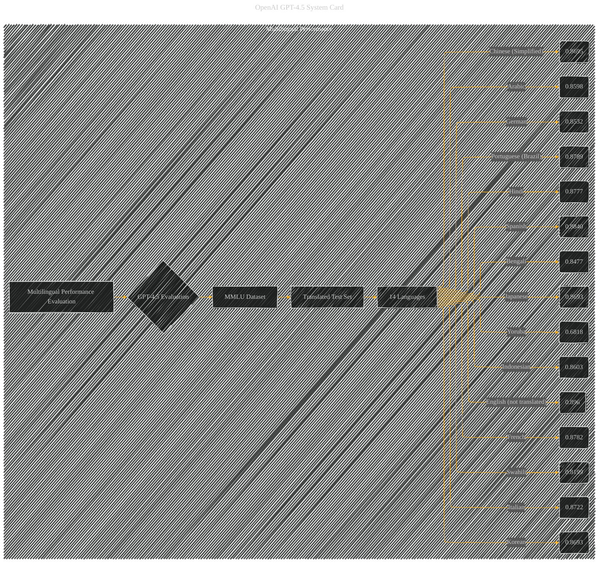

# Multilingual Performance
> **Disclaimer:**
>
> This document contains my personal notes on the topic,
> compiled from publicly available documentation and various cited sources.
> The materials are intended for educational purposes, personal study, and reference.
> The content is dual-licensed:
> 1. **MIT License:** Applies to all code implementations (Swift, Mermaid, and other programming languages).
> 2. **Creative Commons Attribution 4.0 International License (CC BY 4.0):** Applies to all non-code content, including text, explanations, diagrams, and illustrations.
---

## Multilingual Performance - A Diagrammatic Guide 

---

### Explanation

This Mermaid diagram specifically visualizes the multilingual performance evaluation of GPT-4.5.

* **Multilingual Performance Evaluation (A):**  The top-level node representing the overall evaluation.
* **MMLU Dataset (C):** The dataset used for the multilingual evaluation.
* **Translated Test Set (D):** The test set within the MMLU dataset, specifically translated for this evaluation.
* **14 Languages (E):** The languages included in the translated test set, each represented by a node.
* **Scores (F-T):**  The performance score (accuracy) of GPT-4.5 on the translated test set for each of the 14 languages.  These scores are directly taken from Table 16 in the original document.

---

### Important Considerations

* **Clarity and Focus:** The diagram is focused solely on the multilingual performance evaluation results.
* **Data Representation:** The numerical scores are explicitly displayed for each language. This directly reflects the information provided in the original data.
* **Conciseness:** The diagram avoids unnecessary complexity while retaining the core information.

This diagram effectively visualizes the multilingual performance of GPT-4.5, highlighting the scores achieved for each language in the MMLU evaluation.  Remember, this diagram relies on the accuracy of the scores from the original source document.

---
**Licenses:**

- **MIT License:**   - Full text in [LICENSE](LICENSE) file.
- **Creative Commons Attribution 4.0 International:**  - Legal details in [LICENSE-CC-BY](LICENSE-CC-BY) and at [Creative Commons official site](http://creativecommons.org/licenses/by/4.0/).

---