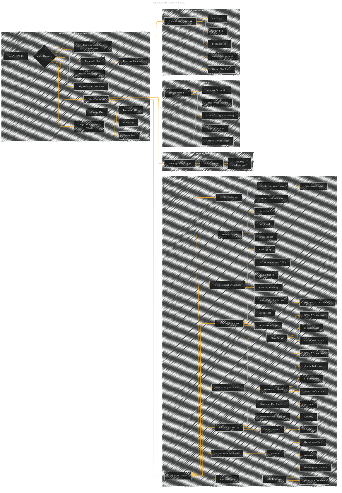

# OpenAI GPT-4.5
> **Disclaimer:**
>
> This document contains my personal notes on the topic,
> compiled from publicly available documentation and various cited sources.
> The materials are intended for educational purposes, personal study, and reference.
> The content is dual-licensed:
> 1. **MIT License:** Applies to all code implementations (Swift, Mermaid, and other programming languages).
> 2. **Creative Commons Attribution 4.0 International License (CC BY 4.0):** Applies to all non-code content, including text, explanations, diagrams, and illustrations.
---

## OpenAI GPT-4.5 - A Diagrammatic Guide 

----

### Explanation and Improvements

This revised Mermaid diagram is significantly more detailed and organized based on the provided text.

* **Subgraphs:**  The subgraphs now provide clear groupings for different evaluation types and model characteristics.
* **Relationships:**  Connectors are added to show the relationships between the components of the system and the evaluations.
* **Evaluation Metrics:**  Nodes like "PersonQA" now explicitly link to the metrics measured within those evaluations, like "Accuracy" and "Hallucination Rate."
* **Red Teaming and Apollo Research:** The structure has been significantly refined to clearly differentiate between various red teaming evaluations and the independent evaluation from Apollo.
* **Preparedness Framework:** A dedicated subgraph now encapsulates the evaluation results through the lens of the OpenAI Preparedness Framework.
* **Clearer Visual Representation:**  The use of distinct node colors (or shapes) could further enhance clarity.  Consider different colors for the various evaluation categories (e.g., red for harmful content, blue for robustness).

This detailed structure provides a more accurate and comprehensive visualization of the OpenAI GPT-4.5 system card's content.  Remember that numerical results from the tables should be incorporated into the relevant evaluation nodes in subgraph "Safety Evaluation Details" to make the visualization actionable.

---
**Licenses:**

- **MIT License:**   - Full text in [LICENSE](LICENSE) file.
- **Creative Commons Attribution 4.0 International:**  - Legal details in [LICENSE-CC-BY](LICENSE-CC-BY) and at [Creative Commons official site](http://creativecommons.org/licenses/by/4.0/).

---