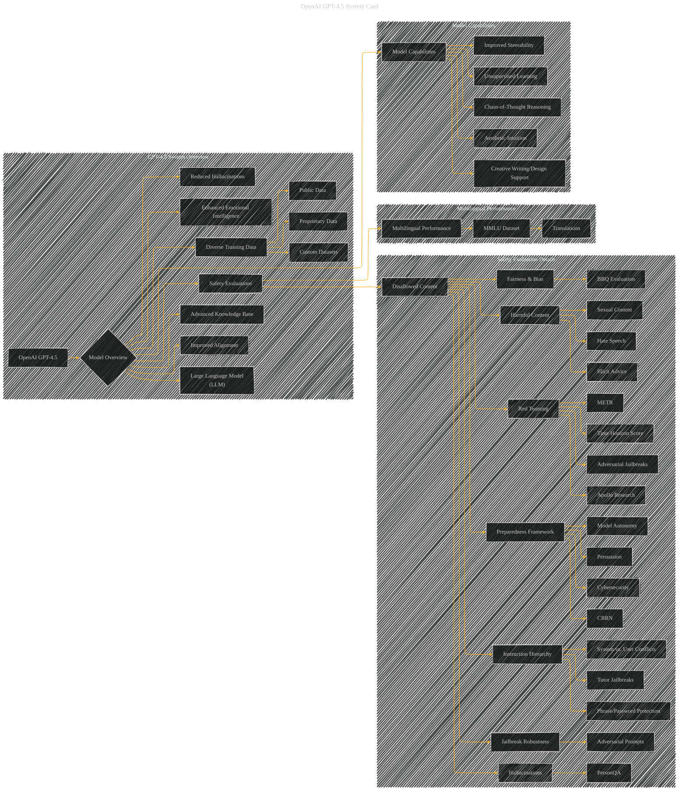

# OpenAI GPT-4.5 System Card Paper Overview
> **Disclaimer:**
>
> This document contains my personal notes on the topic,
> compiled from publicly available documentation and various cited sources.
> The materials are intended for educational purposes, personal study, and reference.
> The content is dual-licensed:
> 1. **MIT License:** Applies to all code implementations (Swift, Mermaid, and other programming languages).
> 2. **Creative Commons Attribution 4.0 International License (CC BY 4.0):** Applies to all non-code content, including text, explanations, diagrams, and illustrations.
---

## OpenAI GPT-4.5 System Card - A Diagrammatic Guide 

---

### Explanation of the Diagram

This Mermaid diagram uses subgraphs to organize the different aspects of the GPT-4.5 system card.

* **GPT-4.5 System Overview:** This subgraph provides a high-level view of the model, its key strengths, and its training data sources.
* **Safety Evaluation Details:** This subgraph delves deeper into the various safety evaluation methods used, categorizing them for better understanding.  Note that this subgraph is quite detailed and contains sub-nodes for each specific evaluation.  Tables within the original document would need to be included as supporting data to this diagram.
* **Multilingual Performance:** This subgraph focuses on the multilingual performance evaluation aspect.
* **Model Capabilities:**  This subgraph highlights the model's advanced capabilities, including unsupervised learning and chain-of-thought reasoning, as well as improved steerability and aesthetic intuition.

---

### Important Considerations and Improvements

* **Tables:**  The diagram is meant to be a conceptual outline.  To make it fully functional, incorporate the results from the tables in the original document into the diagram.  For example, include the scores (and 95% confidence intervals) from the various evaluations in J (Safety Evaluation Details).
* **Connectors:** Add more specific connectors between nodes to show the relationships between different parts of the system.
* **Visual Cues:**  Use different shapes or colors for different types of nodes (e.g., model evaluations, data types) to enhance readability and clarity.
* **Complexity:** The diagram is still quite complex. Break down subgraphs further if necessary to avoid overwhelming the viewer with details.  This would depend on the level of detail required by the user.

This revised structure provides a better visual representation of the key concepts, allowing for a more comprehensive understanding of the OpenAI GPT-4.5 system card. Remember to add the numerical data from the tables into the diagram to make it fully functional.

---
**Licenses:**

- **MIT License:**   - Full text in [LICENSE](LICENSE) file.
- **Creative Commons Attribution 4.0 International:**  - Legal details in [LICENSE-CC-BY](LICENSE-CC-BY) and at [Creative Commons official site](http://creativecommons.org/licenses/by/4.0/).

---