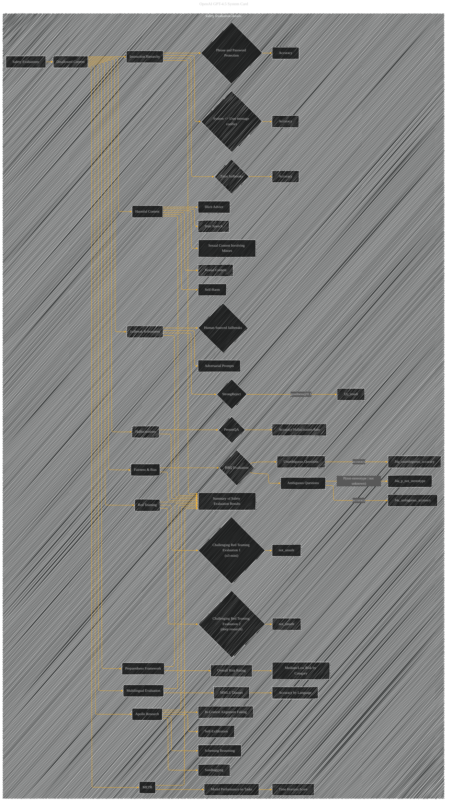

# Safety Evaluation Details
> **Disclaimer:**
>
> This document contains my personal notes on the topic,
> compiled from publicly available documentation and various cited sources.
> The materials are intended for educational purposes, personal study, and reference.
> The content is dual-licensed:
> 1. **MIT License:** Applies to all code implementations (Swift, Mermaid, and other programming languages).
> 2. **Creative Commons Attribution 4.0 International License (CC BY 4.0):** Applies to all non-code content, including text, explanations, diagrams, and illustrations.
---

## Safety Evaluation Details - A Diagrammatic Guide 

---

### Explanation

This subgraph, "Safety Evaluation Details," is a more comprehensive and detailed representation of the safety evaluation aspects of GPT-4.5.

* **Nodes:** Each node represents a specific evaluation type or dataset (e.g., "Disallowed Content," "Jailbreak Robustness").
* **Sub-nodes:**  Sub-nodes break down the broader evaluation categories into their specific components (e.g., "Hate Speech," "Illicit Advice").
* **Results:**  Key results from the tables (e.g., accuracy scores, hallucination rates) are represented by nodes like "J3a_result" and are linked to their parent evaluations.
* **Summary:** The summary node, "J_summary", consolidates the results across all safety evaluations.
* **Clarity and Structure:** The use of subgraphs and detailed connections enhances the clarity of the different evaluation methods and their relationships.
* **Preparedness Framework Integration:**  The node "J10" and its sub-nodes directly represent the risk assessment framework.

---

### Key Improvements

* **Explicit Categories:**  Clearly defines the different categories of safety concerns.
* **Linking to Results:**  Connects each evaluation to the relevant metrics and results (e.g., accuracy, rates).
* **Visual Hierarchy:**  The use of subgraphs and links creates a clear visual hierarchy, making the diagram easier to navigate and understand.
* **Readability:**  The diagram is more organized and readable, focusing on clarity and avoiding overwhelming the viewer with excessive detail.

---

### Important Considerations

* **Table Data Integration:** Replace placeholders like "J3a_result" with specific values from the original tables, as well as any confidence intervals reported.
* **Confidence Intervals:** Include the 95% confidence intervals for the results in the nodes. This reflects the inherent variability in the evaluation results.

This diagram provides a more structured and comprehensive view of the safety evaluation results for GPT-4.5, ready for detailed analysis. Remember to replace the placeholder values with the actual data from the original tables.

---
**Licenses:**

- **MIT License:**   - Full text in [LICENSE](LICENSE) file.
- **Creative Commons Attribution 4.0 International:**  - Legal details in [LICENSE-CC-BY](LICENSE-CC-BY) and at [Creative Commons official site](http://creativecommons.org/licenses/by/4.0/).

---