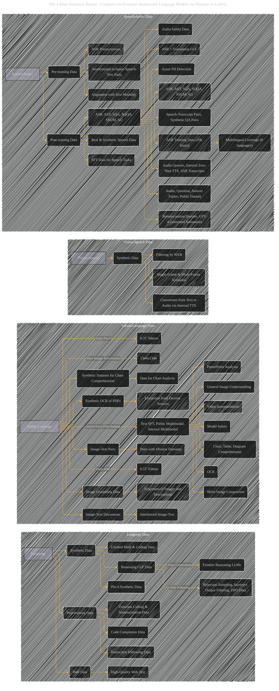

# Data Details
> **Disclaimer:**
>
> This document contains my personal notes on the topic,
> compiled from publicly available documentation and various cited sources.
> The materials are intended for educational purposes, personal study, and reference.
> The content is dual-licensed:
> 1. **MIT License:** Applies to all code implementations (Swift, Mermaid, and other programming languages).
> 2. **Creative Commons Attribution 4.0 International License (CC BY 4.0):** Applies to all non-code content, including text, explanations, diagrams, and illustrations.
---

## Data Details - A Diagrammatic Guide

----

### Explanation of Improvements and Data Detailing

* **Clearer Categorization:** The subgraphs now more accurately reflect the categories of data.  Instead of just "Data," we now have subgraphs for "Language Data," "Vision-Language Data," "Vision-Speech Data," and "Speech/Audio Data."
* **Data Source Specificity:**  The arrows now lead to more specific data sources (e.g., "High-Quality Web Text," "Curated Math & Coding Data," "Rejection Sampling").  This makes the data sources more concrete.
* **Data Characteristics:**  Added details about data characteristics (e.g., data size in tokens, maximum image resolution, and multilingual coverage).
* **Explicit Data Relationships:** The arrows show *how* the data is generated (e.g., reasoning CoT data is generated by frontier models).
* **Safety Considerations:** The data used for safety alignment is also categorized and shows how these are connected to the main model training.
* **Emphasis on Synthesis:**  The diagram now more prominently displays how synthetic data plays a crucial role in training, especially for reasoning and coding tasks.
* **Data Preprocessing:**  The role of data filtering, rejection sampling, and PII detection is more apparent.

This revised diagram provides a much more detailed and accurate representation of the data utilized in training Phi-4-Mini and Phi-4-Multimodal. Remember that this diagram is a simplification; real-world datasets often have more complex structures and relationships.  You can further enhance the diagram with specific dataset names and sizes for each component.

---
**Licenses:**

- **MIT License:**   - Full text in [LICENSE](LICENSE) file.
- **Creative Commons Attribution 4.0 International:**  - Legal details in [LICENSE-CC-BY](LICENSE-CC-BY) and at [Creative Commons official site](http://creativecommons.org/licenses/by/4.0/).

---