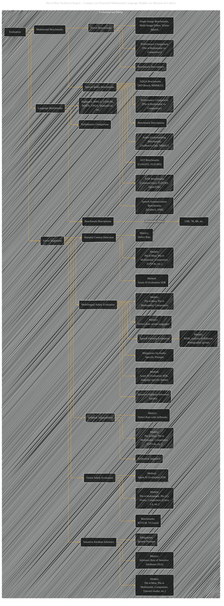

# Evaluation and Safety
> **Disclaimer:**
>
> This document contains my personal notes on the topic,
> compiled from publicly available documentation and various cited sources.
> The materials are intended for educational purposes, personal study, and reference.
> The content is dual-licensed:
> 1. **MIT License:** Applies to all code implementations (Swift, Mermaid, and other programming languages).
> 2. **Creative Commons Attribution 4.0 International License (CC BY 4.0):** Applies to all non-code content, including text, explanations, diagrams, and illustrations.
---

## Evaluation and Safety  - A Diagrammatic Guide

----

### Explanation and Improvements

* **Clearer Structure:** The graph now explicitly shows the different types of benchmarks (language, multimodal, speech/audio) and safety evaluations (harmful content, jailbreaks, sensitive attribute inference, multilingual, vision safety).
* **Metrics and Methods:** Each evaluation type now has specific metrics (e.g., Defect Rate, IPRR, VPRR, WER) and methods (e.g., Azure AI Evaluation SDK, XSTest framework) associated with it.
* **Comparison Focus:** The emphasis on comparing Phi-4-Mini/Multimodal to competitors (GPT-4, other LLMs) is clearer. Parameter sizes are explicitly noted.
* **Detailed Benchmarks:** Individual benchmarks (e.g., BigBench, MMLU, CommonVoice) are listed, promoting a more thorough view of the evaluation scope.
* **Mitigations:** Explicitly shows the use of system prompts and other mitigation strategies.

This significantly improved graph provides a more comprehensive overview of the evaluation and safety aspects of the Phi-4-Mini/Multimodal models, including the methodologies and metrics used to assess their capabilities and limitations compared to other models. Remember to add specific benchmark results and quantitative data for each evaluation point within the nodes to make the graph truly informative. Remember to add quantitative data for each of these benchmarks and include actual values.

---
**Licenses:**

- **MIT License:**   - Full text in [LICENSE](LICENSE) file.
- **Creative Commons Attribution 4.0 International:**  - Legal details in [LICENSE-CC-BY](LICENSE-CC-BY) and at [Creative Commons official site](http://creativecommons.org/licenses/by/4.0/).

---