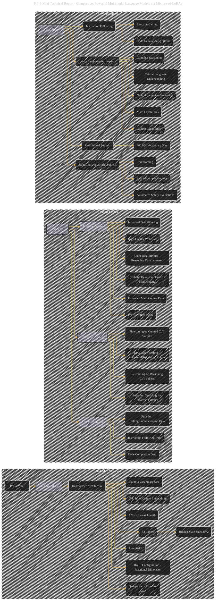

# Phi-4-Mini Technical Report - Compact yet Powerful Multimodal Language Models via Mixture-of-LoRAs
> **Disclaimer:**
>
> This document contains my personal notes on the topic,
> compiled from publicly available documentation and various cited sources.
> The materials are intended for educational purposes, personal study, and reference.
> The content is dual-licensed:
> 1. **MIT License:** Applies to all code implementations (Swift, Mermaid, and other programming languages).
> 2. **Creative Commons Attribution 4.0 International License (CC BY 4.0):** Applies to all non-code content, including text, explanations, diagrams, and illustrations.
---

## Phi-4-Mini Technical Report - Paper Overview

----

**Explanation:**

This Mermaid graph provides a more focused and detailed visualization of Phi-4-Mini, incorporating the training data and key capabilities mentioned in the original text.

*   **Subgraphs:**  Logical grouping of related information (Overview, Training, Key Capabilities).
*   **Relationships:** Clear arrows show how different components and training stages relate to each other.
*   **Specificity:**  More detailed nodes (e.g., "Hidden State Size: 3072," "128K Context Length") convey the key architectural choices of Phi-4-Mini.
*   **Training Details:** Explicitly shows the importance of curated synthetic data, particularly for math/coding, and the multi-stage approach to reasoning training.
*   **Key Capabilities:**  Highlights the model's core strengths, including strong language performance, instruction following, coding, multilingual support, and safety alignment efforts.

**Further Refinements:**

To enhance this diagram even further, you could:

*   **Quantify Data:** Add size estimates for the different training datasets (e.g., "5 trillion pre-training data corpus").
*   **Benchmark Scores:**  Include benchmark scores for Phi-4-Mini on relevant tasks (e.g., "Strong performance on MMLU").
*   **Specific Techniques:** Specify details like the type of synthetic data generated, specific filtering methods, or exact types of post-training data.
*   **Visual Cues:** Use different colors or shapes for different types of data or model components (e.g., synthetic data in a different shade, different shapes for different stages of training).

---
**Licenses:**

- **MIT License:**   - Full text in [LICENSE](LICENSE) file.
- **Creative Commons Attribution 4.0 International:**  - Legal details in [LICENSE-CC-BY](LICENSE-CC-BY) and at [Creative Commons official site](http://creativecommons.org/licenses/by/4.0/).

---