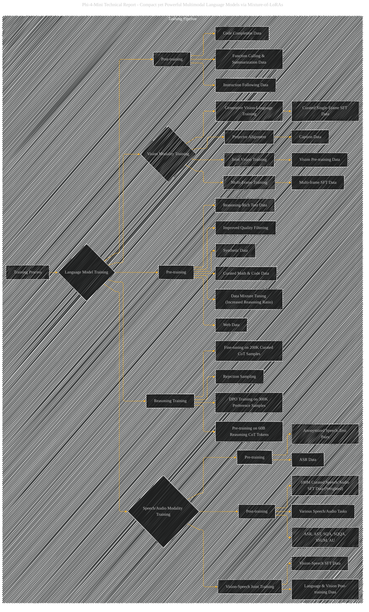

# Training Pipeline
> **Disclaimer:**
>
> This document contains my personal notes on the topic,
> compiled from publicly available documentation and various cited sources.
> The materials are intended for educational purposes, personal study, and reference.
> The content is dual-licensed:
> 1. **MIT License:** Applies to all code implementations (Swift, Mermaid, and other programming languages).
> 2. **Creative Commons Attribution 4.0 International License (CC BY 4.0):** Applies to all non-code content, including text, explanations, diagrams, and illustrations.
---

## Training Pipeline - A Diagrammatic Guide

---

### Explanation and Improvements over Previous Version

* **Explicit Data Sources:**  This version now explicitly shows the types of data used for each training stage. For example, "B1a[Web Data]," "B1b[Synthetic Data]," and "B1c[Curated Math & Code Data]" make it clear where the training data originates. This is a significant improvement for clarity.
* **Modality-Specific Stages:**  Training stages for vision and speech/audio are clearly delineated and linked to their respective pre-training, post-training, and joint training phases.  This improved structure makes the complex multimodal training pipeline more understandable.
* **Reasoning Training Stage:**  A dedicated stage for reasoning training, reflecting the specific pre-training, fine-tuning, and preference labeling processes.
* **Data Filtering and Tuning:**  Explicit nodes (B1e, B1f) highlight the crucial steps of data filtering and mixture tuning, which are crucial parts of the training process.
* **Weighted Data:**  Clarifies that speech/audio post-training uses weighted data.
* **Context Length:**  While not directly shown in the pipeline, consideration for the context length of different tasks (e.g., 64k for multi-image) could be added as annotations.

----

### Further Refinements (Not in the Diagram, But Crucial)

* **Dataset Sizes:**  Add annotations to specify the approximate sizes of the training datasets (e.g., "B1a [Web Data (trillions of tokens)]").
* **Parameter Counts:**  Add annotations to note the parameter counts of different models (e.g., Phi-4-Mini).
* **Specific Techniques:**  Consider adding annotations for specific techniques like "Rejection Sampling" (E2) or "weighted data" within the appropriate nodes.
* **Language Support:**  Include details about the number of supported languages within the respective nodes for language data.

This refined flowchart provides a more accurate and comprehensive visualization of the training pipeline.  It is now a more detailed and informative representation of the model training process described in the technical report. Remember to supplement this diagram with tables, charts, or other visual aids to present the evaluation results for a complete picture of the training process.

---
**Licenses:**

- **MIT License:**   - Full text in [LICENSE](LICENSE) file.
- **Creative Commons Attribution 4.0 International:**  - Legal details in [LICENSE-CC-BY](LICENSE-CC-BY) and at [Creative Commons official site](http://creativecommons.org/licenses/by/4.0/).

---