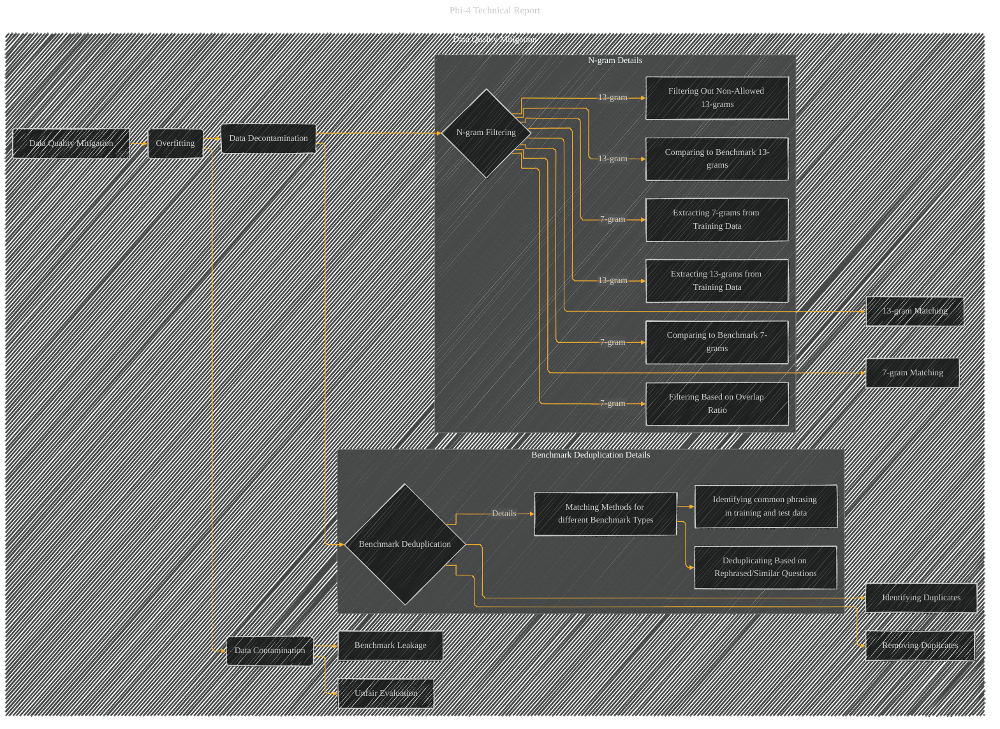

# Data Quality Mitigation
> **Disclaimer:**
>
> This document contains my personal notes on the topic,
> compiled from publicly available documentation and various cited sources.
> The materials are intended for educational purposes, personal study, and reference.
> The content is dual-licensed:
> 1. **MIT License:** Applies to all code implementations (Swift, Mermaid, and other programming languages).
> 2. **Creative Commons Attribution 4.0 International License (CC BY 4.0):** Applies to all non-code content, including text, explanations, diagrams, and illustrations.
---

## Data Quality Mitigation - A Diagrammatic Guide

---

### Explanation

This Mermaid diagram focuses specifically on the "Data Quality Mitigation" aspect of the phi-4 development, drawing from the provided document.  It highlights the key steps and considerations in preventing overfitting and data contamination during the evaluation process.  The diagram uses subgraphs for better organization of related concepts.

* **Overfitting (B):**  This represents the core problem addressed by the data quality mitigation techniques.

* **Data Decontamination (C):** This is the overall process of removing potentially contaminating elements from the training data.

* **N-gram Filtering (D):**  The process of checking for overlaps between training and test data using n-grams of varying lengths (13 and 7). The subgraph `Ngram_Details` provides further details on the extraction, comparison, and filtering procedures for both 13-gram and 7-gram overlaps.

* **Benchmark Deduplication (E):** This subgraph further breaks down the process of identifying and removing duplicates, including rephrased questions and similar phrasing, which could lead to unintended bias in the evaluation.  The `Benchmark_Deduplication_Details` subgraph offers more granular detail regarding the method.

* **Data Contamination (F):**  This node clarifies the core issue: the potential for leakage of test set information into the training data, leading to overfitting and inaccurate evaluation.

* **General Relationships (arrows):** The arrows clearly demonstrate how data decontamination and benchmark deduplication work together to mitigate overfitting and data contamination, ultimately improving the evaluation's accuracy and reliability.

This detailed diagram provides a clearer visual representation of the data quality mitigation strategy implemented in phi-4, emphasizing the specific techniques and their relationships. Note that this diagram can be further expanded if needed to include specific algorithms or data structures used in the filtering process.

---
**Licenses:**

- **MIT License:**   - Full text in [LICENSE](LICENSE) file.
- **Creative Commons Attribution 4.0 International:**  - Legal details in [LICENSE-CC-BY](LICENSE-CC-BY) and at [Creative Commons official site](http://creativecommons.org/licenses/by/4.0/).

---