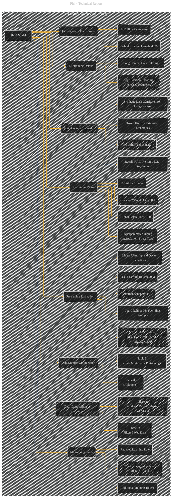

# Model Architecture and Training
> **Disclaimer:**
>
> This document contains my personal notes on the topic,
> compiled from publicly available documentation and various cited sources.
> The materials are intended for educational purposes, personal study, and reference.
> The content is dual-licensed:
> 1. **MIT License:** Applies to all code implementations (Swift, Mermaid, and other programming languages).
> 2. **Creative Commons Attribution 4.0 International License (CC BY 4.0):** Applies to all non-code content, including text, explanations, diagrams, and illustrations.
---

## Model Architecture and Training - A Diagrammatic Guide

---

### Explanation

This Mermaid diagram depicts the Phi-4 model architecture and training process, breaking down the key components. Subgraphs improve readability and organization.

* **Model Architecture and Training (Subgraph):** This section highlights the core elements of the model and its training procedures.  Nodes clearly label parameters, token counts, and optimization strategies.  The diagram connects pretraining and midtraining phases, emphasizing the gradual increase in context length.  It also includes how model performance is evaluated during pretraining and the role of data composition.

* **Data Sources and Mixture (Subgraph):**  This section clarifies the different sources of data utilized for training.  It separates synthetic data generation techniques from organic data curation strategies, highlighting the various data types employed in the pretraining process.

* **Evaluation (Subgraph):** This subgraph illustrates the different evaluation frameworks used to assess the model's performance. It connects benchmark datasets to evaluation metrics.  Crucially, it highlights the use of both internal and external benchmarks.

* **Training Details (Subgraph):** Tables and figures from the original document are explicitly linked to provide detailed analysis of the model's training procedure.

**Key Improvements and Considerations:**

* **Explicit Links to Data:** The diagram explicitly connects data sources (web, code, etc.) to the pretraining and synthetic data generation stages. This clarifies how different data types contribute to the model's training and performance.

* **Detailed Hyperparameters:**  Nodes explicitly represent key hyperparameters (learning rate, batch size, weight decay) to provide a complete overview of the training process.

* **Clear Distinction Between Phases:** Pretraining and midtraining are shown as distinct phases, highlighting the different objectives and strategies involved.

* **Evaluation Focus:**  The diagram emphasizes both internal (PhiBench) and external (MMLU, GPQA, etc.) benchmarks to show the model's evaluation process.  The diagram also highlights long-context evaluation using the HELMET benchmark.

This improved diagram provides a more comprehensive and structured view of Phi-4's architecture and training process, aligning closely with the provided documentation and making it easier to understand the various aspects of its development. Remember to adjust details based on any specific requirements for further clarification.

---
**Licenses:**

- **MIT License:**   - Full text in [LICENSE](LICENSE) file.
- **Creative Commons Attribution 4.0 International:**  - Legal details in [LICENSE-CC-BY](LICENSE-CC-BY) and at [Creative Commons official site](http://creativecommons.org/licenses/by/4.0/).

---