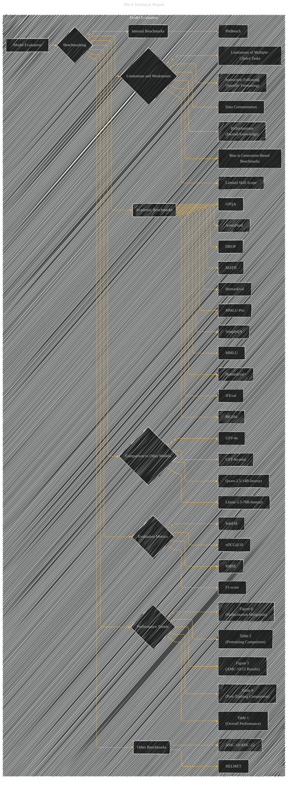

# Model Evaluation
> **Disclaimer:**
>
> This document contains my personal notes on the topic,
> compiled from publicly available documentation and various cited sources.
> The materials are intended for educational purposes, personal study, and reference.
> The content is dual-licensed:
> 1. **MIT License:** Applies to all code implementations (Swift, Mermaid, and other programming languages).
> 2. **Creative Commons Attribution 4.0 International License (CC BY 4.0):** Applies to all non-code content, including text, explanations, diagrams, and illustrations.
---

## Model Evaluation - A Diagrammatic Guide

---

### Explanation

This Mermaid diagram provides a more detailed and structured view of the model evaluation aspects of the phi-4 technical report. It incorporates the evaluation process, metrics, benchmarks, and crucial observations about performance, weaknesses, and limitations.

* **Subgraphs:** Organize related concepts into subgraphs for better clarity (e.g., `Academic Benchmarks`, `Internal Benchmarks`).
* **Nodes:** Represent specific benchmarks, evaluation metrics, and model comparisons using more detailed labels (e.g., `MMLU`, `RMSE`, `Qwen-2.5-14B-Instruct`).
* **Edges:** Illustrate the relationships between components of the evaluation process (e.g., `Academic Benchmarks` are evaluated using `Evaluation Metrics`).
* **Performance Trends:** Explicitly link to tables and figures that show performance trends over time or across different conditions (e.g., `Table 1`, `Figure 1`, `Table 9`). This helps connect the visual representations to the quantitative data presented in the report.
* **Limitations and Weaknesses:**  A dedicated subgraph highlights the limitations and weaknesses identified in the evaluation, drawing connections to the report's discussions on these issues.

This more comprehensive diagram allows for a better understanding of the model evaluation strategy and the key findings from the report.  Remember that this diagram is adaptable; you can add or modify nodes and edges based on specific details or new information discovered in the report.  Note that some concepts, like "Overfitting Analysis", are not directly part of "Model Evaluation" but are important supporting elements. Consider adding a link between these supporting elements and the evaluation aspects to complete the visual representation.

---
**Licenses:**

- **MIT License:**   - Full text in [LICENSE](LICENSE) file.
- **Creative Commons Attribution 4.0 International:**  - Legal details in [LICENSE-CC-BY](LICENSE-CC-BY) and at [Creative Commons official site](http://creativecommons.org/licenses/by/4.0/).

---