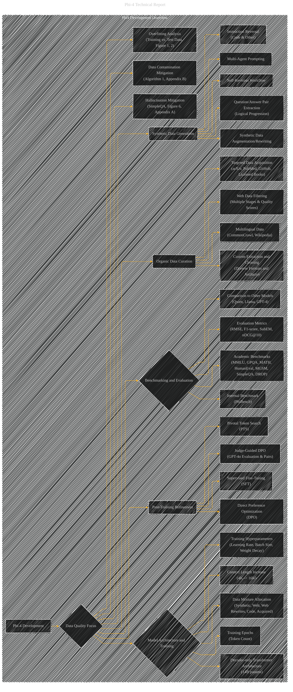

# Phi-4 Development Overview
> **Disclaimer:**
>
> This document contains my personal notes on the topic,
> compiled from publicly available documentation and various cited sources.
> The materials are intended for educational purposes, personal study, and reference.
> The content is dual-licensed:
> 1. **MIT License:** Applies to all code implementations (Swift, Mermaid, and other programming languages).
> 2. **Creative Commons Attribution 4.0 International License (CC BY 4.0):** Applies to all non-code content, including text, explanations, diagrams, and illustrations.
---

## Phi-4 Development Overview - A Diagrammatic Guide

---

### Explanation

This diagram provides a more structured overview of the phi-4 development process, based on the detailed technical report.  It's built on the "overview" structure but now more explicitly links to the report's key elements (tables, figures) for better understanding of each concept.

*   **Data Quality Focus (B):** This is the central driver of phi-4's design, influencing all subsequent stages.
*   **Data Sources (C & D):** Clearly outlines the different types of synthetic and organic data used in training.
*   **Model Architecture & Training (S):** Details the architecture, training data, and hyperparameters.
*   **Benchmarking & Evaluation (Y):**  Highlights the importance of diverse benchmarks and the comparison with other models.
*   **Mitigation Strategies (Post-Training):**  Emphasizes the critical role of post-training techniques in addressing weaknesses.

*   **Links to Supporting Materials:** The diagram includes links to specific tables and figures, enhancing understanding and directing the reader to specific parts of the report for a deeper look at the details.  This helps the user to quickly grasp the details of the different phases, and helps the AI agent to more easily answer any questions about specific elements of the process.

This is a more comprehensive visual representation, reflecting the complexity of the report's content while remaining focused on the core overview.  It helps visualize the different aspects of the phi-4 model development and their interactions. Remember, you can further expand specific nodes (e.g., "Web Data Filtering") with sub-concepts and specifics as needed.

---
**Licenses:**

- **MIT License:**   - Full text in [LICENSE](LICENSE) file.
- **Creative Commons Attribution 4.0 International:**  - Legal details in [LICENSE-CC-BY](LICENSE-CC-BY) and at [Creative Commons official site](http://creativecommons.org/licenses/by/4.0/).

---