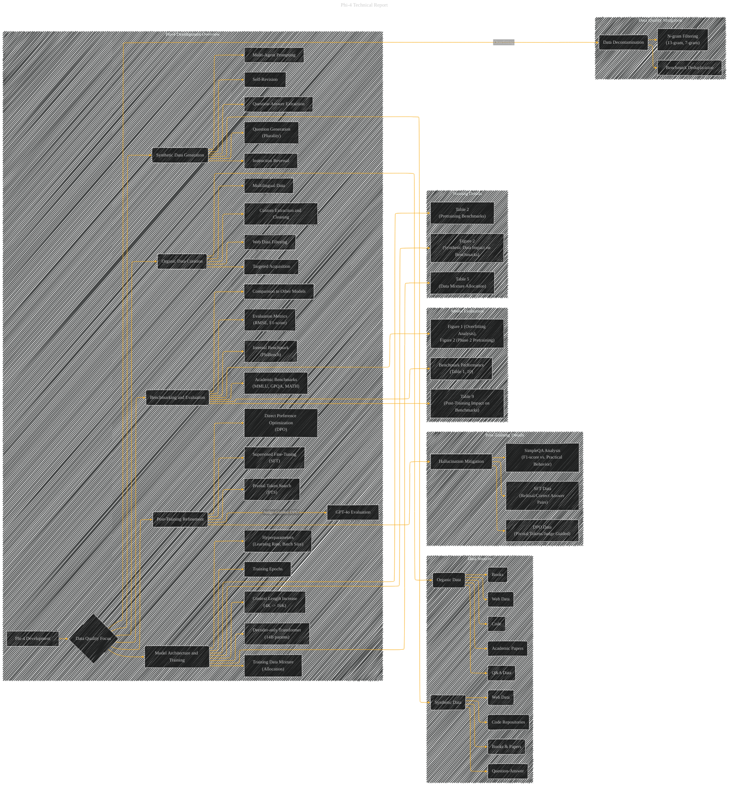

# Phi-4 Technical Report
> **Disclaimer:**
>
> This document contains my personal notes on the topic,
> compiled from publicly available documentation and various cited sources.
> The materials are intended for educational purposes, personal study, and reference.
> The content is dual-licensed:
> 1. **MIT License:** Applies to all code implementations (Swift, Mermaid, and other programming languages).
> 2. **Creative Commons Attribution 4.0 International License (CC BY 4.0):** Applies to all non-code content, including text, explanations, diagrams, and illustrations.
---

## Phi-4 Technical Report Paper Overview - A Diagrammatic Guide

---

### Explanation

This Mermaid diagram visually represents the key concepts and their relationships in the phi-4 development.  It uses subgraphs for better organization and clarity.  The nodes represent key concepts (e.g., "Synthetic Data Generation," "Model Architecture").  The edges show the relationships between them (e.g., "Synthetic Data Generation" influences "Post-Training Refinement"). The diagram also explicitly links to tables and figures for detailed analysis of specific aspects.  This improved structure is more complex and comprehensive than a simple list and helps highlight the interdependencies and processes in the model's development.  Note that due to the document's extensive detail, some concepts have been combined for better diagram clarity.  For instance, "Web Data Filtering" is a sub-concept of "Organic Data Curation." Remember that specific nodes can be further expanded or connected based on the user's request for more detail.

---
**Licenses:**

- **MIT License:**   - Full text in [LICENSE](LICENSE) file.
- **Creative Commons Attribution 4.0 International:**  - Legal details in [LICENSE-CC-BY](LICENSE-CC-BY) and at [Creative Commons official site](http://creativecommons.org/licenses/by/4.0/).

---