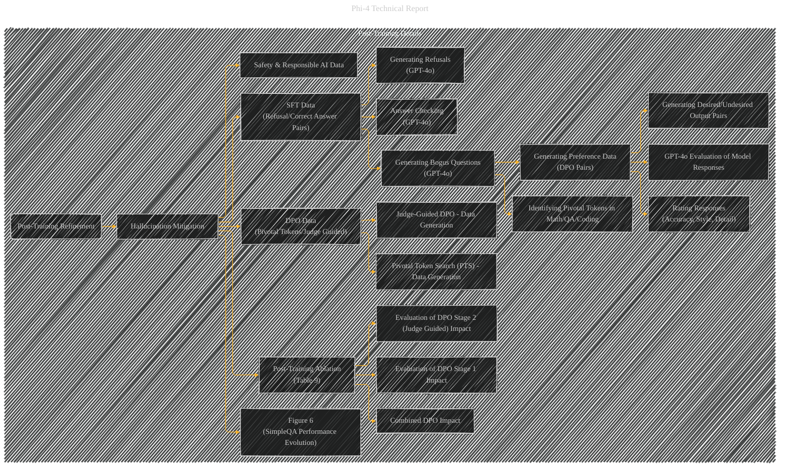

# Post-Training Details
> **Disclaimer:**
>
> This document contains my personal notes on the topic,
> compiled from publicly available documentation and various cited sources.
> The materials are intended for educational purposes, personal study, and reference.
> The content is dual-licensed:
> 1. **MIT License:** Applies to all code implementations (Swift, Mermaid, and other programming languages).
> 2. **Creative Commons Attribution 4.0 International License (CC BY 4.0):** Applies to all non-code content, including text, explanations, diagrams, and illustrations.
---

## Post-Training Details - A Diagrammatic Guide

---

### Explanation of Changes and Additions

*   **More Detailed Data Generation Processes:** The original subgraph was too general.  This version breaks down the data generation for SFT and DPO into more specific processes, reflecting the different types of prompts used for each task (e.g., generating bogus questions, generating refusals, answer checking).
*   **Explicit Connections to GPT-4o's Role:** The diagram clarifies that GPT-4o plays a crucial role in generating and evaluating the post-training data.  This is highlighted with specific nodes like `EEEE1`, `EEEE2`, `EEEE3`, and `EEEEEE2`.
*   **Emphasis on Data Types:** Explicitly shows that safety and Responsible AI (RAI) data are part of the post-training process under the `EE` and `EEEE` nodes. This aligns with the report's focus on safety-related data for DPO and SFT.
*   **Clearer Representation of Ablation Studies:** The `Post-Training Ablation` node now directly connects to the specific evaluation of different post-training strategies, which helps organize the key findings from the ablation studies.
*   **Visual Link to Figure 6:**  The inclusion of `Figure 6` explicitly connects the diagram to the visual representation of SimpleQA performance evolution during post-training, providing a visual aid to understand the concept.

This revised subgraph provides a more detailed and accurate representation of the post-training process, better reflecting the intricacies described in the original text. Note that this diagram is still simplified to fit the diagram structure, and some details (such as exact prompts and grading criteria) are omitted for better readability.  Specifics can be expanded upon if needed.

---
**Licenses:**

- **MIT License:**   - Full text in [LICENSE](LICENSE) file.
- **Creative Commons Attribution 4.0 International:**  - Legal details in [LICENSE-CC-BY](LICENSE-CC-BY) and at [Creative Commons official site](http://creativecommons.org/licenses/by/4.0/).

---