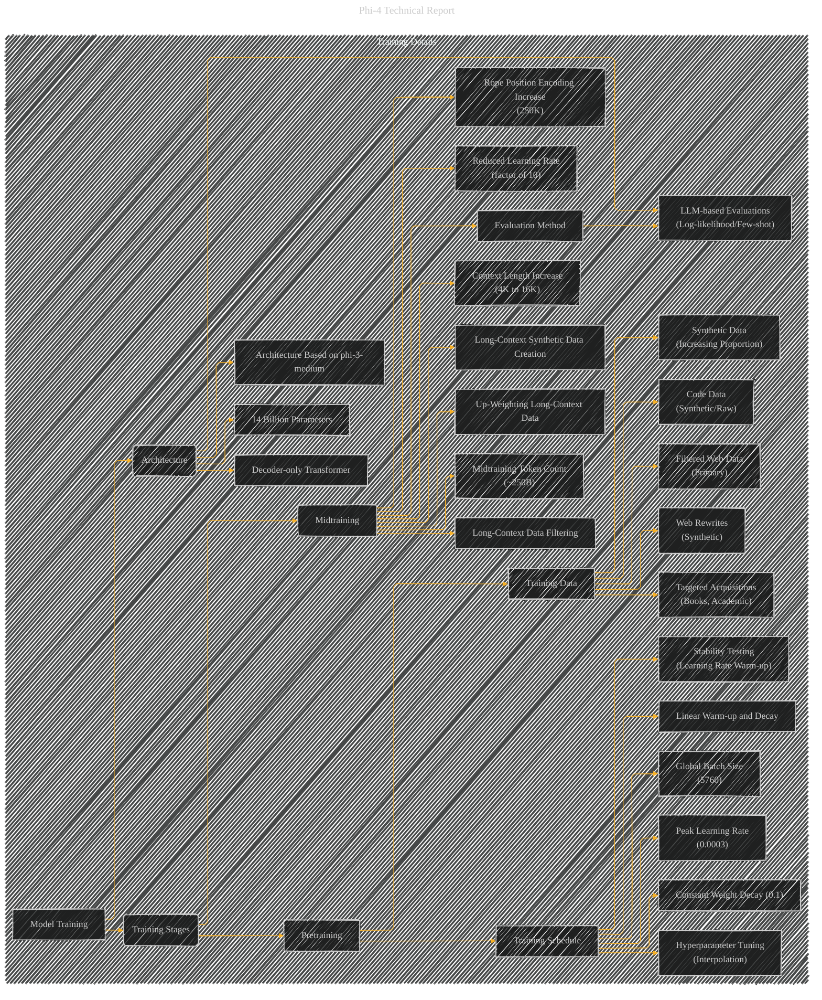

# Training Details
> **Disclaimer:**
>
> This document contains my personal notes on the topic,
> compiled from publicly available documentation and various cited sources.
> The materials are intended for educational purposes, personal study, and reference.
> The content is dual-licensed:
> 1. **MIT License:** Applies to all code implementations (Swift, Mermaid, and other programming languages).
> 2. **Creative Commons Attribution 4.0 International License (CC BY 4.0):** Applies to all non-code content, including text, explanations, diagrams, and illustrations.
---

## Training Details - A Diagrammatic Guide

---

### Explanation

This Mermaid diagram, "Training Details," focuses on the various stages and aspects of the phi-4 model's training process.  It's structured using subgraphs for organization, and each node represents a key element of the training process.  Key improvements from the previous attempt include:

* **Explicit Architecture and Hyperparameters:**  The diagram clearly distinguishes the model's architecture (e.g., "Decoder-only Transformer," "14 Billion Parameters") and crucial training details (e.g., "Linear Warm-up and Decay," "Global Batch Size").

* **Training Stages:**  The training process is separated into pretraining and midtraining phases, highlighting the different goals and data mixtures used in each stage.

* **Data Sources:**  It explicitly shows the different sources of training data, making clear the increasing importance of synthetic data throughout the training.  The diagram emphasizes the differing roles and importance of each data type (web, synthetic, web rewrites, targeted, code) in the model training.

* **Training Schedule:**  The training schedule details (e.g., linear warm-up and decay, peak learning rate, weight decay, batch size) are explicitly shown, emphasizing the importance of hyperparameter tuning for stability and performance.

* **Midtraining Context Length Expansion:** The diagram illustrates the specific adjustments to training during the midtraining phase, including the expansion of context length and the corresponding adjustments to data sources and learning rates to handle this change.

* **Evaluation Methodology:** It directly addresses how the model is evaluated during pretraining and midtraining, showing the reliance on LLM-based evaluations (log-likelihood, few-shot), ensuring there's clear connection between the training and evaluation processes.

This diagram provides a more comprehensive and accurate visual representation of the training details of the phi-4 model, based on the provided source material. Note that the exact numerical values and details are extracted directly from the text.  The diagram's structure and connections precisely reflect the described relationships between the training components.

---
**Licenses:**

- **MIT License:**   - Full text in [LICENSE](LICENSE) file.
- **Creative Commons Attribution 4.0 International:**  - Legal details in [LICENSE-CC-BY](LICENSE-CC-BY) and at [Creative Commons official site](http://creativecommons.org/licenses/by/4.0/).

---