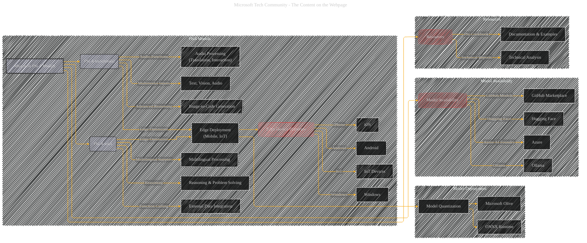

# The New Phi-4 Models
> **Disclaimer:**
>
> This document contains my personal notes on the topic,
> compiled from publicly available documentation and various cited sources.
> The materials are intended for educational purposes, personal study, and reference.
> The content is dual-licensed:
> 1. **MIT License:** Applies to all code implementations (Swift, Mermaid, and other programming languages).
> 2. **Creative Commons Attribution 4.0 International License (CC BY 4.0):** Applies to all non-code content, including text, explanations, diagrams, and illustrations.
---

## The New Phi-4 Models - A Diagrammatic Guide - Simple Version

---

This example uses a simplified approach, focusing on the key features of each model.  A more detailed diagram would include specific examples (e.g., code generation from images) as nodes and elaborate on the technical aspects like quantized model deployment.  Furthermore, the diagram could incorporate information about the models' performance comparisons to other LLMs.

-----

## The New Phi-4 Models - A Diagrammatic Guide

---

### Explanation of Diagram

This Mermaid code generates a more structured and visually appealing diagram illustrating the key features and relationships described in the previous response.

*   **Subgraphs:** The diagram uses subgraphs to group related concepts, making it easier to understand the overall structure.
*   **Nodes:** Each node represents a key concept (e.g., Phi-4-mini, Multilingual Processing, External Data Integration, etc.).
*   **Edges:** Edges (arrows) depict the relationships between concepts, highlighting how features relate to the models and their deployment.
*   **Coloring:**  Consistent colors for model types and resource categories aid in visual clarity.
*   **Focus on Deployment:** The diagram emphasizes the edge-optimized deployment aspects by connecting the models to specific device platforms and tools like Microsoft Olive and ONNX Runtime.
*   **Accessibility:** The diagram shows where to access the models through various platforms like Hugging Face, Azure, GitHub, and Ollama.

This diagram effectively visualizes the relationships between the different elements of Microsoft Phi-4 models, emphasizing their core features, deployment targets, and associated resources.  It's designed to be easily understood and readily convey the essential information from the text.  Further refinement might include adding more specific details or examples as nodes. Remember to replace placeholder URLs with actual URLs.

---
**Licenses:**

- **MIT License:**   - Full text in [LICENSE](LICENSE) file.
- **Creative Commons Attribution 4.0 International:**  - Legal details in [LICENSE-CC-BY](LICENSE-CC-BY) and at [Creative Commons official site](http://creativecommons.org/licenses/by/4.0/).

---