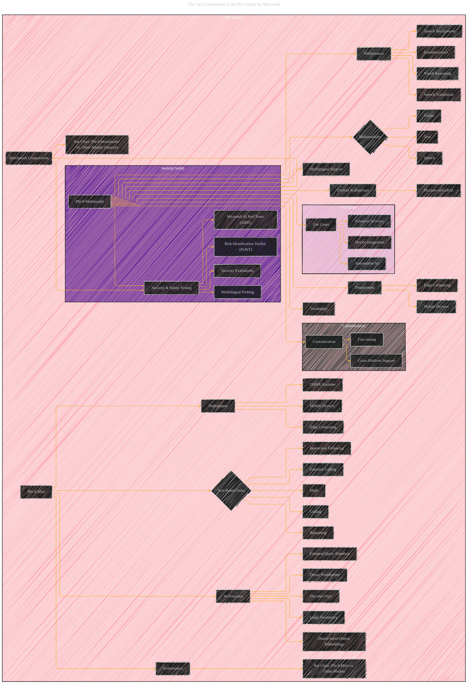

# The Next Generation of the Phi Family
> **Disclaimer:**
>
> This document contains my personal notes on the topic,
> compiled from publicly available documentation and various cited sources.
> The materials are intended for educational purposes, personal study, and reference.
> The content is dual-licensed:
> 1. **MIT License:** Applies to all code implementations (Swift, Mermaid, and other programming languages).
> 2. **Creative Commons Attribution 4.0 International License (CC BY 4.0):** Applies to all non-code content, including text, explanations, diagrams, and illustrations.
---

## The Next Generation of the Phi Family - A Diagrammatic Guide

----

### Explanation

This Mermaid graph uses a subgraph structure to group related concepts, making the diagram more organized and readable. It visualizes the core features of both models, highlighting the relationships between different aspects (e.g., the multimodality of Phi-4-multimodal). The graph also incorporates benchmarking data using bar charts, and illustrates the different architectures of the models.  The addition of subgraphs for Security & Safety Testing, Use Cases, and Customization improve clarity and focus.  Remember, you can add specific data points (e.g., parameter counts) to the nodes for more detail, and add specific examples of use cases to nodes Z, AA, and BB.  Adjust the diagram as needed to fit your desired level of detail. Note that the graph is quite large and could be broken down further into more specialized diagrams.

---
**Licenses:**

- **MIT License:**   - Full text in [LICENSE](LICENSE) file.
- **Creative Commons Attribution 4.0 International:**  - Legal details in [LICENSE-CC-BY](LICENSE-CC-BY) and at [Creative Commons official site](http://creativecommons.org/licenses/by/4.0/).

---