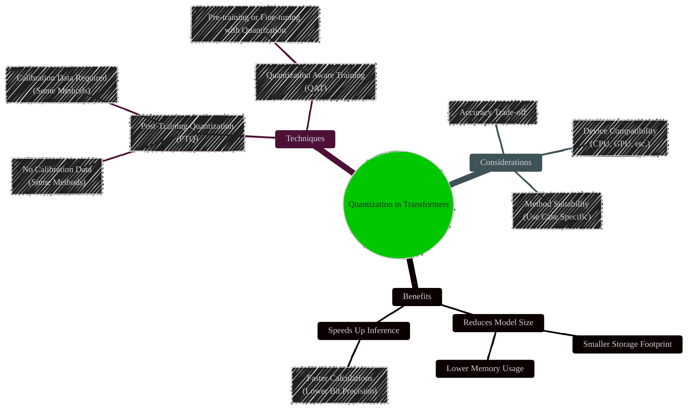

# An Overview of Quantization in Transformers - A Diagrammatic Guide
> **Disclaimer:**
>
> This document contains my personal notes on the topic,
> compiled from publicly available documentation and various cited sources.
> The materials are intended for educational purposes, personal study, and reference.
> The content is dual-licensed:
> 1. **MIT License:** Applies to all code implementations (Swift, Mermaid, and other programming languages).
> 2. **Creative Commons Attribution 4.0 International License (CC BY 4.0):** Applies to all non-code content, including text, explanations, diagrams, and illustrations.
---


## 1. Overview of Quantization

First, let's visualize the general concept of quantization and its benefits.



**Explanation:**

This mindmap illustrates the core idea of quantization, highlighting its benefits in terms of model size and inference speed. It also categorizes quantization techniques into PTQ and QAT and points out key considerations when choosing a method.

---

## 2. Quantization Methods Comparison Table

Let's visualize the comparison table provided in the documentation as a flowchart for easier method selection based on criteria.

```mermaid
---
title: Quantization Methods Comparison Table
config:
  layout: elk
  look: handDrawn
  theme: dark
---
%%{
  init: {
    'fontFamily': 'verdana',
    'themeVariables': {
      'primaryColor': '#BB2528',
      'primaryTextColor': '#f529',
      'primaryBorderColor': '#7C0000',
      'lineColor': '#F8B229',
      'secondaryColor': '#006100',
      'tertiaryColor': '#fff'
    }
  }
}%%
graph TD
    subgraph Quantization_Method_Selection["Quantization Method Selection"]
    style Quantization_Method_Selection fill:#ff11,stroke:#333,stroke-width:2px
        start([Start]) --> on_the_fly{On-the-fly Quantization?}
        on_the_fly -- Yes --> cpu_support{CPU Support?}
        on_the_fly -- No --> calibration_needed[Calibration Needed]

        cpu_support -- Yes --> cuda_gpu_support{CUDA GPU Support?}
        cpu_support -- No --> rocm_gpu_support{ROCm GPU Support?}

        cuda_gpu_support -- Yes --> metal_support{"Metal (Apple Silicon) Support?"}
        cuda_gpu_support -- No --> intel_gpu_support{Intel GPU Support?}

        rocm_gpu_support -- Yes --> metal_support_2{"Metal (Apple Silicon) Support?"}
        rocm_gpu_support -- No --> intel_gpu_support_2{Intel GPU Support?}

        metal_support -- Yes --> torch_compile_support{Torch Compile Support?}
        metal_support -- No --> bits_range[Bits Range]

        metal_support_2 -- Yes --> torch_compile_support_2{Torch Compile Support?}
        metal_support_2 -- No --> bits_range_2[Bits Range]

        intel_gpu_support -- Yes --> torch_compile_support_3{Torch Compile Support?}
        intel_gpu_support -- No --> bits_range_3[Bits Range]

        intel_gpu_support_2 -- Yes --> torch_compile_support_4{Torch Compile Support?}
        intel_gpu_support_2 -- No --> bits_range_4[Bits Range]

        torch_compile_support -- Yes --> peft_support{PEFT Fine-Tuning?}
        torch_compile_support -- No --> bits_range_5[Bits Range]

        torch_compile_support_2 -- Yes --> peft_support_2{PEFT Fine-Tuning?}
        torch_compile_support_2 -- No --> bits_range_6[Bits Range]

        torch_compile_support_3 -- Yes --> peft_support_3{PEFT Fine-Tuning?}
        torch_compile_support_3 -- No --> bits_range_7[Bits Range]

        torch_compile_support_4 -- Yes --> peft_support_4{PEFT Fine-Tuning?}
        torch_compile_support_4 -- No --> bits_range_8[Bits Range]

        peft_support -- Yes --> serializable{Serializable with 🤗Transformers?}
        peft_support -- No --> bits_range_9[Bits Range]

        peft_support_2 -- Yes --> serializable_2{Serializable with 🤗Transformers?}
        peft_support_2 -- No --> bits_range_10[Bits Range]

        peft_support_3 -- Yes --> serializable_3{Serializable with 🤗Transformers?}
        peft_support_3 -- No --> bits_range_11[Bits Range]

        peft_support_4 -- Yes --> serializable_4{Serializable with 🤗Transformers?}
        peft_support_4 -- No --> bits_range_12[Bits Range]

        serializable -- Yes --> transformers_support{🤗Transformers Support?}
        serializable -- No --> bits_range_13[Bits Range]

        serializable_2 -- Yes --> transformers_support_2{🤗Transformers Support?}
        serializable_2 -- No --> bits_range_14[Bits Range]

        serializable_3 -- Yes --> transformers_support_3{🤗Transformers Support?}
        serializable_3 -- No --> bits_range_15[Bits Range]

        serializable_4 -- Yes --> transformers_support_4{🤗Transformers Support?}
        serializable_4 -- No --> bits_range_16[Bits Range]


        calibration_needed --> cpu_support_calibrated{CPU Support?}

        cpu_support_calibrated -- Yes --> cuda_gpu_support_calibrated{CUDA GPU Support?}
        cpu_support_calibrated -- No --> rocm_gpu_support_calibrated{ROCm GPU Support?}

        cuda_gpu_support_calibrated -- Yes --> metal_support_calibrated{"Metal (Apple Silicon) Support?"}
        cuda_gpu_support_calibrated -- No --> intel_gpu_support_calibrated{Intel GPU Support?}

        rocm_gpu_support_calibrated -- Yes --> metal_support_calibrated_2{"Metal (Apple Silicon) Support?"}
        rocm_gpu_support_calibrated -- No --> intel_gpu_support_calibrated_2{Intel GPU Support?}

        metal_support_calibrated -- Yes --> torch_compile_support_calibrated{Torch Compile Support?}
        metal_support_calibrated -- No --> bits_range_calibrated[Bits Range]

        metal_support_calibrated_2 -- Yes --> torch_compile_support_calibrated_2{Torch Compile Support?}
        metal_support_calibrated_2 -- No --> bits_range_calibrated_2[Bits Range]

        intel_gpu_support_calibrated -- Yes --> torch_compile_support_calibrated_3{Torch Compile Support?}
        intel_gpu_support_calibrated -- No --> bits_range_calibrated_3[Bits Range]

        intel_gpu_support_calibrated_2 -- Yes --> torch_compile_support_calibrated_4{Torch Compile Support?}
        intel_gpu_support_calibrated_2 -- No --> bits_range_calibrated_4[Bits Range]

        torch_compile_support_calibrated -- Yes --> peft_support_calibrated{PEFT Fine-Tuning?}
        torch_compile_support_calibrated -- No --> bits_range_calibrated_5[Bits Range]

        torch_compile_support_calibrated_2 -- Yes --> peft_support_calibrated_2{PEFT Fine-Tuning?}
        torch_compile_support_calibrated_2 -- No --> bits_range_calibrated_6[Bits Range]

        torch_compile_support_calibrated_3 -- Yes --> peft_support_calibrated_3{PEFT Fine-Tuning?}
        torch_compile_support_calibrated_3 -- No --> bits_range_calibrated_7[Bits Range]

        torch_compile_support_calibrated_4 -- Yes --> peft_support_calibrated_4{PEFT Fine-Tuning?}
        torch_compile_support_calibrated_4 -- No --> bits_range_calibrated_8[Bits Range]

        peft_support_calibrated -- Yes --> serializable_calibrated{Serializable with 🤗Transformers?}
        peft_support_calibrated -- No --> bits_range_calibrated_9[Bits Range]

        peft_support_calibrated_2 -- Yes --> serializable_calibrated_2{Serializable with 🤗Transformers?}
        peft_support_calibrated_2 -- No --> bits_range_calibrated_10[Bits Range]

        peft_support_calibrated_3 -- Yes --> serializable_calibrated_3{Serializable with 🤗Transformers?}
        peft_support_calibrated_3 -- No --> bits_range_calibrated_11[Bits Range]

        peft_support_calibrated_4 -- Yes --> serializable_calibrated_4{Serializable with 🤗Transformers?}
        peft_support_calibrated_4 -- No --> bits_range_calibrated_12[Bits Range]

        serializable_calibrated -- Yes --> transformers_support_calibrated{🤗Transformers Support?}
        serializable_calibrated -- No --> bits_range_calibrated_13[Bits Range]

        serializable_calibrated_2 -- Yes --> transformers_support_calibrated_2{🤗Transformers Support?}
        serializable_calibrated_2 -- No --> bits_range_calibrated_14[Bits Range]

        serializable_calibrated_3 -- Yes --> transformers_support_calibrated_3{🤗Transformers Support?}
        serializable_calibrated_3 -- No --> bits_range_calibrated_15[Bits Range];

        serializable_calibrated_4 -- Yes --> transformers_support_calibrated_4{🤗Transformers Support?}
        serializable_calibrated_4 -- No --> bits_range_calibrated_16[Bits Range]


        bits_range --> aqlm[AQLM]
        bits_range_2 --> awq[AWQ]
        bits_range_3 --> bitsandbytes[bitsandbytes]
        bits_range_4 --> compressed_tensors[compressed-tensors]
        bits_range_5 --> eetq[EETQ]
        bits_range_6 --> gguf_ggml[GGUF / GGML]
        bits_range_7 --> gptqmodel[GPTQModel]
        bits_range_8 --> autogptq[AutoGPTQ]
        bits_range_9 --> higgs[HIGGS]
        bits_range_10 --> hqq[HQQ]
        bits_range_11 --> optimum_quanto[optimum-quanto]
        bits_range_12 --> fbgemm_fp8[FBGEMM_FP8]
        bits_range_13 --> torchao[torchao]
        bits_range_14 --> vptq[VPTQ]
        bits_range_15 --> spqr[SpQR]
        bits_range_16 --> finegrained_fp8[FINEGRAINED_FP8]

        bits_range_calibrated --> aqlm_calibrated[AQLM]
        bits_range_calibrated_2 --> awq_calibrated[AWQ]
        bits_range_calibrated_3 --> bitsandbytes_calibrated[bitsandbytes]
        bits_range_calibrated_4 --> compressed_tensors_calibrated[compressed-tensors]
        bits_range_calibrated_5 --> eetq_calibrated[EETQ]
        bits_range_calibrated_6 --> gguf_ggml_calibrated[GGUF / GGML]
        bits_range_calibrated_7 --> gptqmodel_calibrated[GPTQModel]
        bits_range_calibrated_8 --> autogptq_calibrated[AutoGPTQ]
        bits_range_calibrated_9 --> higgs_calibrated[HIGGS]
        bits_range_calibrated_10 --> hqq_calibrated[HQQ]
        bits_range_calibrated_11 --> optimum_quanto_calibrated[optimum-quanto]
        bits_range_calibrated_12 --> fbgemm_fp8_calibrated[FBGEMM_FP8]
        bits_range_calibrated_13 --> torchao_calibrated[torchao]
        bits_range_calibrated_14 --> vptq_calibrated[VPTQ]
        bits_range_calibrated_15 --> spqr_calibrated[SpQR]
        bits_range_calibrated_16 --> finegrained_fp8_calibrated[FINEGRAINED_FP8]
    end
    
```


DOI: [10.13140/RG.2.2.22401.57447](http://dx.doi.org/10.13140/RG.2.2.22401.57447)


**Explanation:**

This flowchart represents a decision tree to help users select a quantization method based on their requirements. It starts with whether on-the-fly quantization is needed and then branches based on CPU/GPU support, Apple Silicon compatibility, Torch Compile, PEFT, Serialization, and finally lists the quantization methods with their bit ranges. Note that for simplicity, the flowchart does not include all the nuances and exceptions mentioned in the table footnotes.

---

## 3. AQLM - Additive Quantization of Language Models

Let's visualize the AQLM method and its configurations.

```mermaid
mindmap
  root((AQLM - Additive Quantization of Language Models))
    direction LR
    nodeFormat default
    AQLM
      Description
        Quantizes groups of weights together
        Leverages interdependencies
        Weights as sum of vector codes
      Library
        `aqlm` (Python >= 3.10)
        Efficient Kernels (GPU & CPU)
      PEFT Support
        LoRA Integration (PEFT Library)
      Configurations
        Codebooks
          Number of Codebooks (K)
          Codebook Size (N) - Bits
        Kernels
          Triton
            K x N Notation
            Fast GPU Inference (✅)
            Fast CPU Inference (❌)
            Speedup: ~0.7x
          CUDA (1x16)
            1 Codebook
            16-bit Codebook Size
            Best Accuracy
            Fast GPU Inference (✅)
            Fast CPU Inference (❌)
            Speedup: ~1.3x
          CUDA (2x8)
            2 Codebooks
            8-bit Codebook Size
            OK Accuracy
            Fast GPU Inference (✅)
            Fast CPU Inference (❌)
            Speedup: ~3.0x
          Numba (Kx8)
            K Codebooks
            8-bit Codebook Size
            Good Accuracy
            Fast GPU Inference (❌)
            Fast CPU Inference (✅)
            Speedup: ~4.0x
      Usage
        Install `pip install aqlm[gpu,cpu]`
        Load Model: `AutoModelForCausalLM.from_pretrained(...)`
```

**Explanation:**

This mindmap details the AQLM quantization method. It describes what AQLM is, the library used for implementation, PEFT support, different configurations based on codebooks and kernels, and basic usage instructions.

---

## 4. AWQ - Activation-aware Weight Quantization

Let's visualize the AWQ method and its features.

```mermaid
mindmap
  root((AWQ - Activation-aware Weight Quantization))
    direction LR
    nodeFormat default
    AWQ
      Description
        Preserves important weights
        Quantizes remaining weights (4-bit)
        Reduces quantization loss
        Near-lossless 4-bit quantization
      Libraries
        llm-awq
        autoawq (Transformers Support)
        optimum-intel
      Installation
        `pip install autoawq`
        Downgrades Transformers (v4.47.1) - Reinstall if needed
      Loading AWQ Model
        `AutoModelForCausalLM.from_pretrained(model_id, device_map="auto")`
        `quantization_config` in `config.json`
      Fused Modules
        Improved Accuracy & Performance
        Supported Architectures (Llama, Mistral)
          Enable with `AwqConfig(fuse_max_seq_len, do_fuse=True)`
          Performance Benchmarks (Prefill & Decode Tokens/s, Memory)
        Unsupported Architectures
          Custom Fusing Mapping (`modules_to_fuse`)
          Parameters: attention, layernorm, mlp, use_alibi, num_attention_heads, num_key_value_heads, hidden_size
      ExLlama-v2 Support
        Faster Prefill & Decoding
        `AwqConfig(version="exllama")`
        Install latest `autoawq` from GitHub
        AMD GPU Support (Note)
      Intel CPU/GPU Support
        IPEX Optimizations
        `AwqConfig(version="ipex")`
        Install `intel-extension-for-pytorch` and latest `autoawq`
        Intel CPU/GPU Support (Note)
```

**Explanation:**

This mindmap outlines the AWQ quantization technique. It covers its core principle, supporting libraries, installation steps, model loading, fused modules (with details for supported and unsupported architectures), ExLlama-v2 kernel support, and Intel CPU/GPU optimizations.

---

## 5. BitNet - Extreme Quantization with Ternary Weights

Let's visualize the BitNet architecture and quantization process.

```mermaid
mindmap
  root((BitNet - Extreme Quantization))
    direction LR
    nodeFormat default
    BitNet
      Description
        Replaces Linear Layers with BitLinear
        Ternary Weights (-1, 0, 1)
        8-bit Activations
      BitLinear Layer
        Weights Quantization (Ternary)
          Symmetric Per Tensor
          Scale Calculation: scale_w = 1 / (avg(|W_ij|))
          Quantization: W_q = clamp[-1,1](round(W * scale))
          Dequantization: W_dequantized = W_q * scale_w
        Activations Quantization (8-bit)
          absmax Quantization (Symmetric Per Channel)
          Scale Calculation: scale_x = 127 / max(|X|, dim=-1)
          Quantization: X_q = clamp[-128,127](round(X * scale))
          Dequantization: X_dequantized = X_q * scale_x
      Training
        Quantization Aware Training (QAT)
        Pre-training/Fine-tuning with Quantization
        Nanotron Integration (PR Links Provided)
      Loading
        `AutoModelForCausalLM.from_pretrained(path, device_map="auto")`
        Pre-trained/Fine-tuned & Packed Models on Hub
      Kernels
        `torch.compile` (Initial Version)
        Optimized Kernels (Future Plan)
```

**Explanation:**

This mindmap explains the BitNet quantization method. It details the BitLinear layer architecture, the ternary weight and 8-bit activation quantization formulas, the training process (QAT), model loading, and kernel implementation.

---

## 6. bitsandbytes - Easy 8-bit and 4-bit Quantization

Let's visualize the bitsandbytes quantization options and features.

```mermaid
mindmap
  root((bitsandbytes - 8-bit & 4-bit Quantization))
    direction LR
    nodeFormat default
    bitsandbytes
      Description
        Easiest 8-bit & 4-bit Quantization
        8-bit (LLM.int8()): fp16 outliers, int8 non-outliers
        4-bit (QLoRA): Further compression, QLoRA finetuning
      Installation
        8-bit: `pip install transformers accelerate bitsandbytes>0.37.0`
        4-bit: `pip install bitsandbytes>=0.39.0`, `pip install --upgrade accelerate transformers`
        Multi-Backend Support (CUDA, ROCm, Intel CPU, Intel XPU, Apple Silicon - in progress)
      Usage
        `BitsAndBytesConfig` for 8-bit & 4-bit
        `AutoModelForCausalLM.from_pretrained(..., quantization_config=config)`
        Works with any model with `torch.nn.Linear` layers
      8-bit Features (LLM.int8())
        Offloading
          CPU-GPU Offloading (Weights in float32 on CPU)
          `BitsAndBytesConfig(llm_int8_enable_fp32_cpu_offload=True)`
          Custom `device_map`
        Outlier Threshold
          `llm_int8_threshold` parameter in `BitsAndBytesConfig`
        Skip Modules
          `llm_int8_skip_modules` parameter in `BitsAndBytesConfig`
        Finetuning
          PEFT Library Compatible
      4-bit Features (QLoRA)
        Compute Data Type
          `bnb_4bit_compute_dtype` parameter in `BitsAndBytesConfig` (e.g., torch.bfloat16)
        Normal Float 4 (NF4)
          `bnb_4bit_quant_type="nf4"` in `BitsAndBytesConfig` (for training)
        Nested Quantization
          `bnb_4bit_use_double_quant=True` in `BitsAndBytesConfig` (memory saving)
      Serialization
        Push to Hub (Latest Transformers & bitsandbytes)
        `model.push_to_hub(...)`
        Save Locally: `model.save_pretrained(...)`
      Dequantization
        `model.dequantize()` (Quality Loss Possible)
```

**Explanation:**

This mindmap comprehensively details the bitsandbytes library. It covers its description, installation for 8-bit and 4-bit quantization, general usage, specific features for both 8-bit and 4-bit quantization (like offloading, outlier threshold, NF4, nested quantization), serialization, and dequantization.

---

## 7. Compressed Tensors - Versatile Compressed Checkpoints

Let's visualize the Compressed Tensors library and its features.

```mermaid
mindmap
  root((Compressed Tensors Library))
    direction LR
    nodeFormat default
    Compressed_Tensors
      Description
        Unified format for compressed model checkpoints
        Supports various quantization & sparsity schemes
        Versatile & Efficient Storage
      Supported Formats
        dense
        int-quantized (INT8)
        float-quantized (FP8 - E4M3)
        pack-quantized (INT4/INT8 packed in INT32)
      Creation
        llm-compressor (Recommended)
        Independent creation & serialization
      Features
        Weight & Activation Precisions: FP8, INT4, INT8 (Arbitrary INT Precision)
        Quantization Strategies: tensor, channel, group, block, token
        Dynamic Per-Token Activation Quantization
        Sparsity (Unstructured, Semi-structured) + Quantization
        Arbitrary Module Quantization
        Targeted/Ignored Modules (Name/Class)
      Installation
        Stable (PyPI): `pip install compressed-tensors`
        Development (Source): GitHub Clone & `pip install -e .`
      Quickstart Load
        `AutoModelForCausalLM.from_pretrained(model_name)`
        Memory Efficient Loading
      Deep Dive - Model Checkpoint
        Configuration (`quantization_config` in `config.json`)
          `config_groups` (Weight & Activation Quantization)
          `format` (naive-quantized)
          `ignore` (modules to skip)
          `quant_method` (compressed-tensors)
          `quantization_status` (frozen)
        Safetensors Viewer (Quantized Weights, Scales)
        `CompressedLinear` Modules (Replaces Linear Modules)
```

**Explanation:**

This mindmap details the Compressed Tensors library. It describes its purpose, supported formats, creation methods, key features (precisions, strategies, sparsity), installation, quickstart loading, and a deep dive into the model checkpoint structure and configuration.

---

## 8. EETQ - Efficient and Easy Tensor Quantization

Let's visualize the EETQ library and its usage.

```mermaid
mindmap
  root((EETQ - Efficient and Easy Tensor Quantization))
    direction LR
    nodeFormat default
    EETQ
      Description
        int8 Per-Channel Weight-Only Quantization (NVIDIA GPUs)
        High-Performance Kernels (FasterTransformer, TensorRT-LLM)
        No Calibration Dataset Required
        Negligible Accuracy Degradation
      Installation
        Release Page (Pre-built Wheel): `pip install --no-cache-dir <wheel_url>`
        Source Code: GitHub Clone & `pip install .`
        CUDA Capability <= 8.9 and >= 7.0 Required
      Quantization
        `EetqConfig("int8")`
        `AutoModelForCausalLM.from_pretrained(path, device_map="auto", quantization_config=config)`
      Saving Quantized Model
        `model.save_pretrained(quant_path)`
      Loading Quantized Model
        `AutoModelForCausalLM.from_pretrained(quant_path, device_map="auto")`
```

**Explanation:**

This mindmap outlines the EETQ library. It covers its description, installation methods (pre-built wheel and from source), the quantization process using `EetqConfig`, and saving and loading quantized models.

---

## 9. FBGEMM FP8 & Fine-grained FP8 - FP8 Quantization

Let's visualize the FP8 quantization methods.

```mermaid
mindmap
  root((FP8 Quantization - FBGEMM & Fine-grained))
    direction LR
    nodeFormat default
    FP8_Quantization
      FBGEMM_FP8
        Description
          FP8 (W8A8) Quantization
          Weights: 8-bit (FP8) Per Channel
          Activations: 8-bit (FP8) Per Token
          FBGEMM Library (Efficient Low-Precision GEMM)
          Accuracy Loss Minimization Techniques
        GPU Requirement
          Compute Capability >= 9 (e.g., H100)
        Installation
          `pip install --upgrade accelerate fbgemm-gpu torch` (Nightly if issues)
        Usage
          `FbgemmFp8Config()`
          `AutoModelForCausalLM.from_pretrained(..., quantization_config=config, torch_dtype="auto", device_map="auto")`
        Saving & Loading
          `model.save_pretrained(quant_path)`
          `AutoModelForCausalLM.from_pretrained(quant_path, device_map="auto")`
      Fine_grained_FP8
        Description
          FP8 (W8A8) Quantization
          Weights: 8-bit (FP8) Per 2D Block (e.g., 128x128) - DeepSeek Inspired
          Activations: 8-bit (FP8) Per Group Per Token (Group = Weight Input Channels, e.g., 128)
          DeepSeek-V3 & DeepSeek-R1 Support
        GPU Requirement
          Compute Capability >= 9 (e.g., H100)
        Installation
          `pip install --upgrade accelerate torch` (Torch compatible with CUDA)
        Usage
          `FineGrainedFP8Config()`
          `AutoModelForCausalLM.from_pretrained(..., quantization_config=config, torch_dtype="auto", device_map="auto")`
        Saving & Loading
          `model.save_pretrained(quant_path)`
          `AutoModelForCausalLM.from_pretrained(quant_path, device_map="auto")`
        Quantization Scheme (Image Provided - DeepSeek)
```

**Explanation:**

This mindmap compares and contrasts FBGEMM FP8 and Fine-grained FP8 quantization methods. It highlights their descriptions, GPU requirements, installation steps, usage with configurations, and saving/loading procedures. It also mentions the DeepSeek inspiration for Fine-grained FP8 and its block-wise quantization scheme.

---

## 10. GPTQ - Post-Training Quantization for Speed and Memory Savings

Let's visualize the GPTQ method and its features.

```mermaid
mindmap
  root((GPTQ - Post-Training Quantization))
    direction LR
    nodeFormat default
    GPTQ
      Description
        Post-Training Quantization (PTQ)
        Row-wise weight quantization (independent)
        Int4 weights (stored as int32), dequantized to fp16 on-the-fly
        Memory Saving (~4x), Inference Speedup
      Libraries
        GPTQModel (Maintained Fork of AutoGPTQ)
          Model & Multimodal Support, Platform & Hardware Support, Asymmetric Support, IPEX Kernel, Marlin Kernel, Faster Quantization, User-Friendly APIs
        AutoGPTQ (Likely Deprecated)
      Installation
        `pip install --upgrade accelerate optimum transformers`
        `pip install gptqmodel --no-build-isolation` OR `pip install auto-gptq --no-build-isolation`
      Quantization Process
        `GPTQConfig(bits=4, dataset="c4", tokenizer=tokenizer)`
        Dataset (c4 Recommended, Custom Dataset Possible)
        `AutoModelForCausalLM.from_pretrained(model_id, device_map="auto", quantization_config=config)`
        Memory Management (`max_memory` parameter)
        Time-Consuming Process (Hardware Dependent)
      Saving & Loading
        `model.push_to_hub("model-gptq")`, `tokenizer.push_to_hub("model-gptq")`
        `model.save_pretrained("model-gptq")`, `tokenizer.save_pretrained("model-gptq")`
        `AutoModelForCausalLM.from_pretrained("{user}/model-gptq", device_map="auto")`
      Kernels
        Marlin (CUDA, NVIDIA A100 Optimized)
          `GPTQConfig(bits=4, backend="marlin")`
        ExLlama (CUDA, Faster Inference, Llama Models)
          Default Kernel
        ExLlamaV2 (Boosted Speed)
          `GPTQConfig(bits=4, exllama_config={"version":2})`
          4-bit Models Only, Deactivate for PEFT Finetuning
        CPU Inference (Disable ExLlama Kernel)
          `GPTQConfig(bits=4, use_exllama=False)`
```

**Explanation:**

This mindmap provides a detailed overview of GPTQ quantization. It covers its description, the two main libraries (GPTQModel and AutoGPTQ), installation, the quantization process with dataset and memory considerations, saving and loading quantized models, and different kernel options like Marlin and ExLlama for optimized inference.

---

## 11. HIGGS - 0-Shot Quantization with Hadamard Preprocessing

Let's visualize the HIGGS quantization method.

```mermaid
mindmap
  root((HIGGS - 0-Shot Quantization))
    direction LR
    nodeFormat default
    HIGGS
      Description
        0-Shot Quantization Algorithm
        Hadamard Preprocessing
        MSE-Optimal Quantization Grids
        Lower Quantization Error, SOTA Performance
      Runtime Support
        FLUTE Library
      Quantization Example
        `HiggsConfig(bits=4)`
        `AutoModelForCausalLM.from_pretrained(model_id, quantization_config=config, device_map="auto")`
      Pre-quantized Models
        Official Collection on Hugging Face Hub
      Current Limitations
        Architectures Supported
          Llama 3 & 3.1 (8B, 70B, 405B)
          Gemma-2 (9B, 27B)
          Limited Model Diversity (Work in Progress)
        `torch.compile` Compatibility
          Fully Compatible
          Speedups on RTX 4090 (Benchmarks Provided)
        Quantized Training
          Not Supported (Work in Progress)
```

**Explanation:**

This mindmap details the HIGGS quantization method. It describes its core features (0-shot, Hadamard, MSE-Optimal), runtime support via FLUTE, a quantization example, pre-quantized models availability, and current limitations regarding architecture support and quantized training, while highlighting `torch.compile` compatibility and speedups.

---

## 12. HQQ - Half-Quadratic Quantization for On-the-Fly Quantization

Let's visualize the HQQ method and its configurations.

```mermaid
mindmap
  root((HQQ - Half-Quadratic Quantization))
    direction LR
    nodeFormat default
    HQQ
      Description
        On-the-Fly Quantization
        Fast Robust Optimization
        No Calibration Data Required
        Quantize Any Model
      Library
        `hqq` (Official Package - GitHub)
      Installation
        `pip install hqq` (Builds CUDA Kernels)
      Quantization Configuration
        `HqqConfig(nbits=8, group_size=64)` (Single Config for All Linear Layers)
        `HqqConfig(dynamic_config={...})` (Dedicated Config per Layer Tag)
          Example: `dynamic_config={'self_attn.q_proj': q4_config, ...}`
          MoE Models - Experts Less Affected by Lower Bits
      Quantization Usage
        `AutoModelForCausalLM.from_pretrained(model_id, quantization_config=config, device_map="cuda", torch_dtype=torch.float16)`
      Optimized Runtime
        Backends
          Pure PyTorch & CUDA Kernels (Older GPUs, PEFT/QLoRA)
          4-bit Fused Kernels (TorchAO, Marlin - Faster Inference)
        Backend Details - Refer to `hqq` GitHub Repository
```

**Explanation:**

This mindmap outlines the HQQ quantization method. It describes its on-the-fly nature, no calibration requirement, installation, two ways to define quantization configurations (single or dynamic per layer), quantization usage, and optimized runtime backends (PyTorch/CUDA and fused kernels).

---

## 13. Optimum & Optimum-quanto - Libraries for Optimized Hardware

Let's visualize the Optimum and Optimum-quanto libraries.

```mermaid
mindmap
  root((Optimum & Optimum-quanto Libraries))
    direction LR
    nodeFormat default
    Optimum_Libraries
      Optimum
        Description
          Library for Optimized Hardware
          Quantization Support for:
            Intel CPUs
            Furiosa NPUs
            ONNX Runtime
            GPTQ
            Lower-Level PyTorch Quantization
        Use Cases
          Specific Optimized Hardware (Intel, Furiosa, ONNX Runtime)
      Optimum_quanto
        Description
          Versatile PyTorch Quantization Toolkit
          Linear Quantization Method
        Features
          Weights Quantization (float8, int8, int4, int2)
          Activation Quantization (float8, int8)
          Modality Agnostic (CV, LLM)
          Device Agnostic (CUDA, XPU, MPS, CPU)
          `torch.compile` Compatibility
          Custom Kernel Support
          Quantization Aware Training (QAT)
        Installation
          `pip install optimum-quanto accelerate transformers`
        Usage
          `QuantoConfig(weights="int8")`
          `AutoModelForCausalLM.from_pretrained(model_id, quantization_config=config, device_map="cuda:0", torch_dtype="auto")`
          Weights Quantization Only (Transformers Integration)
          Quanto Library for Advanced Use Cases (Activation Quantization, Calibration, QAT)
        Limitations
          Serialization Not Yet Supported (Transformers Integration) - Coming Soon
        Benchmarks
          Llama-2-7b Perplexity (Good Results - Linear Quantization)
          More Benchmarks - `optimum-quanto` GitHub
        Future Plans
          Seamless Integration of Popular PTQ Algorithms (AWQ, SmoothQuant)
```

**Explanation:**

This mindmap compares and contrasts the Optimum and Optimum-quanto libraries. It describes Optimum's focus on hardware optimization and Optimum-quanto's versatility as a PyTorch quantization toolkit, detailing their features, installation, usage, limitations, benchmarks, and future plans.

---

## 14. SpQR - Sparse-Quantized Representation for Near-Lossless Compression

Let's visualize the SpQR quantization method.

```mermaid
mindmap
  root((SpQR - Sparse-Quantized Representation))
    direction LR
    nodeFormat default
    SpQR
      Description
        Sparse-Quantized Representation
        16x16 Tiled Bi-Level Group 3-bit Quantization
        Sparse Outliers
        Near-Lossless LLM Weight Compression
      Algorithm Details
        Refer to [SpQR Repository](https://github.com/Vahe1994/SpQR)
        Paper: [arxiv.org/abs/2306.03078](https://arxiv.org/abs/2306.03078)
      Loading Pre-quantized Model
        `AutoModelForCausalLM.from_pretrained(model_name, torch_dtype=torch.half, device_map="auto")`
        Models Available on Hugging Face Hub
```

**Explanation:**

This mindmap outlines the SpQR quantization method. It describes its core features (sparse-quantized, bi-level group 3-bit, sparse outliers), points to the SpQR repository and paper for algorithm details, and shows how to load pre-quantized SpQR models.

---

## 15. TorchAO - Architecture Optimization Library for PyTorch

Let's visualize the TorchAO library and its features.

```mermaid
mindmap
  root((TorchAO - Architecture Optimization for PyTorch))
    direction LR
    nodeFormat default
    TorchAO
      Description
        Architecture Optimization Library for PyTorch
        High-Performance Dtypes, Techniques, Kernels
        Inference & Training
        Composability with `torch.compile`, FSDP, etc.
      Installation
        `pip install --upgrade torch torchao transformers` (Latest Versions)
      Quantization Configurations
        `TorchAoConfig("int4_weight_only", group_size=128)`
        `int4_weight_only`, `int8_weight_only`, `int8_dynamic_activation_int8_weight`
        More Examples & Docs - `torchao` GitHub Repository
      Usage
        `TorchAoConfig(...)`
        `AutoModelForCausalLM.from_pretrained(model_name, quantization_config=config, device_map="auto", torch_dtype="auto")`
        `torch_dtype="auto"` for Memory-Optimal Data Type
        `cache_implementation="static"` for `torch.compile` Speedup
        Benchmarking Example Provided
      Serialization & Deserialization
        Non-Safetensor Serialization Only
        `safe_serialization=False` in `save_pretrained`, `push_to_hub`
        `torch.load(..., weights_only=True)` for Deserialization
        Tensor Subclasses Implementation (Flexibility)
        Safetensor Not Supported (Safety vs. Flexibility Trade-off)
```

**Explanation:**

This mindmap details the TorchAO library. It describes its purpose, installation, quantization configurations (with examples), usage with `TorchAoConfig` and `torch.compile`, and serialization/deserialization aspects, highlighting the non-safetensor serialization and the use of tensor subclasses.

---

## 16. VPTQ - Vector Post-Training Quantization for Ultra-Low Bitwidth

Let's visualize the VPTQ method and its capabilities.

```mermaid
mindmap
  root((VPTQ - Vector Post-Training Quantization))
    direction LR
    nodeFormat default
    VPTQ
      Description
        Vector Post-Training Quantization (PTQ)
        Novel PTQ Method
        Vector Quantization for High Accuracy at Low Bitwidth (<2-bit)
        Compress 70B & 405B Models to 1-2 bits
        High Accuracy, Lightweight Quantization, Agile Inference
      Library
        `vptq` (Efficient Kernels for NVIDIA/AMD GPUs)
      Installation
        `pip install vptq`
      Inference Example
        Load Pre-quantized Model: `AutoModelForCausalLM.from_pretrained(...)`
        Real-time Inference (Llama 3.1 70B on RTX 4090 @ ~2bits) - Example Provided
      Quantization Algorithm
        Early Release - [VPTQ Algorithm Repository](https://github.com/microsoft/VPTQ/tree/algorithm)
        Tutorial - [Algorithm Tutorial](https://github.com/microsoft/VPTQ/blob/algorithm/algorithm.md)
      Early Results (Tech Report)
        Better Accuracy & Throughput
        Lower Quantization Overhead
        Performance Table (Model, Bitwidth, Metrics, tok/s, mem, cost/h) - Reference Only
      VPTQ-community Models
        [Hugging Face Collection](https://huggingface.co/VPTQ-community)
        Models Based on Tech Report & Algorithm
        Community Provided - Use Responsibly
      Bitwidth Estimation
        Model Naming Convention (Vector Length, Codebook Sizes)
        Equivalent Bitwidth Calculation (Index Bits + Residual Index Bits)
        Model Size Estimation (Bitwidth * Model Parameters / 8)
        Note: Estimate Excludes Codebook & Overhead Sizes - Refer to Tech Report
      Model Series & Collections
        Table of Model Series, HF Collections, Estimated Bit per Weight
        Llama 3.1, Mistral Large, Qwen 2.5 Series Listed
        Reproduced Tech Report & Hessian Checkpoints Collections
```

**Explanation:**

This mindmap details the VPTQ quantization method. It describes its key features (vector quantization, ultra-low bitwidth), the `vptq` library, installation, inference example, quantization algorithm resources, early performance results, VPTQ-community models, bitwidth estimation method, and a table summarizing available model series and collections.


---
**Licenses:**

- **MIT License:**  [](LICENSE) - Full text in [LICENSE](LICENSE) file.
- **Creative Commons Attribution 4.0 International:** [](LICENSE-CC-BY) - Legal details in [LICENSE-CC-BY](LICENSE-CC-BY) and at [Creative Commons official site](http://creativecommons.org/licenses/by/4.0/).

---