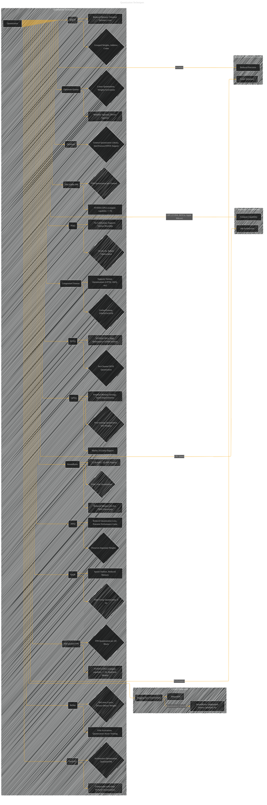
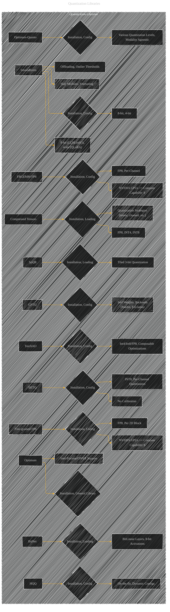
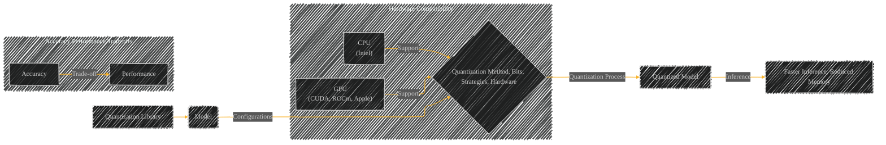

# An Overview of Quantization in Transformers
> **Disclaimer:**
>
> This document contains my personal notes on the topic,
> compiled from publicly available documentation and various cited sources.
> The materials are intended for educational purposes, personal study, and reference.
> The content is dual-licensed:
> 1. **MIT License:** Applies to all code implementations (Swift, Mermaid, and other programming languages).
> 2. **Creative Commons Attribution 4.0 International License (CC BY 4.0):** Applies to all non-code content, including text, explanations, diagrams, and illustrations.
---

## Key Concepts and Relationships

* **Quantization:** The core concept is representing numerical data with fewer bits, trading off accuracy for reduced memory footprint and faster inference.  This directly impacts model size and speed.

* **Quantization Methods:** The document introduces a variety of quantization methods, including:
    * **AQLM:** Additive Quantization of Language Models, a technique that quantizes groups of weights as a sum of codes.
    * **AWQ:** Activation-aware Weight Quantization, which focuses on preserving weights crucial for model accuracy.
    * **bitsandbytes:** A comprehensive library for 8-bit and 4-bit quantization.  Includes strategies like LLM.int8() and QLoRA support.
    * **Compressed Tensors:** A unified format supporting various quantization and sparsity schemes, including FP8 and INT4, optimized for different hardware.
    * **EETQ:**  Per-channel int8 quantization for NVIDIA GPUs, leveraging FasterTransformer and TensorRT.
    * **FBGEMM FP8:** FP8 quantization per channel, targeting smaller batch sizes on compute-capable GPUs.
    * **Fine-grained FP8:**  FP8 quantization per 2D block, leveraging DeepSeek implementations.
    * **GPTQ:** A post-training quantization technique that quantizes each row of the weight matrix independently.  Supports int4, int8, and various backends.
    * **Marlin:** 4-bit GPTQ kernel optimized for NVIDIA A100 GPUs.
    * **ExLlama/ExLlamaV2:** CUDA implementations for faster 4-bit GPTQ inference.
    * **HQQ:** Half-Quadratic Quantization, a robust on-the-fly quantization technique for diverse models.
    * **Optimum:** A general library for quantization that supports various backends.
    * **Optimum-quanto:**  Supports various quantization levels (e.g., int8), modality-agnostic, and device-agnostic.
    * **SpQR:**  16x16 tiled bi-level group 3-bit quantization structure for LLMs.
    * **BitNet:** Replaces linear layers with specialized BitLinear layers for ternary/binary weight and 8-bit activation quantization.
    * **TorchAO:** An architecture optimization library for PyTorch, including quantization techniques like int4_weight_only.

* **Libraries and Tools:**  Crucially, the document highlights specific libraries (e.g., bitsandbytes, compressed-tensors, optimum, etc.) and associated commands for implementing each quantization technique.  There's emphasis on installing the correct versions and using appropriate configuration options.

* **Hardware Considerations:** Each quantization method often has specific hardware requirements (e.g., compute capability, GPU type, etc.).  The document explicitly notes compatibility with CPUs, GPUs (CUDA, ROCm, Apple Silicon), and specific GPU architectures (e.g., NVIDIA A100).

* **Accuracy/Performance Tradeoffs:** The document emphasizes the trade-offs inherent in quantization (reduced memory usage vs. potential loss of accuracy).  It frequently provides benchmarks and comparisons to highlight the performance gains or limitations of each approach.

* **Use Cases and Support:**  The document identifies specific use cases where each method excels (e.g., on-the-fly quantization, calibration-based compression, specific hardware support). This is presented through various examples of loading, using, and potentially saving quantized models.

----

## Diagrammatic Representations (Conceptual Outline)

* **Quantization Techniques Overview:** A mind map or flowchart outlining the various quantization techniques, their pros and cons, and the associated libraries/tools.  Each quantization method could be a branch with sub-branches representing specific features, use cases, or hardware support.
* **Hardware Compatibility Matrix:** A table showing the compatibility of each quantization technique with different hardware.  This would clearly display the constraints of each technique based on the targeted hardware.
* **Quantization Pipeline:** A sequence diagram to illustrate the steps involved in quantizing a model (e.g., loading, configuring, quantization, inference).
* **Accuracy-Performance Tradeoff Charts:**  Scatter plots or bar graphs illustrating the trade-offs between accuracy and performance for different quantization levels.
* **Library Integration Graph:** A graph showing the relationships and dependencies between the quantization libraries and the Hugging Face Transformers library.  Nodes could be specific library packages, and the edges would indicate how they integrate or call each other.

----

----

These are highly simplified conceptual representations.  A more detailed diagram would require more complex Mermaid structure, potentially including nested subgraphs for specific configurations and libraries, tables for hardware compatibility, and graphs to illustrate performance trade-offs. Remember to incorporate the code examples and mathematical expressions as annotations within the diagrams for a more complete and informative representation.

---
**Licenses:**

- **MIT License:**   - Full text in [LICENSE](LICENSE) file.
- **Creative Commons Attribution 4.0 International:**  - Legal details in [LICENSE-CC-BY](LICENSE-CC-BY) and at [Creative Commons official site](http://creativecommons.org/licenses/by/4.0/).

---