# Synthetic Zooniverse
A Deep Dive into Cutting-Edge AI Models and Techniques

[](LICENSE) [](LICENSE-CC-BY)

> Copyright © 2025 Cong Le. All Rights Reserved.

----
<details open>
	
<summary>Click to show/hide the full disclaimer.</summary>
 
> <ins>📢 **WARNING** 🚨</ins>
 
> **About This Project**
> - This repository documents my ongoing exploration at the intersection of digital art and artificial intelligence.

> **Purpose**
> - To publicly document academic research.
> - To share findings with the community.
> - To maintain a personal portfolio of creative and technical work.

> **Disclaimer**
> - This is a personal project.
> - Any user who shares, adapts, or builds upon this work is responsible for their own interpretations and applications.

> This document contains my personal notes on the topic,
> compiled from publicly available documentation and various cited sources.
> The materials are intended for 👨‍🎓 <ins>educational purposes</ins> 👨‍🎓 (<ins>sometimes, entertainment purposes</ins>), 📖 <ins> personal study </ins> 📖, and 🔖 <ins> technical reference </ins> 🔖.

> The content is dual-licensed:
> 1. **MIT License:** Applies to all code implementations (Swift, Mermaid, and other programming languages).
> 2. **Creative Commons Attribution-ShareAlike 4.0 International License (CC BY-SA 4.0):** Applies to all non-code content, including text, explanations, diagrams, and illustrations.

> ... and I'm still searching for a real job now.

</details>


---

Welcome to the **Synthetic Zooniverse**! This repository provides curated insights, in-depth research, and practical explorations of the newest and most impactful AI models and methodologies shaping the future of technology. Whether you're a seasoned AI researcher, a student eager to dive into the field, or a tech enthusiast looking to understand the cutting edge, the Synthetic Zooniverse is designed to provide you with comprehensive and accessible resources.

## Table of Contents

- [About the Project](#about-the-project)
- [Areas of Focus](#areas-of-focus)
- [Repository Structure](#repository-structure)
- [Example of Model Architecture](#example-of-model-architecture)
- [Getting Started](#getting-started)
- [Usage](#usage)
- [Contributing](#contributing)
- [License](#license)
<!-- - [Contact](#contact) -->
<!-- - [Acknowledgments](#acknowledgments) -->
- [Disclaimer](#disclaimer)
<!-- - [Quick Links](#quick-links) -->
- [Markdown Resources](#markdown-resources)

---

## About the Project

The **Synthetic Zooniverse** aims to be a leading hub for understanding and exploring the world of Artificial Intelligence. The repository features:

-   **Research Frameworks:** Step-by-step analyses of state-of-the-art AI models and methodologies, inspired by the approach used in [AlgoVerse](https://github.com/CongLeSolutionX/AlgoVerse.git) (though focused on AI instead of algorithms).
-   **Model Deep Dives:** Detailed examinations of specific models, including architecture, training techniques, and performance evaluations.
-   **Practical Implementations:** Code examples in various programming languages showcasing how to use and experiment with AI models.
-   **Comparative Studies:** Side-by-side comparisons of different AI approaches and technologies.
-   **Educational Resources:** Links to helpful research papers, tutorials, and community discussions.

The goal is to foster a deeper understanding of AI, contribute to the open-source community, and help others stay informed about the dynamic landscape. The project is created to enhance the AI model exploration and understanding capabilities with innovative approaches, and it has the potential to impact future technology.

---

## Areas of Focus

The Synthetic Zooniverse covers multiple focus areas within modern AI:
- **Generative AI:** Examine technologies like Stable Diffusion, DALL-E 2, and GANs.
- **Language Models:** Focus on advanced language models such as GPT-3/4, BERT, and their applications.
- **Computer Vision:** Explore and understand frameworks and tools for image processing and analysis, and object detection.
- **Reinforcement Learning:** Focus on reinforcement learning paradigms.

## Repository Structure

This repository is organized into folders, mirroring the structure of models or research areas explored. Details of files:

-   **README.md**: This file—the project overview and license information.
-   **Model Specific Folders:** Detailed information about the AI Models, including research, implementation, and evaluation.
-   **Code Implementations**: Files for implementing the models.
-   **Licenses**: Contains text for MIT and CC BY 4.0.

```md
SyntheticZooniverse/
├── ... (main project files, including this README.md)
│
├── Generative-AI/
│   ├── Stable-Diffusion/
│   │   ├── README.md            (Model framework and analysis)
│   │   ├── stable_diffusion.py  (Code implementations)
│   │   └── ... (relevant resources )
│   ├── DALL-E-2/
│   │   ├── README.md            (Model framework)
│   │   └── dall_e_2.py         (Code implementation)
│   │   └── ... (related resources)
│   └── ... (other Generative AI models)
├── Language-Models/
│   ├── GPT-3/
│   │   ├── README.md            (Model framework)
│   │   ├── gpt3_example.py      (Code implementation)
│   └── ... (other Language Models)
├── Computer-Vision/
│   ├── YOLO/
│    ├── README.md          (Model framework)
│    ├── yolo_implementation.py (Code implementation )
│    └── ... (related resources)
│
├── LICENSE-MIT              (MIT License text)
├── LICENSE-CC-BY-4.0         (Creative Commons BY 4.0 License)
└── ... (other focus areas will be added)
```

---

## Example of Model Architecture

```mermaid
---
title: "Transformer Architecture - Simplified Main Flow with Detailed Layer Subgraphs"
author: "Cong Le"
version: "2.0"
license(s): "MIT, CC BY 4.0"
copyright: "Copyright (c) 2025 Cong Le. All Rights Reserved."
config:
  layout: elk
  look: handDrawn
  theme: dark
---
%%{
  init: {
    "flowchart": { "htmlLabels": true, 'curve': 'linear' },
    'fontFamily': 'verdana',
    'themeVariables': {
      'primaryColor': '#BB2528',
      'primaryTextColor': '#f529',
      'primaryBorderColor': '#7C0000',
      'lineColor': '#F8B229',
      'secondaryColor': '#006100',
      'tertiaryColor': '#fff'
    }
  }
}%%
%%%%%%%% Mermaid version v11.4.1-b.14
%%%%%%%% Available curve styles include the following keywords:
%% basis, bumpX, bumpY, cardinal, catmullRom, linear, monotoneX, monotoneY, natural, step, stepAfter, stepBefore.
graph LR
    subgraph Transformer["Transformer Architecture"]
        style Transformer fill:#e834,stroke:#005a9e,stroke-width:2px

        A["Input Sequence<br>(x₁, ..., xₙ)"] --> B["Input Embeddings"]
        B --> C["Positional Encoding"]
        C --> D1["Encoder Block 1"]

        D1 --> D2["Encoder Block 2"]
        D2 --> D3["..."]
        D3 --> DN["Encoder Block N"]

        DN --> I1["Decoder Block 1"]

        I1 --> I2["Decoder Block 2"]
        I2 --> I3["..."]
        I3 --> IN["Decoder Block N"]

        IN --> P["Linear Layer"]
        P --> Q["Softmax"]
        Q --> R["Output Sequence<br>(y₁, ..., yₘ)"]

        A -.-> S["Target Sequence<br>(y₁, ..., yₘ₋₁)"]
        S --> T["Target Embeddings"]
        T --> U["Positional Encoding"]
        U --> I1

        %% Connections to show layer details (referencing side subgraphs)
        D1 -- "See Encoder Layer Detail" --> Encoder_Layer
        DN -- "See Encoder Layer Detail" --> Encoder_Layer
        I1 -- "See Decoder Layer Detail" --> Decoder_Layer
        IN -- "See Decoder Layer Detail" --> Decoder_Layer
     end

    subgraph Encoder_Layer["Encoder Layer Detail"]
        style Encoder_Layer fill:#2cc33,stroke:#005a9e,stroke-width:1px
        En_MultiHead["Multi-Head<br>Self-Attention"] --> En_AddNorm1["Add & Norm"]
        En_AddNorm1 --> En_FFN["Feed-Forward<br>Network"]
        En_FFN --> En_AddNorm2["Add & Norm"]

        %% Input connections (Conceptual - not directly drawn in main flow)
        En_Input --> En_MultiHead

         %% Output connection (Conceptual - represented by layer stacking in main flow)
        En_AddNorm2 --> En_Output
    end

    subgraph Decoder_Layer["Decoder Layer Detail"]
        style Decoder_Layer fill:#d2f3,stroke:#005a9e,stroke-width:1px

        De_MaskedMultiHead["Masked<br>Multi-Head<br>Self-Attention"] --> De_AddNorm1["Add & Norm"]
        De_AddNorm1 --> De_EncDecAttn["Multi-Head<br>Encoder-Decoder<br>Attention"]
        De_EncDecAttn --> De_AddNorm2["Add & Norm"]
        De_AddNorm2 --> De_FFN["Feed-Forward<br>Network"]
        De_FFN --> De_AddNorm3["Add & Norm"]

        %% Input Connections (Conceptual)
        De_Input --> De_MaskedMultiHead
        De_EncoderOutput --> De_EncDecAttn

        %% Output Connection (Conceptual)
        De_AddNorm3--> De_Output
    end

        subgraph Scaled_Dot_Product_Attention["Scaled Dot-Product Attention"]
        style Scaled_Dot_Product_Attention fill:#c8e4,stroke:#43a047,stroke-width:2px
        Attn_Input["Input<br>(Q, K, V)"] --> Attn_ScaledDotProduct["Scaled<br>Dot-Product"]
        Attn_ScaledDotProduct --> Attn_Softmax["Softmax"]
        Attn_Softmax --> Attn_Output["Output"]
        Attn_Input --> Attn_Output
    end

    En_MultiHead -- "Q, K, V" --> Attn_Input
    De_MaskedMultiHead -- "Q, K, V" --> Attn_Input
    De_EncDecAttn -- "Q from Decoder,<br>K, V from Encoder" --> Attn_Input

    %% Formulas

    classDef formulaStyle fill:none,stroke:none,font-size:14px
    classDef formulaStyleSubText fill:none,stroke:none,font-size:10px

    PE_Formula1:::formulaStyle
    PE_Formula2:::formulaStyle

    MultiHead_Formula:::formulaStyle
    FFN_Formula:::formulaStyle
    SoftmaxFormula:::formulaStyle
    ScaledDotProduct_Formula:::formulaStyle

    C -.-> PE_Formula1("PE(pos, 2i) = sin(pos/10000<sup>2i/d<sub>model</sub></sup>)")
    C -.-> PE_Formula2("PE(pos, 2i+1) = cos(pos/10000<sup>2i/d<sub>model</sub></sup>)")
    U -.-> PE_Formula1
    U -.-> PE_Formula2

    En_MultiHead -.-> MultiHead_Formula("MultiHead(Q, K, V) = Concat(head<sub>1</sub>, ..., head<sub>h</sub>)W<sup>O</sup>")
    MultiHead_Formula -.-> head_i_sub:::formulaStyleSubText
    head_i_sub("head<sub>i</sub> = Attention(QW<sub>i</sub><sup>Q</sup>, KW<sub>i</sub><sup>K</sup>, VW<sub>i</sub><sup>V</sup>)")

    En_FFN -.- FFN_Formula("FFN(x) = max(0, xW<sub>1</sub> + b<sub>1</sub>)W<sub>2</sub> + b<sub>2</sub>")
    De_FFN -.- FFN_Formula
    Q -.-> SoftmaxFormula("softmax<br>(z<sub>i</sub>)<br>= e<sup>z<sub>i</sub></sup> / Σ<sub>j</sub>e<sup>z<sub>j</sub></sup>")

    Scaled_Dot_Product_Attention -.- ScaledDotProduct_Formula("Attention(Q, K, V) = softmax(QK<sup>T</sup> / √d<sub>k</sub>)V")

    En_AddNorm1 -.-> En_AddNorm1_Sub:::formulaStyleSubText
    En_AddNorm1_Sub("LayerNorm(x + Attention(x))")
    En_AddNorm2 -.-> En_AddNorm2_Sub:::formulaStyleSubText
    En_AddNorm2_Sub("LayerNorm(x + FFN(x))")

    De_AddNorm1 -.-> De_AddNorm1_Sub:::formulaStyleSubText
    De_AddNorm1_Sub("LayerNorm(x + MaskedAttention(x))")
    De_AddNorm2 -.-> De_AddNorm2_Sub:::formulaStyleSubText
    De_AddNorm2_Sub("LayerNorm(x + Attention(x))")
    De_AddNorm3 -.-> De_AddNorm3_Sub:::formulaStyleSubText
    De_AddNorm3_Sub("LayerNorm(x + FFN(x))")
    Attn_ScaledDotProduct -.-> Attn_ScaledDotProduct_Sub:::formulaStyleSubText
    Attn_ScaledDotProduct_Sub("QK<sup>T</sup> / √d<sub>k</sub>")
    Attn_Softmax -.-> Attn_Softmax_sub:::formulaStyleSubText
    Attn_Softmax_sub("softmax(QK<sup>T</sup> / √d<sub>k</sub>)")
    Attn_Output -.-> Attn_Output_sub:::formulaStyleSubText
    Attn_Output_sub("softmax(QK<sup>T</sup> / √d<sub>k</sub>)V")

    linkStyle 38,41 stroke:#aa3,stroke-width:1px,stroke-dasharray: 5 5

```




> [!TIP]
> DOI: [10.13140/RG.2.2.14724.03203](http://dx.doi.org/10.13140/RG.2.2.14724.03203)


> [!NOTE]
> Mermaid version v11.4.1-b.14

---

## Getting Started

### Prerequisites

To fully utilize the materials, you may need:

-   **Programming Skills:** Knowledge of Python and potential exposure to other languages (e.g., C++, JavaScript).
-   **Machine Learning Background:** Familiarity with basic concepts such as neural networks, training, and evaluation.
-   **Required Tools:** A code editor or IDE, along with the necessary libraries (e.g., PyTorch, TensorFlow) and runtime environments. Git for version control is recommended for your contributions.

### Cloning the Repository

Clone the repository to your local machine by running:

```bash
git clone [YOUR_REPO_URL]  # Replace [YOUR_REPO_URL] with your actual repository URL

```

---

## Usage

### Exploring the Synthetic Zooniverse

1.  **Navigate:** Explore the folders based on your areas of interest (e.g., `SyntheticZooniverse/Generative-AI/Stable-Diffusion/`).
2.  **Read the README.md:** Dive into the framework files, which offer model overviews, research insights, and discussions.
3.  **Examine Implementations:** Explore code examples to visualize the practical application.
4.  **Experiment:** Modify, modify, and run experiments for your own learning or research, respecting the licensing terms.

---

## Contributing

We welcome contributions! If you have new insights, model implementations, or research updates to share, please refer to the CONTRIBUTING.md (Not yet implemented will be updated later) for guidelines.

---

## 🚀 Project Current Activities

<div align="left"><a name="project-current-activities"></a>

<details open>
<summary>Click to show/hide more on recent activities of this project </summary>

> powered by [OSS Insight](https://ossinsight.io)
<!-- All the diagrams below are made with [OSS Insight](https://ossinsight.io/) -->

| :bar_chart: Widget & Description | :art: Snapshot (Light Mode) |
|---|---|
| Active Contributors :technologist: of CongLeSolutionX/Synthetic-Zooniverse - Last 28 days |  <br/> :link: [View Full Report :mag:](https://next.ossinsight.io/widgets/official/compose-recent-active-contributors?repo_id=932142266&limit=30) |
| Pushes :arrow_up: and Commits :writing_hand: of CongLeSolutionX/Synthetic-Zooniverse |  <br/> :link: [View Full Report :mag:](https://next.ossinsight.io/widgets/official/analyze-repo-pushes-and-commits-per-month?repo_id=932142266) |
| Pull Request Size :straight_ruler: of CongLeSolutionX/Synthetic-Zooniverse |  <br/> :link: [View Full Report :mag:](https://next.ossinsight.io/widgets/official/analyze-repo-pull-requests-size-per-month?repo_id=932142266) |
| Pull Request Lifecycle :arrows_counterclockwise: of CongLeSolutionX/Synthetic-Zooniverse |  <br/> :link: [View Full Report :mag:](https://next.ossinsight.io/widgets/official/analyze-repo-pull-request-open-to-merged?repo_id=932142266) |
| Lines of Code Changes :computer::scroll: of CongLeSolutionX/Synthetic-Zooniverse |  <br/> :link: [View Full Report :mag:](https://next.ossinsight.io/widgets/official/analyze-repo-loc-per-month?repo_id=932142266) |
| Commits Time Distribution :alarm_clock::date: of CongLeSolutionX/Synthetic-Zooniverse |  <br/> :link: [View Full Report :mag:](https://next.ossinsight.io/widgets/official/analyze-repo-commits-time-distribution?repo_id=932142266&period=last_1_year&zone=0) | 

</details>

</div>


----

## License

-   Code files within this repository are licensed under the [MIT License](LICENSE).
-   Framework files (README.md and related documentation) are licensed under the [Creative Commons Attribution 4.0 International License (CC BY 4.0)](LICENSE-CC-BY).
<!-- 
---

## Contact

[Your Email or Preferred Contact Method] -->

<!-- ---

## Acknowledgments

(To be completed later, will be updated with your input)
*   [Mention contributors, funding sources, or communities.]

--- -->

## Disclaimer

AI technologies are evolving at a rapid pace. The information and code provided in this repository are for educational and research purposes. We do not provide any guarantees regarding the accuracy or completeness of the materials.

<!-- ---

## Quick Links

-   [GitHub Repository URL](Replace with actual URL)
-   [Project Discussions/Forum (If Applicable)](Link to forum)

--- -->

## Markdown Resources

*   [Markdown Guide](https://www.markdownguide.org/)
*   [GitHub Flavored Markdown](https://github.github.com/gfm/)


---

<!-- 


---


