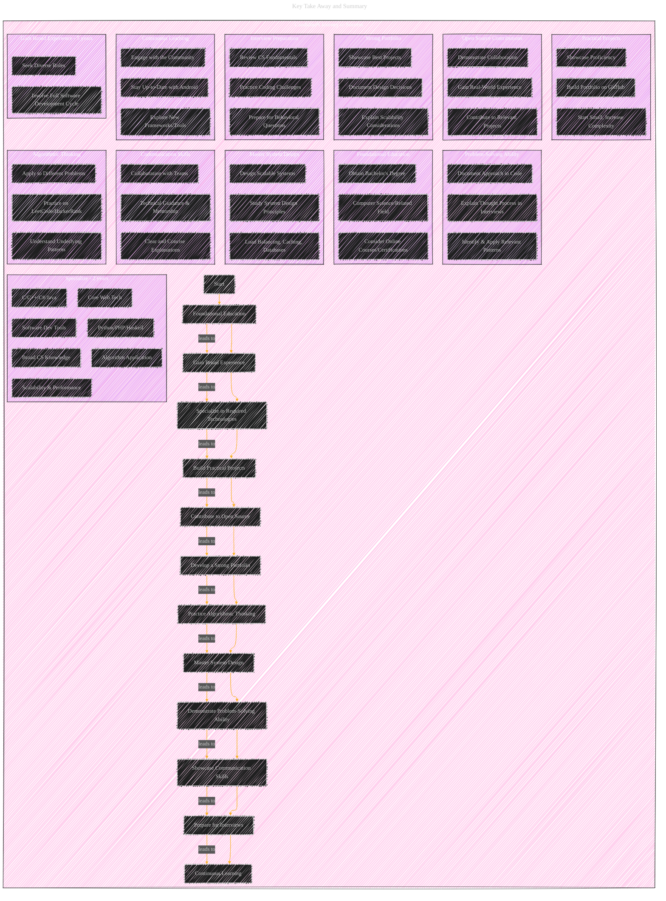

# Software Engineer, Android
> **Disclaimer:**
>
> This document contains my personal notes on the topic,
> compiled from publicly available documentation and various cited sources.
> The materials are intended for educational purposes, personal study, and reference.
> The content is dual-licensed:
> 1. **MIT License:** Applies to all code implementations (Swift, Mermaid, and other programming languages).
> 2. **Creative Commons Attribution 4.0 International License (CC BY 4.0):** Applies to all non-code content, including text, explanations, diagrams, and illustrations.
---

## Software Engineer, Android - A Visual and Practical Guide

This response will cover:

1.  **Visual Representations:** Using Mermaid diagrams to illustrate the job responsibilities, qualifications, and relationships between them.
2.  **Actionable Advice:** Specific steps a candidate can take to acquire and demonstrate the required skills.
3.  **Open Source Links:** Where applicable, links to relevant open-source projects for practical experience.

---

### **1. Visual Representations**

#### **1.1 Job Responsibilities - Mind Map**

**Explanation:**

*   **Purpose:** This mind map provides a hierarchical overview of the responsibilities, breaking them down into key areas and sub-tasks.
*   **Nodes:**  The central node represents the job title, with branches extending to major responsibility categories.
*   **Structure:**  The map visually organizes the information, making it easier to grasp the breadth of the role.

#### **1.2 Minimum Qualifications - Mind Map**

**Explanation:**

*   **Purpose:**  This mind map breaks down the minimum qualifications, separating educational requirements from experience requirements.  The experience section is further divided into general and specific skill areas.
*  **Visual Clarity** Emphasis the 2 key qualifications along with their respective requirements, to make it clear, concise, and easy to follow.

#### **1.3 Relationships between Responsibilities and Qualifications - Graph**

**Explanation:**

*   **Purpose:**  This graph visually connects each responsibility to the qualifications needed to fulfill it.  This helps a candidate understand *why* each qualification is required.
*   **Nodes:**  Responsibilities and Qualifications are grouped into separate subgraphs.
*   **Edges:**  Arrows ("Requires") indicate which qualifications are necessary for each responsibility.  For example, "Research, Design, Develop, Test" requires a CS degree, 5 years of general experience, and 2 years of experience in various specific areas.

---

### **2. Actionable Advice for Candidates**

This section provides concrete steps a candidate can take to gain and demonstrate the required qualifications.

#### **2.1 Education:**

*   **Action:** Obtain a Bachelor's degree in a relevant field (Computer Science, Computer Engineering, etc.).  If you're already past this stage, consider relevant certifications or online courses to fill knowledge gaps.

#### **2.2 General Experience (5 Years):**

*   **Action:**  Seek out roles that provide broad exposure to software development.  Focus on projects that involve the full software development lifecycle (SDLC).  This could include internships, entry-level positions, or even contributing to open-source projects.

#### **2.3 Specific Experience (2 Years):**

*   **2.3.1 C, C++, C#, or Java:**
    *   **Action:**
        *   **Practice:**  Work on projects that require these languages. Start with small projects and gradually increase complexity.  LeetCode, HackerRank, and similar platforms are excellent for practice.
        *   **Demonstrate:**  Build a portfolio of projects on GitHub that showcase your proficiency.  Contribute to open-source projects that use these languages.
        *   **Open Source Examples:**
            *   **C++:**  [SerenityOS](https://github.com/SerenityOS/serenity) (Operating System), [Godot Engine](https://github.com/godotengine/godot) (Game Engine)
            *   **Java:**  [Apache Hadoop](https://github.com/apache/hadoop) (Distributed Processing), [Elasticsearch](https://github.com/elastic/elasticsearch) (Search Engine)
            *   **C#:** [.NET Runtime](https://github.com/dotnet/runtime) (Runtime Environment)

*   **2.3.2 Python, PHP, or Haskell:**
    *   **Action:**
        *   **Practice:**  Similar to the above, practice with projects and online resources.
        *   **Demonstrate:**  Build a portfolio, contribute to open source.
        *   **Open Source Examples:**
            *   **Python:**  [Django](https://github.com/django/django) (Web Framework), [Flask](https://github.com/pallets/flask) (Web Framework)
            *   **PHP:**  [WordPress](https://github.com/WordPress/WordPress) (Content Management System), [Laravel](https://github.com/laravel/laravel) (Web Framework)
            *   **Haskell:** [xmonad](https://github.com/xmonad/xmonad) (Window Manager), [pandoc](https://github.com/jgm/pandoc) (Document Converter)

*   **2.3.3 Software Development Tools:**
    *   **Action:**
        *   **Practice:**  Become proficient with VIM or Emacs.  Use Git for version control on *all* your projects, even small ones.
        *   **Demonstrate:**  Your GitHub profile will demonstrate your Git usage.  Configuring your VIM/Emacs setup and sharing it (e.g., as a dotfiles repository) can also be a demonstration.
        *   **Open Source Examples:**  Almost any open-source project will use a revision control system. Look for projects that seem interesting to you and contribute.

*   **2.3.4 Core Web Technologies (HTML, CSS, JavaScript):**
    *   **Action:**
        *   **Practice:**  Build websites and web applications.  Start with simple static sites and move on to dynamic applications.
        *   **Demonstrate:**  A portfolio of web projects is essential.  Contribute to open-source web projects.
        *   **Open Source Examples:**  [React](https://github.com/facebook/react) (JavaScript Library), [Vue.js](https://github.com/vuejs/vue) (JavaScript Framework)

*   **2.3.5 Highly-Scalable Performant Solutions:**
    *   **Action:**
        *   **Learn:**  Study system design principles.  Read about load balancing, caching, databases, and other concepts related to scalability.
        *   **Practice:**  Design and implement (even on a small scale) systems that *could* scale.  Think about how you would handle increasing traffic or data volume.
        *   **Demonstrate:**  Document your design decisions and explain how your projects address scalability concerns.  This can be done in a blog post or in the README of your project.

*   **2.3.6 Broad CS Knowledge:**
    *   **Action:**
        *   **Learn:**  Take courses (online or in person) on the listed topics. Solid understanding on data structure and algorithm is essential for any roles.
        *   **Practice:**  Apply these concepts in your projects.  For example, use networking concepts when building a client-server application.
        *   **Demonstrate:**  This is harder to demonstrate directly, but it will become evident in your code quality, design decisions, and problem-solving skills.

*   **2.3.7 Algorithm Application:**
    *   **Action:**
        *   **Practice:**  Work on algorithmic problems (LeetCode, HackerRank, etc.).  Focus on understanding the underlying patterns and how different algorithms can be applied to different problems.
        *   **Demonstrate:**  Explain your thought process when solving algorithmic problems in interviews.  Show how you can identify and apply relevant patterns.  Document your approach in your code (comments and README).

**Key Take Away and Summary**

*  **Visual Representation:** This flowchart represents a candidate's journey toward meeting the job qualifications and excelling in the role.
* **Step-by-Step Process** It outlines a clear path from foundational education to specialization, practical application, and continuous learning.
*  **Detailed Subgraphs** Each major step is further broken down into specific actions and areas of focus.
* **Interconnectedness:** The arrows clearly indicate the progression and dependencies between different stages of development.

---
**Licenses:**

- **MIT License:**   - Full text in [LICENSE](LICENSE) file.
- **Creative Commons Attribution 4.0 International:**  - Legal details in [LICENSE-CC-BY](LICENSE-CC-BY) and at [Creative Commons official site](http://creativecommons.org/licenses/by/4.0/).

---