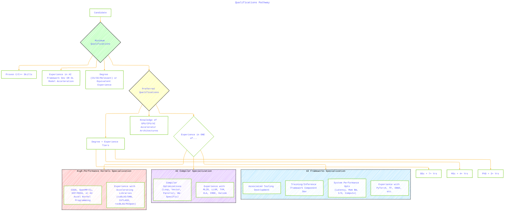

# Analysis of Software Engineer, Systems ML - Frameworks / Compilers / Kernels Role at Meta
> **Disclaimer:**
>
> This document contains my personal notes on the topic,
> compiled from publicly available documentation and various cited sources.
> The materials are intended for educational purposes, personal study, and reference.
> The content is dual-licensed:
> 1. **MIT License:** Applies to all code implementations (Swift, Mermaid, and other programming languages).
> 2. **Creative Commons Attribution 4.0 International License (CC BY 4.0):** Applies to all non-code content, including text, explanations, diagrams, and illustrations.
---

## A Diagrammatic Guide 

Here is a breakdown of the Systems ML Software Engineer role focused on Frameworks, Compilers, and Kernels, presented using Mermaid diagrams and explanations on how to demonstrate the required qualifications, along with relevant open-source project links.

This role sits at the intersection of cutting-edge AI research and high-performance computing hardware. You'll be part of the Meta Training & Inference Accelerator (MTIA) Software team, working closely with the PyTorch organization. The core mission is to build and optimize the software stack (frameworks, compilers, kernels) that enables Meta's AI models to run efficiently on current and future custom MTIA hardware. This involves deep technical work in C++, compiler design, performance optimization, and understanding AI model architectures.

## Visualizing the Role and Responsibilities

Here are several Mermaid diagrams illustrating the key aspects of the role:

----

### 1. Role Overview and Context

This diagram shows the placement of the role within the organization and its primary goal.

**Explanation:** This mind map highlights that the role is deeply integrated within Meta's AI infrastructure, specifically linking PyTorch development with the custom MTIA hardware initiative. The focus is on performance, flexibility, and enabling new AI models through sophisticated software engineering.

----

### 2. Key Responsibilities Breakdown

This diagram details the primary tasks and duties associated with the role.

```mermaid
---
title: "Key Responsibilities Breakdown"
author: "Cong Le"
version: "1.0"
license(s): "MIT, CC BY 4.0"
copyright: "Copyright (c) 2025 Cong Le. All Rights Reserved."
config:
  layout: elk
  look: handDrawn
  theme: dark
---
%%%%%%%% Mermaid version v11.4.1-b.14
%%%%%%%% Toggle theme value to `base` to activate the initilization below for the customized theme version.
%%%%%%%% Available curve styles include the following keywords:
%% basis, bumpX, bumpY, cardinal, catmullRom, linear, monotoneX, monotoneY, natural, step, stepAfter, stepBefore.
%%{
  init: {
    'graph': { 'htmlLabels': false, 'curve': 'linear' },
    'fontFamily': 'Monospace',
    'themeVariables': {
      'primaryColor': '#ffff',
      'primaryTextColor': '#55ff',
      'primaryBorderColor': '#7c2',
      'lineColor': '#F8B229',
      'secondaryColor': '#006100',
      'tertiaryColor': '#fff'
    }
  }
}%%
graph TD
    A["Software Engineer, Systems ML"] --> B("Develop SW Stack")
    B --> B1["Focus:<br>AI Frameworks"]
    B --> B2["Focus:<br>Compiler Stack"]
    B --> B3["Focus:<br>High-Performance Kernels"]
    B --> B4["Focus:<br>Acceleration on Next-Gen Hardware"]

    A --> C("Contribute to PyTorch Core Compilers")
    C --> C1["Support New AI Hardware Accelerators<br>(Training)"]
    C --> C2["Support New AI Hardware Accelerators<br>(Inference)"]
    C --> C3["Optimize Performance for Accelerators"]

    A --> D("Analyze & Optimize Deep Learning")
    D --> D1["Analyze DL Network Architectures"]
    D --> D2["Develop Compiler Optimization Algorithms"]
    D --> D3["Implement Compiler Optimization Algorithms"]

    A --> E("Collaborate with AI Researchers")
    E --> E1["Accelerate Next-Gen Models"]
    E1 --> E1a["Recommendation Systems"]
    E1 --> E1b["Generative AI"]
    E1 --> E1c["Computer Vision"]
    E1 --> E1d["NLP"]

    A --> F("Performance Tuning & Optimization")
    F --> F1["DL Framework Components"]
    F --> F2["Other Software Components"]

    style A fill:#f9f3,stroke:#333,stroke-width:2px
```

**Explanation:** This flowchart breaks down the responsibilities into distinct areas: core software stack development (with specialization options), contributions to the PyTorch compiler ecosystem, deep learning model analysis and optimization, collaboration with research, and general performance tuning.

----

### 3. Technical Focus Areas & Technologies

This diagram illustrates the specific technical domains and example technologies involved.

**Explanation:** This graph maps the core technical areas (Frameworks, Compiler, Kernels, Tooling) to specific technologies and concepts mentioned in the job description. It also shows the interdependencies (e.g., the Compiler generates code that uses Kernels, and interacts with Frameworks).

----

### 4. Qualifications Pathway

This diagram outlines the minimum and preferred qualifications, including the specialized tracks.

**Explanation:** This flowchart shows the path from minimum qualifications to preferred ones. It highlights the required foundational skills (C++, AI/DL experience, degree) and then branches into the preferred qualifications, emphasizing the need for hardware architecture knowledge and deep experience in *at least one* of the three core areas: Frameworks, Compiler, or Kernels.

----

## How to Demonstrate and Practice Qualifications

Here’s how a candidate can actively demonstrate or practice the skills required for this role:

**1. C/C++ Programming Skills (Minimum):**
    *   **Practice:**
        *   Work on personal projects involving systems programming, performance-critical code, or resource management (e.g., custom memory allocators, concurrent data structures).
        *   Participate in competitive programming (platforms like LeetCode, HackerRank, Codeforces often require efficient C++ solutions).
        *   Study and implement low-level systems concepts.
    *   **Demonstrate:**
        *   **Contribute to Open Source:** Find C++ based projects (especially in systems, compilers, game engines, high-performance computing) and contribute bug fixes, features, or optimizations. Examples: LLVM, GCC, Boost, database systems (PostgreSQL), large parts of PyTorch/TensorFlow core.
        *   **Portfolio:** Showcase personal projects on GitHub with clean, well-documented, and performant C++ code.
        *   **Technical Interviews:** Be prepared for C++ questions covering language features (templates, RAII, move semantics, C++11/14/17/20 features), memory management, pointers, data structures, and basic algorithms.

**2. AI Framework Development / DL Model Acceleration (Minimum & Preferred):**
    *   **Practice:**
        *   **Dive Deep into One Framework:** Choose PyTorch or TensorFlow. Understand its internal architecture – how graphs are represented, how execution works, how autograd functions.
        *   **Implement Custom Components:** Write custom layers, operators (Ops), or activation functions within the framework, including their forward and backward passes. Try writing a C++ extension for PyTorch or a custom Op for TensorFlow.
        *   **Experiment with Acceleration:** Take a simple model and try to accelerate it on available hardware (even CPU initially, focusing on vectorization, then GPU if possible). Use framework-provided tools (PyTorch JIT, `tf.function`, XLA).
        *   **Study Model Architectures:** Understand architectures like Transformers, CNNs, RNNs, GNNs, and how their computational patterns map to hardware.
    *   **Demonstrate:**
        *   **Contributions:** Contribute to PyTorch, TensorFlow, ONNX Runtime, or related ecosystem projects. This could involve bug fixes, documentation, implementing new features, or optimizing existing code.
        *   **Projects:** Build projects that involve training or deploying non-trivial models, potentially with custom modifications or performance tuning for specific hardware (even if it's just optimizing CPU/GPU usage via standard framework tools initially).
        *   **Blog Posts/Write-ups:** Explain complex framework concepts or detail your experiments in accelerating a model.

**3. Hardware Architecture Knowledge (Preferred - GPU/CPU/AI Accelerator):**
    *   **Practice:**
        *   **Study Computer Architecture:** Read classic textbooks (e.g., Hennessy & Patterson). Understand concepts like instruction sets, pipelines, caches, memory hierarchies, SIMD/SIMT, parallel processing paradigms.
        *   **Read Vendor Documentation:** Study architecture guides from NVIDIA (CUDA), AMD (ROCm), Intel (oneAPI), and public information about AI accelerators (like Google TPUs, or papers discussing accelerator design).
        *   **Use Profiling Tools:** Learn to use NVIDIA Nsight, AMD ROCprofiler, Intel VTune, or `perf` on Linux to understand how code interacts with the hardware (cache misses, instruction throughput, memory bandwidth usage).
    *   **Demonstrate:**
        *   **Explain Trade-offs:** Be able to discuss the architectural differences between CPU, GPU, and typical AI accelerators and how these differences impact algorithm design and performance.
        *   **Performance Analysis:** Show experience analyzing code performance using profiling tools and correlating results back to hardware limitations (e.g., "this kernel is memory-bound because...").
        *   **Targeted Optimizations:** Discuss or show examples of optimizations made specifically considering a hardware feature (e.g., optimizing for cache locality, using specific instruction sets like AVX or tensor cores).

**4. Specialization Tracks (Preferred):**

    *   **A. High-Performance Kernels:**
        *   **Practice:**
            *   Learn CUDA or HIP/ROCm programming thoroughly. Implement fundamental parallel algorithms (reduction, scan, matrix multiplication, convolution) from scratch.
            *   Optimize these kernels focusing on memory access patterns, thread divergence, occupancy, and instruction throughput.
            *   Study the internals and design principles of libraries like cuBLAS, cuDNN, CUTLASS, rocBLAS, MIOpen. Try implementing a small part of their functionality.
            *   Learn OpenMP/OpenCL for CPU/cross-platform parallel programming.
        *   **Demonstrate:**
            *   **GitHub Portfolio:** Showcase highly optimized kernel implementations. Compare their performance against naive versions or standard libraries.
            *   **Contributions:** Contribute to projects like CUTLASS, Triton, or libraries within the ROCm ecosystem.
            *   **Explain Kernel Optimization Techniques:** Be ready to discuss concepts like shared memory usage, tiling, register blocking, warp-level primitives, asynchronous operations.

    *   **B. AI Compiler:**
        *   **Practice:**
            *   Learn Compiler Fundamentals: Study compiler design principles (lexing, parsing, semantic analysis, intermediate representations, code generation, optimization). The "Dragon Book" is a classic resource.
            *   Study LLVM and MLIR: Understand their architecture, IRs, and pass management systems. Try writing simple passes (e.g., a basic optimization pass, an analysis pass).
            *   Explore AI Compilers: Install and experiment with TVM, XLA (via TensorFlow/JAX), IREE, or Halide. Understand their different approaches to representing and optimizing ML workloads. Try compiling a simple model and inspecting the generated code or IR.
            *   Implement Optimizations: Try implementing classic compiler optimizations (e.g., loop fusion, constant folding) or ML-specific ones (e.g., operator fusion) in a simple compiler framework or by modifying an existing one.
        *   **Demonstrate:**
            *   **Contributions:** Contribute to LLVM, MLIR, TVM, XLA, IREE, or related projects.
            *   **Projects/Experiments:** Build a toy compiler or demonstrate adding a custom optimization pass or hardware backend to an existing ML compiler framework.
            *   **Explain Compiler Concepts:** Discuss different IRs (e.g., MLIR dialects vs LLVM IR), phases of compilation, common optimization techniques (graph-level, loop-level, instruction-level), and challenges in compiling for heterogeneous hardware.

    *   **C. AI Frameworks (Deeper Dive):**
        *   **Practice:**
            *   **Understand Framework Internals:** Go beyond the user API. Trace the execution path of an operation in PyTorch/TensorFlow. Understand the role of the dispatcher, scheduler, memory manager, and autograd engine.
            *   **Develop Framework Components:** Try adding a new distributed training strategy, a custom device backend (even a basic CPU one initially), or improving the framework's profiling capabilities.
            *   **System Performance Analysis:** Use system-level tools (`perf`, `htop`, `iostat`) alongside framework-specific profilers to understand bottlenecks across the entire stack (CPU, memory, I/O, network) during training or inference. Develop tools or scripts to automate this analysis.
        *   **Demonstrate:**
            *   **Contributions:** Contribute significantly to core components of PyTorch, TensorFlow, JAX, or related framework infrastructure projects.
            *   **Projects:** Build tools for framework analysis, debugging, or performance optimization. Showcase projects demonstrating deep integration with framework internals.
            *   **Explain System-Level Optimizations:** Discuss techniques for optimizing data loading pipelines, reducing framework overhead, improving memory allocation patterns, and parallelizing execution effectively across different system resources.

----

## Relevant Open-Source Projects for Practice & Contribution

*   **Frameworks:**
    *   **PyTorch:** [https://github.com/pytorch/pytorch](https://github.com/pytorch/pytorch) (Core framework, C++ and Python)
    *   **TensorFlow:** [https://github.com/tensorflow/tensorflow](https://github.com/tensorflow/tensorflow) (Core framework, C++ and Python)
    *   **ONNX Runtime:** [https://github.com/microsoft/onnxruntime](https://github.com/microsoft/onnxruntime) (Inference engine for ONNX models, C++)
    *   **JAX:** [https://github.com/google/jax](https://github.com/google/jax) (High-performance ML research, uses XLA)
*   **Compilers:**
    *   **LLVM Project:** [https://github.com/llvm/llvm-project](https://github.com/llvm/llvm-project) (Includes LLVM core, Clang, and MLIR, C++)
    *   **MLIR:** (Part of LLVM Project) [https://mlir.llvm.org/](https://mlir.llvm.org/)
    *   **Apache TVM:** [https://github.com/apache/tvm](https://github.com/apache/tvm) (End-to-end ML compiler stack, C++/Python)
    *   **XLA (Accelerated Linear Algebra):** [https://github.com/openxla/xla](https://github.com/openxla/xla) (Domain-specific compiler used by TensorFlow/JAX, C++)
    *   **IREE (Intermediate Representation Execution Environment):** [https://github.com/openxla/iree](https://github.com/openxla/iree) (MLIR-based compiler and runtime, C++)
    *   **Halide:** [https://github.com/halide/Halide](https://github.com/halide/Halide) (Language/compiler for image processing and array computations, C++)
*   **Kernels & Libraries:**
    *   **CUTLASS:** [https://github.com/NVIDIA/cutlass](https://github.com/NVIDIA/cutlass) (CUDA C++ templates for high-performance matrix multiplication and related kernels)
    *   **Triton:** [https://github.com/openai/triton](https://github.com/openai/triton) (Language/compiler for writing efficient GPU kernels, Python interface, generates LLVM/PTX)
    *   **ROCm Libraries:** (AMD's equivalent to CUDA libraries, e.g., rocBLAS, MIOpen - often found within ROCm installation) [https://github.com/ROCmSoftwarePlatform](https://github.com/ROCmSoftwarePlatform)
    *   **oneDNN:** [https://github.com/oneapi-src/oneDNN](https://github.com/oneapi-src/oneDNN) (Intel's library for deep learning primitives, C++)

---
**Licenses:**

- **MIT License:**   - Full text in [LICENSE](LICENSE) file.
- **Creative Commons Attribution 4.0 International:**  - Legal details in [LICENSE-CC-BY](LICENSE-CC-BY) and at [Creative Commons official site](http://creativecommons.org/licenses/by/4.0/).

---