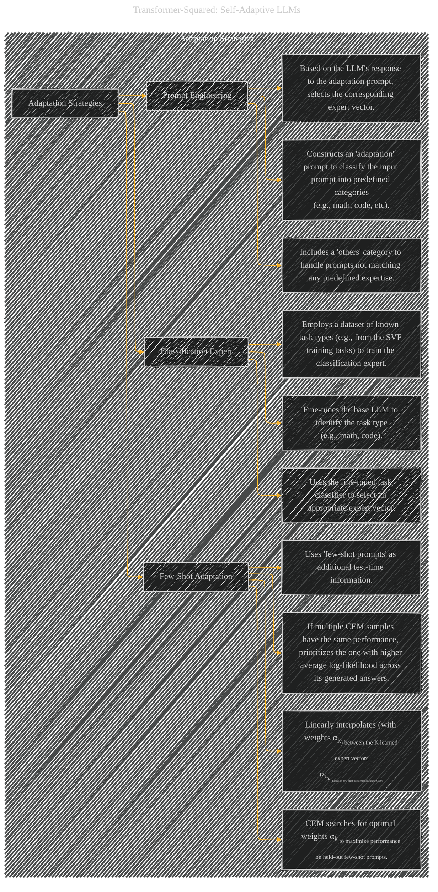

# Adaptation Strategies
> **Disclaimer:**
>
> This document contains my personal notes on the topic,
> compiled from publicly available documentation and various cited sources.
> The materials are intended for educational purposes, personal study, and reference.
> The content is dual-licensed:
> 1. **MIT License:** Applies to all code implementations (Swift, Mermaid, and other programming languages).
> 2. **Creative Commons Attribution 4.0 International License (CC BY 4.0):** Applies to all non-code content, including text, explanations, diagrams, and illustrations.
---

## Adaptation Strategies - A Diagrammatic Guide 

---

### Explanation of the Diagram

* **Subgraph:** The diagram is structured within a subgraph to clearly delineate the concept of "Adaptation Strategies."

* **Nodes:** Each node represents a distinct adaptation strategy (Prompt Engineering, Classification Expert, Few-Shot Adaptation).

* **Edges and Relationships:** Edges show the relationships between the strategy and its constituent parts.  For example, the edge from "Prompt Engineering" to "Constructs an 'adaptation' prompt" indicates the first step in the prompt engineering method.

* **Detailed Descriptions:**  The descriptions within each node's description are crucial for understanding the nuances of each method. They accurately capture the core steps and processes involved in each adaptation approach. This improves clarity and avoids ambiguity.

* **Focus on Key Steps:**  The diagram highlights the critical steps within each strategy, focusing on the actions, methodologies, and processes involved. This improves clarity and understanding of the paper's approach.

----

### Key improvements

* **Specificity:** The descriptions within the nodes are much more precise and accurately reflect the content of the original text.

* **Clarity:** The diagram is clearer and more focused on the core components of each adaptation strategy.

* **Relationships:** The relationships between the adaptation methods are explicitly shown via the arrows, improving the overall comprehension of the paper's architecture.

This revised diagram effectively summarizes the different adaptation strategies employed in the "Transformer-Squared" paper, providing a clearer and more detailed illustration of the key components of each approach.

---
**Licenses:**

- **MIT License:**   - Full text in [LICENSE](LICENSE) file.
- **Creative Commons Attribution 4.0 International:**  - Legal details in [LICENSE-CC-BY](LICENSE-CC-BY) and at [Creative Commons official site](http://creativecommons.org/licenses/by/4.0/).

---