# Diagram Types and Visualizations
> **Disclaimer:**
>
> This document contains my personal notes on the topic,
> compiled from publicly available documentation and various cited sources.
> The materials are intended for educational purposes, personal study, and reference.
> The content is dual-licensed:
> 1. **MIT License:** Applies to all code implementations (Swift, Mermaid, and other programming languages).
> 2. **Creative Commons Attribution 4.0 International License (CC BY 4.0):** Applies to all non-code content, including text, explanations, diagrams, and illustrations.
---

## Diagram Types and Visualizations - A Diagrammatic Guide 

```mermaid
---
title: "Transformer-Squared: Self-Adaptive LLMs"
config:
  layout: elk
  look: handDrawn
  theme: dark
---
%%%%%%%% Available curve styles include the following keywords:
%% basis, bumpX, bumpY, cardinal, catmullRom, linear, monotoneX, monotoneY, natural, step, stepAfter, stepBefore.
%%{
  init: {
    "graph": { "htmlLabels": false, 'curve': 'linear' },
    'fontFamily': 'Fantasy',
    'themeVariables': {
      'primaryColor': '#BB2528',
      'primaryTextColor': '#f529',
      'primaryBorderColor': '#7C0000',
      'lineColor': '#F8B229',
      'secondaryColor': '#006100',
      'tertiaryColor': '#fff'
    }
  }
}%%
graph LR
    subgraph Diagram_Types_and_Visualizations["Diagram Types and Visualizations"]
        A["Visualizations"] --> B{"Model Architectures"}
        B --> BA["Transformer Architecture"]
        B --> BB["Mixture of Experts (MoE)"]
        B --> BC["LoRA"]
        B --> BD["SVF"]
        
        A --> C{"Data Representations"}
        C --> CA["Training Data Sets<br>(e.g., GSM8K, MBPP-Pro, ARC)"]
        C --> CB["Validation Data"]
        C --> CC["Test Data"]
        
        A --> D{"Adaptation Processes"}
        D --> DA["Two-Pass Inference Process"]
        D --> DB["Prompt Engineering"]
        D --> DC["Classification Expert"]
        D --> DD["Few-Shot Adaptation using CEM"]
        
        A --> E{"Performance Evaluation"}
        E --> EA["Learning Curves<br>(SVF, LoRA)"]
        E --> EB["Confusion Matrices<br>(Adaptation Strategy Accuracy)"]
        E --> EC["PCA Variance Explained<br>(SVF, LoRA)"]
        E --> ED["Adaptation Coefficients<br>(α<sub>k</sub>)"]
        E --> EE["Hyperparameter Sweeps"]
        
        A --> F{"Comparison and Analysis"}
        F --> FA["Comparison Charts<br>(SVF vs. LoRA)"]
        F --> FB["Ablation Study Results"]
        F --> FC["Cross-Model Transfer Results"]
        F --> FD["Efficiency Tradeoffs<br>(Few-Shot Samples vs. Generations)"]

    end
    
```

---

### Explanation of Diagram Types and Visualizations

This revised diagram is organized into categories representing the different ways the paper visualizes and analyzes its concepts.

* **Model Architectures (B):** This category highlights the various architectures relevant to the paper, including the base Transformer architecture, the MoE structure, the LoRA structure, and the core SVF design. These visuals could be simplified diagrams of the network layers or complex layouts depending on the detail you want.

* **Data Representations (C):** This category displays the visual representation of data used in the experiments.  It shows how different data sets (training, validation, and test) are visualized and differentiated.  This might involve graphs showing task characteristics or tables displaying the data.

* **Adaptation Processes (D):** This category focuses on the visualization of how the self-adaptation process works, specifically highlighting each of the three adaptation strategies, and how the two-pass inference process functions.  Flowcharts are highly suitable here to illustrate the steps involved.

* **Performance Evaluation (E):** This category displays the visualizations used to evaluate the performance of the different methods.  This includes learning curves, which show training progress over time; confusion matrices, which demonstrate the accuracy of task classification; and PCA variance plots, which show the fraction of variance captured by the top singular components.  A diagram might also include charts to compare different hyperparameter sweeps.

* **Comparison and Analysis (F):** This section groups the visuals used to analyze and compare the different methods. This might include charts to compare the performance of SVF against LoRA, diagrams of ablation study results, and results from cross-model experiments, all in a way to show the different advantages/disadvantages of the methods and the implications of the analyses.

---

### Example of How to Flesh Out a Node

**Node:**  `EA[Learning Curves (SVF, LoRA)]`

**Possible Visualizations:**  Line graphs showing the training accuracy and test accuracy of SVF and LoRA over multiple epochs or iterations.  Distinct colors would distinguish SVF and LoRA, and separate lines might show the performance on various tasks.  The graph might include a dashed line representing the performance of the base model.  You might also see plots showing the training and test error over time to show how overfitting might manifest.

This detailed breakdown helps you understand how to populate the diagram with specific visual elements based on the content of the paper. Remember that the diagrams should effectively represent the relationships between concepts, methodologies, and results.

---
**Licenses:**

- **MIT License:**   - Full text in [LICENSE](LICENSE) file.
- **Creative Commons Attribution 4.0 International:**  - Legal details in [LICENSE-CC-BY](LICENSE-CC-BY) and at [Creative Commons official site](http://creativecommons.org/licenses/by/4.0/).

---