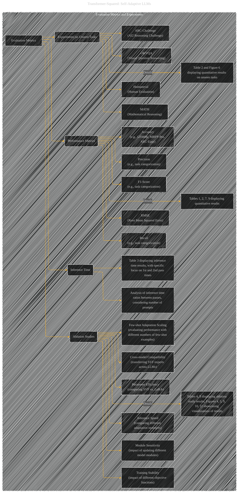

# Evaluation Metrics and Experiments
> **Disclaimer:**
>
> This document contains my personal notes on the topic,
> compiled from publicly available documentation and various cited sources.
> The materials are intended for educational purposes, personal study, and reference.
> The content is dual-licensed:
> 1. **MIT License:** Applies to all code implementations (Swift, Mermaid, and other programming languages).
> 2. **Creative Commons Attribution 4.0 International License (CC BY 4.0):** Applies to all non-code content, including text, explanations, diagrams, and illustrations.
---

## Evaluation Metrics and Experiments - A Diagrammatic Guide 

----

### Explanation

This Mermaid diagram provides a structured overview of the evaluation metrics and experiments used in the paper "Transformer-Squared: Self-Adaptive LLMs".

* **Subgraph "Evaluation Metrics & Experiments":** Encompasses all aspects of the evaluation.

* **Nodes:**  Represent key elements of the evaluation, categorized into "Performance Metrics," "Ablation Studies," "Experiments on Unseen Tasks," and "Inference Time."  These nodes are connected by edges that represent the relationships between them.

* **Edges:**  Define the connections between different evaluation types and the supporting details.

* **Detailed Nodes:** Nodes like `B1` specify the types of tasks and metrics used.  `B_details`, `C_details`, and `D_details` represent tables and figures from the original paper that display the quantitative or visual results of the specific experiments.

* **Metrics:**  The diagram explicitly lists various evaluation metrics used (accuracy, precision, recall, F1-score, RMSE) to give a clear understanding of the evaluation procedures.

* **Emphasis on Tables and Figures:**  The diagram explicitly notes that the supporting data is presented in tables and figures from the original document, making it clear that this is not a re-creation but a visualization of the existing content.

* **Inference Time:**  A dedicated section for analyzing inference time and the relative costs of the adaptation process.

This diagram provides a structured representation of the evaluation methodology, highlighting the specific experiments and tables from the original paper where results are presented.  It makes it easier to quickly locate and understand the methodology behind the evaluation of the different components of the model.  Crucially, it doesn't attempt to recreate the results but rather shows *how* and *where* the results are documented in the original paper.

---
**Licenses:**

- **MIT License:**   - Full text in [LICENSE](LICENSE) file.
- **Creative Commons Attribution 4.0 International:**  - Legal details in [LICENSE-CC-BY](LICENSE-CC-BY) and at [Creative Commons official site](http://creativecommons.org/licenses/by/4.0/).

---