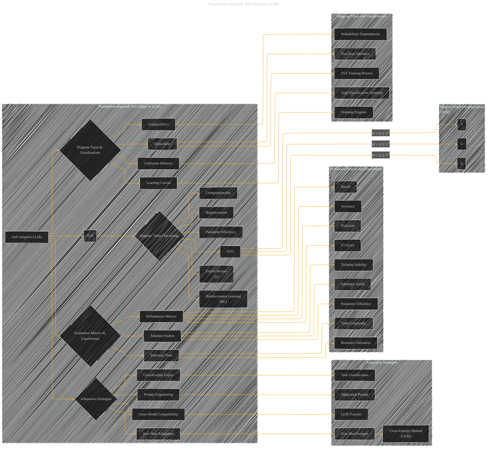

# Transformer-Squared: Self-Adaptive LLMs
> **Disclaimer:**
>
> This document contains my personal notes on the topic,
> compiled from publicly available documentation and various cited sources.
> The materials are intended for educational purposes, personal study, and reference.
> The content is dual-licensed:
> 1. **MIT License:** Applies to all code implementations (Swift, Mermaid, and other programming languages).
> 2. **Creative Commons Attribution 4.0 International License (CC BY 4.0):** Applies to all non-code content, including text, explanations, diagrams, and illustrations.
---

## Transformer-Squared - A Diagrammatic Guide 

---

### Explanation

This Mermaid diagram uses a hierarchical structure to represent the key concepts from the paper, organizing them into subgraphs for clarity.

* **Subgraphs:**  The top-level subgraph encapsulates the entire paper's subject.  Subsequent subgraphs further categorize concepts for detailed representation.

* **Nodes and Edges:**  Nodes represent core concepts (e.g., "Self-Adaptive LLMs," "SVF," "Adaptation Strategies"). Edges define relationships between these concepts.  For example, an edge from "Self-Adaptive LLMs" to "SVF" signifies that SVF is a crucial component of the overall framework.

* **Specialized Subgraphs:** Specialized subgraphs (e.g., SVD, Adaptation Strategies, Evaluation Metrics) provide more detail within specific areas of the paper.

* **Mathematical Relationships (Use of LateX):** The diagram now includes mathematical formulas (using Mermaid's support for LaTeX). This is crucial for accurately portraying the relationships between concepts.

---

### How to Extend

You can further enhance this diagram by:

* Adding specific details about the experiments (e.g., tasks used, model architectures).
* Including code snippets (if appropriate) within the respective nodes to illustrate the implementation.
* Adding more detailed relationships (e.g., connecting different adaptation strategies to specific performance metrics).

This structured approach will facilitate creating a comprehensive visual representation of the paper's key ideas and relationships. Remember to tailor the details within each subgraph and node to specifically reflect the content of the original paper.

---
**Licenses:**

- **MIT License:**   - Full text in [LICENSE](LICENSE) file.
- **Creative Commons Attribution 4.0 International:**  - Legal details in [LICENSE-CC-BY](LICENSE-CC-BY) and at [Creative Commons official site](http://creativecommons.org/licenses/by/4.0/).

---