# Transformer Squared
> **Disclaimer:**
>
> This document contains my personal notes on the topic,
> compiled from publicly available documentation and various cited sources.
> The materials are intended for educational purposes, personal study, and reference.
> The content is dual-licensed:
> 1. **MIT License:** Applies to all code implementations (Swift, Mermaid, and other programming languages).
> 2. **Creative Commons Attribution 4.0 International License (CC BY 4.0):** Applies to all non-code content, including text, explanations, diagrams, and illustrations.
---

## Transformer Squared - A Diagrammatic Guide 

```mermaid
---
title: "Transformer-Squared: Self-Adaptive LLMs"
config:
  layout: elk
  look: handDrawn
  theme: dark
---
%%%%%%%% Available curve styles include the following keywords:
%% basis, bumpX, bumpY, cardinal, catmullRom, linear, monotoneX, monotoneY, natural, step, stepAfter, stepBefore.
%%{
  init: {
    "graph": { "htmlLabels": false, 'curve': 'linear' },
    'fontFamily': 'Fantasy',
    'themeVariables': {
      'primaryColor': '#BB2528',
      'primaryTextColor': '#f529',
      'primaryBorderColor': '#7C0000',
      'lineColor': '#F8B229',
      'secondaryColor': '#006100',
      'tertiaryColor': '#fff'
    }
  }
}%%
graph LR
    subgraph Transformer2["Transformer Squared<br>(Transformer2)"]
        A[Transformer Squared] --> B(Self-Adaptive LLM)
        B --> C(Framework)
        
        C --> D["Singular Value Fine-tuning<br>(SVF)"]
        D --> E[SVD Decomposition]
        D --> F["Expert Vectors<br>(z)"]
        D --> G[RL Training]
        
        C --> H[Adaptation Strategies]
        H --> I[Prompt Engineering]
        I --> I1["Adaptation Prompt"]
        I1 --> I2[Classifies Task]
        
        H --> J[Classification Expert]
        J --> J1["Task Classification LLM"]
        J1 --> J2[Learns Task Identities]
        
        H --> K[Few-Shot Adaptation]
        K --> K1["Few-Shot Prompts"]
        K1 --> K2["Cross-Entropy Method<br>(CEM)"]
        K2 --> K3[Optimizes α Weights]
        
        C --> L[Two-Pass Inference]
        L --> M["First Pass<br>(Task Identification)"]
        M --> M1[Observes Model Behavior]
        M --> M2[Selects Expert Vectors]
        L --> N["Second Pass<br>(Response Generation)"]
        N --> N1[Combines Expert Vectors]
        N --> N2[Adapts Base Model Weights]
        N --> N3[Generates Response]
        
        C --> O[Evaluation]
        O --> P[Performance Metrics]
        P --> P1["Accuracy<br>(e.g., GSM8K, MBPP, ARC)"]
        P --> P2[Inference Time]
        P --> P3[Resource Cost]
        
        C --> Q[Analysis]
        Q --> Q1[Cross-Model Compatibility]
        Q --> Q2[Adaptation Strategy Analysis]
        Q --> Q3[Ablation Studies]
        Q --> Q4[Hyperparameter Tuning]
    end

```

---

### Explanation

This Mermaid diagram, based on the provided reference structure, visually represents the key components and relationships within "Transformer Squared."

* **Top-Level Subgraph:**  Clearly identifies the main subject.

* **Hierarchical Structure:** Organizes concepts into a hierarchical manner.  Subgraphs are used to group related ideas, such as "Adaptation Strategies" or "Evaluation," providing better visual organization.

* **Detailed Connections:**  Illustrates the flow of information and processes. For example, the flow from "Prompt Engineering" to "Adaptation Prompt" and the subsequent use of this prompt for task classification.

* **Focus on Key Components:** Highlights crucial components like SVD, expert vector training with RL, the two-pass inference mechanism, and the evaluation process.

* **Clear Labels:** Uses precise labels for each component, avoiding ambiguity.

----

### Further Improvements

To make the diagram even more informative:

* **Specific Metrics:** Replace generic labels like "Performance Metrics" with specific examples like "Accuracy on GSM8K," "Inference Time on MATH."
* **Model Architectures:**  Include nodes for specific LLM architectures (e.g., LLAMA3-8B, MISTRAL-7B) and their interactions.
* **Quantitative Relationships:**  Add links between the adaptation strategies (e.g., Prompt Engineering) and the corresponding gains in performance metrics.
* **Data Flow:** Show the flow of data through the different components of the model.

This detailed diagram would be much more informative to those looking at the technical architecture and implementation of "Transformer Squared".

---
**Licenses:**

- **MIT License:**   - Full text in [LICENSE](LICENSE) file.
- **Creative Commons Attribution 4.0 International:**  - Legal details in [LICENSE-CC-BY](LICENSE-CC-BY) and at [Creative Commons official site](http://creativecommons.org/licenses/by/4.0/).

---