# Transformer Architecture Drafts
> **Disclaimer:**
>
> This document contains my personal notes on the topic,
> compiled from publicly available documentation and various cited sources.
> The materials are intended for educational purposes, personal study, and reference.
> The content is dual-licensed:
> 1. **MIT License:** Applies to all code implementations (Swift, Mermaid, and other programming languages).
> 2. **Creative Commons Attribution 4.0 International License (CC BY 4.0):** Applies to all non-code content, including text, explanations, diagrams, and illustrations.
---

## Transformer Architecture - A Draft Comprehensive Diagram

```mermaid
---
title: Optimized Transformer Model Diagram
config:
  layout: elk
  look: handDrawn
  theme: default
---
%%{
  init: {
    'themeVariables': {
      'primaryColor': '#007acc',
      'primaryTextColor': '#ffffff',
      'primaryBorderColor': '#005a9e',
      'lineColor': '#f90',
      'secondaryColor': '#e8f3fb',
      'tertiaryColor': '#ffffff'
    }
  }
}%%
graph TD
    subgraph Transformer_Model["Transformer Model"]
    style Transformer_Model fill:#e8f3fb,stroke:#005a9e,stroke-width:2px

        A["Input Sequence (x₁, ..., xₙ)"] -->|Tokenized| B["Input Embeddings (E(xᵢ))"]
        B -->|Add Positional Info| C["Positional Encoding (PE)"]
        C -->|Summed Representation| D["Encoder Stack (N Layers)"]

        subgraph Encoder_Layer["Encoder Layer (Repeated N Times)"]
        style Encoder_Layer fill:#d8e8ff,stroke:#005a9e,stroke-width:2px
            E["Multi-Head Self-Attention<br>hᵢ = Attention(QWᵢᵏ, KWᵢᵏ, VWᵢᵏ)"] 
            E --> F["Add & Norm<br>LayerNorm(x + Sublayer(x))"]
            F --> G["Feed-Forward Network (FFN)<br>FFN(x) = max(0, xW₁ + b₁)W₂ + b₂"]
            G --> H["Add & Norm<br>LayerNorm(x + Sublayer(x))"]
        end

        D --> I["Decoder Stack (N Layers)"]

        subgraph Decoder_Layer["Decoder Layer (Repeated N Times)"]
        style Decoder_Layer fill:#d8e8ff,stroke:#005a9e,stroke-width:2px
            J["Masked Multi-Head Attention<br>Prevent future peeking"]
            J --> K["Add & Norm<br>LayerNorm(x + Sublayer(x))"]
            K --> L["Encoder-Decoder Attention<br>Uses encoder output as keys and values"]
            L --> M["Add & Norm<br>LayerNorm(x + Sublayer(x))"]
            M --> N["Feed-Forward Network (FFN)<br>FFN(x) = max(0, xW₁ + b₁)W₂ + b₂"]
            N --> O["Add & Norm<br>LayerNorm(x + Sublayer(x))"]
        end
        
        I --> P["Linear Projection"]
        P --> Q["Softmax Layer<br>pᵢ = e^(zᵢ) / Σⱼ e^(zⱼ)"]
        Q --> R["Output Sequence (y₁, ..., yₘ)"]

        A --> S["Target Sequence (y₁, ..., yₘ₋₁)"]
        S --> T["Target Embeddings (E(yᵢ))"]
        T --> U["Positional Encoding (PE)"]
        U --> J
    end

    subgraph Attention_Mechanisms["Attention Mechanisms"]
    style Attention_Mechanisms fill:#c8e6c9,stroke:#43a047,stroke-width:2px

        V["Scaled Dot-Product Attention"]
        V --> W["Compute Similarity<br>(QKᵀ / √dₖ)"]
        W --> X["Softmax Scaling<br>softmax(QKᵀ / √dₖ)"]
        X --> Y["Weighted Sum<br>Σ(attention_scores * V)"]

        subgraph Multi_Head_Attention["Multi-Head Attention"]
        style Multi_Head_Attention fill:#43a047,stroke:#005a9e,stroke-width:2px
            Z["Split Input into h Heads"] --> AA["Apply Scaled Dot-Product Attention Separately"]
            AA --> BB["Concatenate Heads"]
            BB --> CC["Final Linear Projection"]
        end
    end

    E -- "Queries, Keys, Values" --> V
    J -- "Masked Queries, Keys, Values" --> V
    L -- "Queries from Decoder, Keys/Values from Encoder" --> V
    E -- "Uses Multi-Head Attention" --> Multi_Head_Attention
    J -- "Uses Multi-Head Attention" --> Multi_Head_Attention
    L -- "Uses Multi-Head Attention" --> Multi_Head_Attention

```

---

## Optimized Transformer Model Overview

This improved Mermaid diagram enhances clarity by:

1. **Maintaining Hierarchy & Logical Flow:**  
   - The main **Transformer Model** contains **Encoder** and **Decoder stacks**.
   - **Subgraphs** define different parts (Encoder Layer, Decoder Layer, Attention Mechanisms).

2. **Explicit Mathematical Equations:**  
   - Key formulas such as **scaled dot-product attention**, **softmax**, and **feed-forward networks** are directly embedded in the diagram.

3. **Improved Connection Mapping:**  
   - The data flow between **embeddings → positional encodings → encoder → decoder → final output** is visually clear.
   - Multi-head attention is shown with proper hierarchical nesting.

4. **Color Coding for Readability:**  
   - Different sections are given **contrasting colors** to highlight components distinctly.

### Key Features of the Optimized Diagram

1. **Input Processing:**  
   - The input text is tokenized into embeddings.
   - Positional encoding is added to inject sequential information.

2. **Encoder Stack:**  
   - Uses **multi-head self-attention** (`MultiHead(Q, K, V)`).
   - Passes through a feed-forward network.
   - Outputs contextualized representations.

3. **Decoder Stack:**  
   - Uses **masked multi-head attention** to prevent looking at future tokens.
   - Incorporates an **encoder-decoder attention mechanism** to reference the encoded input.

4. **Attention Mechanisms:**  
   - Shows the workings of **scaled dot-product attention**.
   - Illustrates how multiple attention heads are concatenated in multi-head attention.

5. **Output Generation:**  
   - Outputs pass through a linear projection and softmax layer.
   - The final predicted sequence is produced.

---

### Final Thoughts on Optimization
- This optimized diagram visually encapsulates the **entire Transformer model**, including equations and structured component interaction.
- It serves as a reference for both **high-level understanding** and **technical deep dives** into each step of the Transformer’s functionality.
- The balance between conceptual clarity and technical depth ensures that this representation aligns well with the original "Attention Is All You Need" paper while being accessible to both researchers and developers.

This refined visualization provides a **strategic, structured, and visually coherent** way to represent the Transformer architecture. 🚀

---
**Licenses:**

- **MIT License:**   - Full text in [LICENSE](LICENSE) file.
- **Creative Commons Attribution 4.0 International:**  - Legal details in [LICENSE-CC-BY](LICENSE-CC-BY) and at [Creative Commons official site](http://creativecommons.org/licenses/by/4.0/).

---